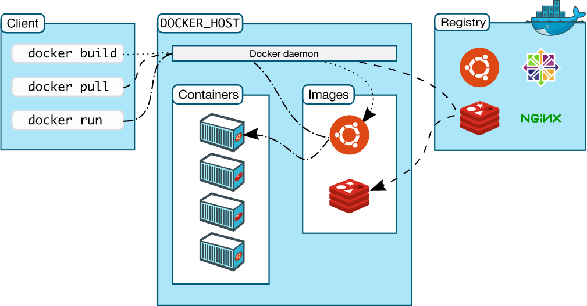
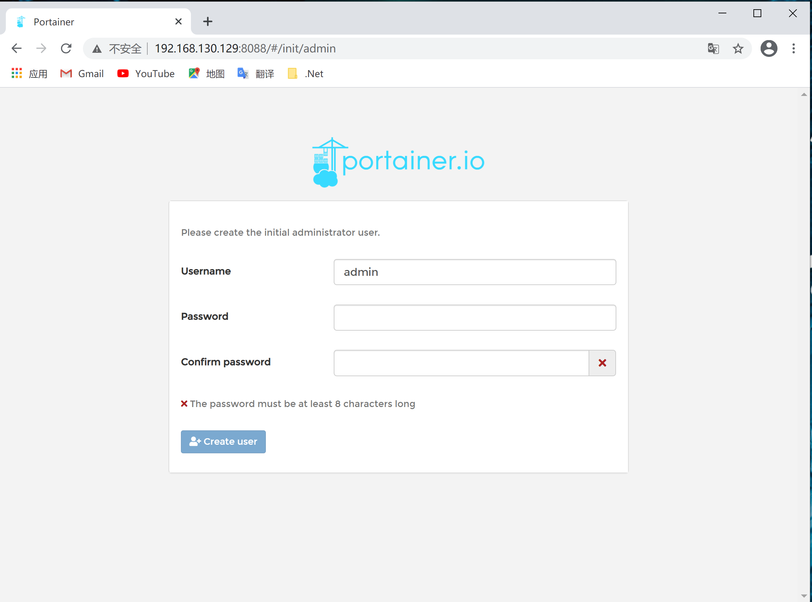
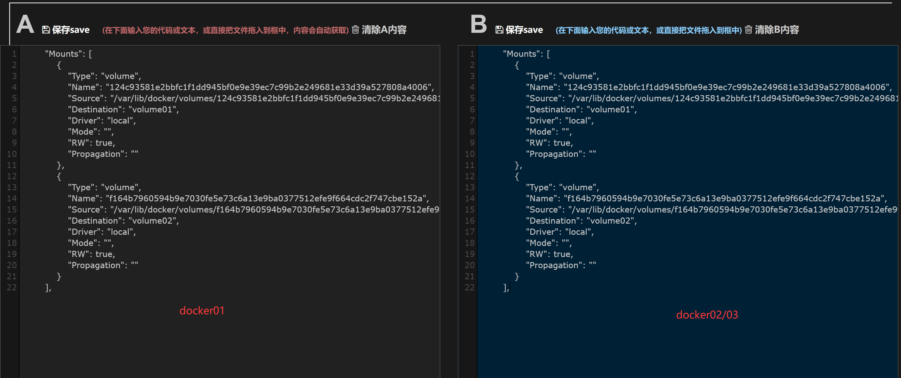
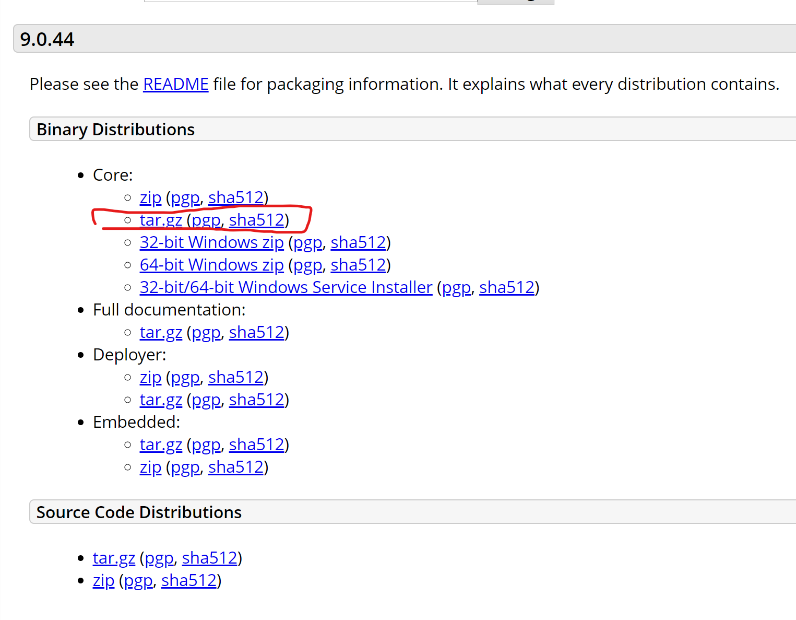
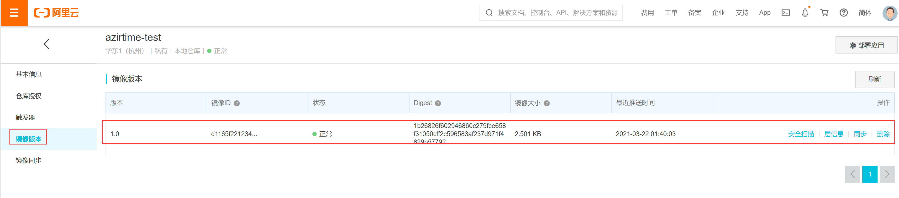

[TOC]

# 资源

[视频教程](https://www.bilibili.com/video/BV1og4y1q7M4?p=1)

[Docker官网](https://www.docker.com/)

[Docker文档](https://docs.docker.com/docker-for-windows/install/)

[Docker仓储](https://hub.docker.com/)

[Docker 教程](https://www.runoob.com/docker/docker-architecture.html)


# Docker学习大纲

- Docker概述
- Docker安装
- Docker命令
  - 镜像命令
  - 容器命令
  - 操作命令
  - ......
- Docker镜像
- 容器数据卷
- IDEA整合Docker
- Docker Compose
- Docker  Swarm
- CI\CD jenkins


# 环境搭建

## 使用Linux虚拟机

使用虚拟机，搭建CentOs 系统，参见教程：

安装vmare：https://www.bilibili.com/video/BV1Sv411r7vd?p=5

​                      https://blog.csdn.net/qq_39192827/article/details/85872025

安装CentOS：https://www.bilibili.com/video/BV1Sv411r7vd?p=6


# Docker概述

## Docker为什么会出现

一款产品：开发-上线 两套环境、应用欢迎、应用环境

开发与运维的问题：两套环境引发各种问题

Docker根据以上问题，提出了解决方案：

java-apk-发布应用商店-使用apk--安装应用

java-jar（环境）--打包项目带上环境（镜像）--Docker仓库：商店--下载我们发布的镜像--直接运行即可

隔离:Docker的核心思想

Docker通过隔离机制，可将服务器利用用到极致

在容器技术之前，我们都是使用虚拟技术

虚拟机：在windows中安装一个Vmare，通过这个软件我们可以虚拟出一台或多台电脑，笨重

### docker的特点：

- 隔离

- 小巧

  镜像（最核心的环境4m）十分小巧，运行镜像即可，几个M，秒级启动

  虚拟机 几个G, 启动几分钟


## Docker的历史

2013年Docker开源

2014年4月9日，Docker1.0发布


## Docker能干什么

### 虚拟技术的确定：

- 资源占用十分多；
- 冗余步骤多；
- 启动很慢

### 容器技术

容器技术不是模拟一个完整的操作系统，

每个容器间都是相互隔离的，每个容器都有一个属于自己的文件系统，互不影响

### DevOPS（开发运维一体化）

- 应用更快捷的交付和部署

​      传统：一堆帮助文档，安装程序

​      Docker：打包镜像，发布测试，一件运维

- 更便捷的升级和扩缩容

  使用Docker后，项目打包为一个就镜像，

- 更简单的系统运维

  在容器化之后，开发、运维、测试都是高度一致

- 更高效的计算资源利用

  Docker的内核级别的虚拟化，可以在一个物理机上运行很多个容器实例，服务器的性能可以被利用到极致

  


## Docker的基本组成

- **镜像（Image）**：Docker 镜像（Image），就相当于是一个 root 文件系统。比如官方镜像 ubuntu:16.04 就包含了完整的一套 Ubuntu16.04 最小系统的 root 文件系统。

- **容器（Container）**：镜像（Image）和容器（Container）的关系，就像是面向对象程序设计中的类和实例一样，镜像是静态的定义，容器是镜像运行时的实体。

  容器可以被创建、启动、停止、删除、暂停等（相当于一个简易的Linux系统）。

- **仓库（Repository）**：仓库可看成一个代码控制中心，用来保存镜像。

  可分为公有仓库和私有服务

Docker 使用客户端-服务器 (C/S) 架构模式，使用远程API来管理和创建Docker容器。

Docker 容器通过 Docker 镜像来创建。

容器与镜像的关系类似于面向对象编程中的对象与类。




## 安装Docker

### CentOS安装

https://docs.docker.com/engine/install/centos/


- 卸载旧版本

  ```shell
  yum remove docker \
                    docker-client \
                    docker-client-latest \
                    docker-common \
                    docker-latest \
                    docker-latest-logrotate \
                    docker-logrotate \
                    docker-engine
  ```

  

- 在线下载并安装 yum-util

   Install the `yum-utils` package (which provides the `yum-config-manager` utility) and set up the **stable** repository. 

  ```shell
  yum install -y yum-util
  ```


- 设置镜像仓库

  默认是国外的，下载很慢

  ```she
  yum-config-manager \
      --add-repo \
      https://download.docker.com/linux/centos/docker-ce.repo
  ```

​       使用国内镜像，比如：阿里

```shell
   yum-config-manager \
        --add-repo \
        http://mirrors.aliyun.com/docker-ce/linux/centos/docker-ce.repo
```


- 更新yum 软件包的索引

  ```shell
  yum makecache fast
  ```

  

- 安装Docker

Docker-ce 社区版本

Docker-ee 企业版本

**安装最新版本**

```shell
yum install docker-ce docker-ce-cli containerd.io
```


**安装指定版本**

```shell
yum list docker-ce --showduplicates | sort -r
yum install docker-ce-<VERSION_STRING> docker-ce-cli-<VERSION_STRING> containerd.io
```


- 启动Docker

  **手动启动Docker**

  ```shell
  systemctl start docker
  ```

​      

​       **设置Docker开机启动**

```shell
systemctl start docker
systemctl enable docker
```

# reboot
   

​     重启命令 ：

  ```shell
systemctl restart docker
  ```


- 测试Docker

  ```shell
  # 测试是否安装成功
  docker version
  ```

  测试helloword

  ```shell
  [root@centos7 ~]# docker run hello-world
  Unable to find image 'hello-world:latest' locally
  latest: Pulling from library/hello-world
  b8dfde127a29: Pull complete 
  Digest: sha256:308866a43596e83578c7dfa15e27a73011bdd402185a84c5cd7f32a88b501a24
  Status: Downloaded newer image for hello-world:latest
  
  Hello from Docker!
  This message shows that your installation appears to be working correctly.
  
  To generate this message, Docker took the following steps:
   1. The Docker client contacted the Docker daemon.
   2. The Docker daemon pulled the "hello-world" image from the Docker Hub.
      (amd64)
   3. The Docker daemon created a new container from that image which runs the
      executable that produces the output you are currently reading.
   4. The Docker daemon streamed that output to the Docker client, which sent it
      to your terminal.
  
  To try something more ambitious, you can run an Ubuntu container with:
   $ docker run -it ubuntu bash
  
  Share images, automate workflows, and more with a free Docker ID:
   https://hub.docker.com/
  
  For more examples and ideas, visit:
   https://docs.docker.com/get-started/
  
  ```

  

- 查看镜像

```shell
[root@centos7 ~]# docker images
REPOSITORY    TAG       IMAGE ID       CREATED       SIZE
hello-world   latest    d1165f221234   12 days ago   13.3kB
```

#### 卸载

1. Uninstall the Docker Engine, CLI, and Containerd packages:

   删除docker依赖

   ```
   $ sudo yum remove docker-ce docker-ce-cli containerd.io
   ```

2. Images, containers, volumes, or customized configuration files on your host are not automatically removed. To delete all images, containers, and volumes:

   删除docker资源

   ```
   $ sudo rm -rf /var/lib/docker
   $ sudo rm -rf /var/lib/containerd
   ```


### Window10 安装


## 检查安装

检查安装是否成功：

```powershell

```


## Run的运行和原理

```powershell
PS C:\Users\wei> docker run hello-world
Unable to find image 'hello-world:latest' locally
latest: Pulling from library/hello-world
0e03bdcc26d7: Pull complete
Digest: sha256:95ddb6c31407e84e91a986b004aee40975cb0bda14b5949f6faac5d2deadb4b9
Status: Downloaded newer image for hello-world:latest

Hello from Docker!
This message shows that your installation appears to be working correctly.

To generate this message, Docker took the following steps:
 1. The Docker client contacted the Docker daemon.
 2. The Docker daemon pulled the "hello-world" image from the Docker Hub.
    (amd64)
 3. The Docker daemon created a new container from that image which runs the
    executable that produces the output you are currently reading.
 4. The Docker daemon streamed that output to the Docker client, which sent it
    to your terminal.

To try something more ambitious, you can run an Ubuntu container with:
 $ docker run -it ubuntu bash

Share images, automate workflows, and more with a free Docker ID:
 https://hub.docker.com/

For more examples and ideas, visit:
 https://docs.docker.com/get-started/
```


## 配置镜像源

### 阿里云镜像加速

https://blog.csdn.net/u011700186/article/details/109452566


### 其它源

参考资料：

​     https://blog.csdn.net/zzk437367083/article/details/108769956

​     https://www.cnblogs.com/yyee/p/12827767.html


 常用的几个国内源 

```powershell
Docker官方中国仓库：https://registry.docker-cn.com
中科大USTC: https://docker.mirrors.ustc.edu.cn
网易163镜像：http://hub-mirror.c.163.com
```


#### Docker Desktop 的配置

Windos 10系统： Docker Desktop


```json
{
  "registry-mirrors": [],
  "insecure-registries": [],
  "debug": false,
  "experimental": false,
  "features": {
    "buildkit": true
  }
}
```

修改为：

```json
{
  "registry-mirrors": [
   "https://registry.docker-cn.com",
   "http://hub-mirror.c.163.com",
   "https://docker.mirrors.ustc.edu.cn"
   ],
  "insecure-registries": [],
  "debug": false,
  "experimental": false,
  "features": {
    "buildkit": true
  }
}

```

点击【Apply&Restart】


# 底层原理

##   Docker是怎么工作的？

Docker是一个Client-server 结构的系统，Docker的守护进程运行在主机上，通过Socketcon从客户端访问，

DockerServer接收到Docker-Client的指令，就会执行这个命名


## Docker 为什么比VM快？


1. Docker有比虚拟机更少的抽象层
2. Docker利用的是宿主机的内核，VM需要的是Guest OS


所以说，新建一个容器的时候，docker不需要像虚拟机一样重新加载一个操作系统，避免引导。

虚拟机是加载Guest OS（分钟级别的）

Docker是利用宿主机的操作系统，省略 了这个复杂的过程，秒级的


# Docker的常用命令


## 帮助命令

```powershell
docker version     #显示docker的版本信息
docker info        # docker的系统信息，包括镜像和容器的数量
docker 命令 --help  # 帮助命令
```

帮助文档：

https://docs.docker.com/engine/reference/commandline/cli/


## 镜像命令

### docker images 查看镜像

#### **查看所有本地的主机上的镜像**

```powershell
> docker images --help

Usage:  docker images [OPTIONS] [REPOSITORY[:TAG]]

List images

Options:
  -a, --all             Show all images (default hides intermediate images)
      --digests         Show digests
  -f, --filter filter   Filter output based on conditions provided
      --format string   Pretty-print images using a Go template
      --no-trunc        Don't truncate output
  -q, --quiet           Only show image IDs
```


```powershell
> docker images
REPOSITORY    TAG       IMAGE ID       CREATED         SIZE
hello-world   latest    bf756fb1ae65   13 months ago   13.3kB
```

- REPOSITORY： 镜像的仓储源

- TAG：镜像的标签

- IMAGE：镜像的ID

- CREATED: 镜像的创建时间

- SIZE：镜像的大小


#### **全部的images的ID**

```powershell
PS C:\Users\wei> docker images -aq
2933adc350f3
bf756fb1ae65
```


### docker search 搜索镜像

搜索镜像

```powershell
> docker search --help

Usage:  docker search [OPTIONS] TERM

Search the Docker Hub for images

Options:
  -f, --filter filter   Filter output based on conditions provided
      --format string   Pretty-print search using a Go template
      --limit int       Max number of search results (default 25)
      --no-trunc        Don't truncate output
```


搜索mysql

```powershell
>docker search mysql
```


#### 搜索 `STARS `大于3000的镜像

```powershell
docker search mysql --filter=STARS=700
```

 


### docker pull 下载镜像

#### 下载镜像

```powershell
>docker pull --help

Usage:  docker pull [OPTIONS] NAME[:TAG|@DIGEST]

Pull an image or a repository from a registry

Options:
  -a, --all-tags                Download all tagged images in the repository
      --disable-content-trust   Skip image verification (default true)
      --platform string         Set platform if server is multi-platform
                                capable
  -q, --quiet                   Suppress verbose output
```


下载镜像：mysql

```powershell
# 下载镜像 docker pull 镜像名[:tag]
PS C:\Users\wei> docker pull mysql
Using default tag: latest    # 如果不写tag，默认就是lastest
latest: Pulling from library/mysql
45b42c59be33: Pull complete  # 分层下载，docker image的核心，联合文件系统
b4f790bd91da: Pull complete
325ae51788e9: Pull complete
adcb9439d751: Pull complete
174c7fe16c78: Pull complete
698058ef136c: Pull complete
4690143a669e: Pull complete
f7599a246fd6: Pull complete
35a55bf0c196: Pull complete
790ac54f4c47: Pull complete
18602acc97e1: Pull complete
365caa3500d0: Pull complete
Digest: sha256:b1cc887ed32cc6c2f217b12703bd05f503f2037892c8bb226047fe5dff85a109 #签名
Status: Downloaded newer image for mysql:latest
docker.io/library/mysql:latest # 真实地址
```


真实地址：

```powershell
docker pull mysql
```

 等价于

```powershell
docker pull docker.io/library/mysql:latest
```


#### 指定版本

指定的版本必须是官网存在的

比如：mysql https://hub.docker.com/_/mysql  指明了支持的版本

```C#
Supported tags and respective Dockerfile links
8.0.23, 8.0, 8, latest
5.7.33, 5.7, 5
5.6.51, 5.6
```

下载5.7版本

```powershell
PS C:\Users\wei> docker pull mysql:5.7
5.7: Pulling from library/mysql
45b42c59be33: Already exists
b4f790bd91da: Already exists
325ae51788e9: Already exists
adcb9439d751: Already exists
174c7fe16c78: Already exists
698058ef136c: Already exists
4690143a669e: Already exists
66676c1ab9b3: Pull complete
25ebf78a38b6: Pull complete
349a839d5e27: Pull complete
40b03e3e5980: Pull complete
Digest: sha256:853105ad984a9fe87dd109be6756e1fbdba8b003b303d88ac0dda6b455f36556
Status: Downloaded newer image for mysql:5.7
docker.io/library/mysql:5.7
```

注意到：

```powershell
45b42c59be33: Already exists
b4f790bd91da: Already exists
325ae51788e9: Already exists
adcb9439d751: Already exists
174c7fe16c78: Already exists
698058ef136c: Already exists
4690143a669e: Already exists
```

已经存在，这就是Docker的联合文件系统，`5.7`版本与之前我们下载最新版本公用分层

```powershell
PS C:\Users\wei> docker images
REPOSITORY    TAG       IMAGE ID       CREATED         SIZE
mysql         5.7       5f47254ca581   2 weeks ago     449MB
mysql         latest    2933adc350f3   2 weeks ago     546MB
hello-world   latest    bf756fb1ae65   13 months ago   13.3kB
```


### 删除镜像

```powershell
PS C:\Users\wei> docker rmi --help

Usage:  docker rmi [OPTIONS] IMAGE [IMAGE...]

Remove one or more images

Options:
  -f, --force      Force removal of the image
      --no-prune   Do not delete untagged parents
```

可通过镜像的 IMAGE ID ，删除多个的Images时候， Id用空格间隔

```powershell
docker rmi 5f47254ca581               # 单个删除
docker rmi 5f47254ca581 bf756fb1ae65  # 多个删除
docker rmi -f $(docker images -a)     # 全部删除
```


示例1：单个删除

```powershell
PS C:\Users\wei> docker rmi 5f47254ca581
Untagged: mysql:5.7
Untagged: mysql@sha256:853105ad984a9fe87dd109be6756e1fbdba8b003b303d88ac0dda6b455f36556
Deleted: sha256:5f47254ca5817f99cdd387ce7345d43e770e0682a4c81b62776f3347551b1d85
Deleted: sha256:63f5d2725ff0ecffe0a7345e749d39b269a8cef04984661f0f4e752869b9fbb1
Deleted: sha256:acbe85abff4e7bbdd75a1f56ee9a095a72fcba4c226d0194d46b9a8471b1fe18
Deleted: sha256:b851a484b18c5d3d25497260c111631ae3adf924eb10baa533b2a5b03b339d1a
Deleted: sha256:b5133b076285236e7fd98c42c1f18f57e2b4ed98daaed7b0afb3b98b804d6f25

PS C:\Users\wei> docker images
REPOSITORY    TAG       IMAGE ID       CREATED         SIZE
mysql         latest    2933adc350f3   2 weeks ago     546MB
hello-world   latest    bf756fb1ae65   13 months ago   13.3kB
```


示例2：全部删除

```powershell
PS C:\Users\wei> docker rmi -f $(docker images -a)
Error response from daemon: invalid reference format: repository name must be lowercase
Error response from daemon: invalid reference format: repository name must be lowercase
Error response from daemon: invalid reference format: repository name must be lowercase
PS C:\Users\wei> docker rmi -f $(docker images -aq)
Untagged: mysql:latest
Untagged: mysql@sha256:b1cc887ed32cc6c2f217b12703bd05f503f2037892c8bb226047fe5dff85a109
Deleted: sha256:2933adc350f3b62c05a66f700fba68ef93997d67263121250ec7848c50dcf3f5
Deleted: sha256:78b6531a3acdad2154a839ac1ec9ae2677632cc834bd996e75317f6e35717834
Deleted: sha256:f0c1c423000a6848e30ae3249c25b16f678167e56b4bb3013445b2ad1d179e8c
Deleted: sha256:4386f82820992c927b924177ed3e4c2ffd477d4db7a63539ac76fd09ee36cd89
Deleted: sha256:d7494c9168a11444d8b13558068409ace7393452f08f878686eec45122ee56c1
Deleted: sha256:08dbcab3fe630e39bbabaa9f0ae72ec6d100bf1e400ebb4b7f04151b18bca89c
Deleted: sha256:c3f78dcd6bcc4c156554296323e0eed74a4d2d93b304be15f55c1ef62dd06e0a
Deleted: sha256:f89b66495a65489290c8edb71e0dbf9e3d0d6213b82cebc2554b271599f2f99d
Deleted: sha256:1918839317d9988ff5e0168e336717e32820af1e77c3121297efc73a387ecdc5
Deleted: sha256:1d2bcd52664a92805e5f49d94d3649323dd0f5682ae3e1380fa07b7a54d6ceb0
Deleted: sha256:787de05fee96c7ba99e49f17d72aec68769a7373a8881a27917bdbf83dca58e8
Deleted: sha256:eb82f9a2fbd7a4a0fdfbe40b5e77a995ccf73ab91364d90f4db820fd59dbf63b
Deleted: sha256:9eb82f04c782ef3f5ca25911e60d75e441ce0fe82e49f0dbf02c81a3161d1300
Untagged: hello-world:latest
Untagged: hello-world@sha256:95ddb6c31407e84e91a986b004aee40975cb0bda14b5949f6faac5d2deadb4b9
Deleted: sha256:bf756fb1ae65adf866bd8c456593cd24beb6a0a061dedf42b26a993176745f6b

PS C:\Users\wei> docker images
REPOSITORY   TAG       IMAGE ID   CREATED   SIZE

```

其中,

- `$(docker images -a)` ：

`docker images -a`:获取所有镜像的ID

`$`:作为参数传递，可查看：https://www.cnblogs.com/chengd/p/7803664.html


- 被装载的镜像也会被删除，使用该镜像的容器还会继续运行


## 容器命令

> 说明：我们有了镜像才能创建容器


现在下载一个**Centons**镜像来测试学习

```powershell
PS C:\Users\wei> docker pull centos
Using default tag: latest
latest: Pulling from library/centos
7a0437f04f83: Pull complete
Digest: sha256:5528e8b1b1719d34604c87e11dcd1c0a20bedf46e83b5632cdeac91b8c04efc1
Status: Downloaded newer image for centos:latest
docker.io/library/centos:latest

PS C:\Users\wei> docker images
REPOSITORY   TAG       IMAGE ID       CREATED        SIZE
centos       latest    300e315adb2f   2 months ago   209MB
```


### 新建容器并启动

```powershell
docker run [可选项] image [COMMAND] [ARG...]
```

- 可选项：

  **-- name="Name"**  :容器的名字，tomcat01, tomcat02， 用于区分容器

  **-d**:后台方式运行

  **-it**:使用交互方式运行，进入容器查看内容

  -**p**:指定容器的端口 ，-p 8080:8080  

     -p IP:主机端口:容器端口

  ​    -p 主机端口:容器端口 （常用）

  ​    -p 容器端口


```powershell
docker run -it centos /bin/bash
```

` /bin/bash`命名是Linux系统下的控制台程序。


看到主机名变了，`@1b5b876a7037`

```powershell
# 测试，启动并进入容器
PS C:\Users\wei> docker run -it centos /bin/bash
[root@1b5b876a7037 /]# ls # 查看容器内Centos,基础版本，很多命名都不完善
bin  dev  etc  home  lib  lib64  lost+found  media  mnt  opt  proc  root  run  sbin  srv  sys  tmp  usr  var

# 从容器中退回主机
[root@1b5b876a7037 /]# exit
exit
PS C:\Users\wei>

```


> 在容器中输入：exit
>
> 退出容器，并且容器停止运行


### 查看容器

**docker ps**

​         列出当前正在运行的容器

**-a** ：列出所有的容器，包括：当前正在运行的容器、历史运行过容器

**-n=?**：显示最近创建的容器，比如：-n=10 显示最近创建的10个容器

**-q**：显示ID


```powershell
PS C:\Users\wei> docker ps # 查看运行中容器
CONTAINER ID   IMAGE     COMMAND   CREATED   STATUS    PORTS     NAMES
 
PS C:\Users\wei> docker ps -a # 查看曾经运行（已经退出）的容器
CONTAINER ID   IMAGE          COMMAND       CREATED          STATUS                     PORTS     NAMES
1b5b876a7037   centos         "/bin/bash"   10 minutes ago   Exited (0) 7 minutes ago             relaxed_wing
c86e09381431   bf756fb1ae65   "/hello"      3 hours ago      Exited (0) 3 hours ago               happy_snyder

PS C:\Users\wei> docker ps -n=10
CONTAINER ID   IMAGE          COMMAND       CREATED          STATUS                      PORTS     NAMES
1b5b876a7037   centos         "/bin/bash"   29 minutes ago   Exited (0) 25 minutes ago             relaxed_wing
c86e09381431   bf756fb1ae65   "/hello"      3 hours ago      Exited (0) 3 hours ago                happy_snyder

PS C:\Users\wei> docker ps -aq #显示所有容器的ID
1b5b876a7037
c86e09381431
```

 


### 退出容器

#### 容器退出并停止

```powershell
exit
```

示例：


#### 容器退出不停止

```
Ctrl + P + Q
```

示例：


### 删除容器

```powershell
docker rm 容器ID                 # 删除指定的容器
docker rm -f $(docker ps -aq)   # 删除所有的容器
docker ps -a -q|xargs docker rm # 删除所有的容器(看下Linux管道)
```

运行中的容器不能删除


**示例：删除容器**

```powershell
PS C:\Users\wei> docker ps -a
CONTAINER ID   IMAGE          COMMAND       CREATED              STATUS                          PORTS     NAMES
9a1ba404016c   centos         "/bin/bash"   22 seconds ago       Up 21 seconds                             mystifying_haslett
8b3a69b39c57   centos         "/bin/bash"   About a minute ago   Exited (0) About a minute ago             heuristic_taussig
1b5b876a7037   centos         "/bin/bash"   38 minutes ago       Exited (0) 34 minutes ago                 relaxed_wing
c86e09381431   bf756fb1ae65   "/hello"      4 hours ago          Exited (0) 4 hours ago                    happy_snyder

PS C:\Users\wei> docker rm 9a1ba404016c # 运行中的容器不能删除
Error response from daemon: You cannot remove a running container 9a1ba404016c07663efc3e557e79ecdee9242dcfa25ebc5cc96a7a6e91ab33b0. Stop the container before attempting removal or force remove

PS C:\Users\wei> docker rm 1b5b876a7037 # 删除指定的容器
1b5b876a7037

```


### 启动和停止

```powershell
docker start 容器ID       # 启动容器
docker restart 容器ID     # 重启容器
docker stop 容器ID        # 停止当前正在运行的容器
docker kill 容器ID        # 强制停止当前容器
```


# 常用其它命令


## 后台启动容器

后台方式启动容器

```powershell
docker run -d centos
```

```powershell
PS C:\Users\wei> docker run -d centos
f3a64b6496d3d6fa5902513b27e876a838b7f39e1183842badab896b037c03e9
PS C:\Users\wei> docker ps
CONTAINER ID   IMAGE     COMMAND   CREATED   STATUS    PORTS     NAMES
PS C:\Users\wei>
```

从上面运行的情况，可以看到：

`centos`容器是停止的，

这是比较常见的坑，容器使用后后台运行，必须要有一个前台进程，**docker发现被没用使用，就会自动停止**，

比如:nginx容器启动后，发现自己没有提供服务，就会自动停止。


## 查看日志

```powershell
PS C:\Users\wei> docker logs --help

Usage:  docker logs [OPTIONS] CONTAINER

Fetch the logs of a container

Options:
      --details        Show extra details provided to logs
  -f, --follow         Follow log output
      --since string   Show logs since timestamp (e.g.
                       2013-01-02T13:23:37Z) or relative (e.g. 42m for 42
                       minutes)
  -n, --tail string    Number of lines to show from the end of the logs
                       (default "all")
  -t, --timestamps     Show timestamps
      --until string   Show logs before a timestamp (e.g.
                       2013-01-02T13:23:37Z) or relative (e.g. 42m for 42
                       minutes)
```


**示例1：查看全部日志**

**注意，如果日志还有写入，查看日志显示是会同步更新在界面上的**

```powershell
PS C:\Users\wei> docker ps -a
CONTAINER ID   IMAGE          COMMAND                  CREATED          STATUS                      PORTS     NAMES

c86e09381431   bf756fb1ae65   "/hello"                 4 hours ago      Exited (0) 4 hours ago                happy_snyder

PS C:\Users\wei> docker start c86e09381431
c86e09381431
PS C:\Users\wei> docker logs c86e09381431

Hello from Docker!
This message shows that your installation appears to be working correctly.

To generate this message, Docker took the following steps:
 1. The Docker client contacted the Docker daemon.
 2. The Docker daemon pulled the "hello-world" image from the Docker Hub.
.......


Hello from Docker!
This message shows that your installation appears to be working correctly.

To generate this message, Docker took the following steps:
 1. The Docker client contacted the Docker daemon.
 2. The Docker daemon pulled the "hello-world" image from the Docker Hub.
    (amd64)
 3. The Docker daemon created a new container from that image which runs the
    executable that produces the output you are currently reading.
 4. The Docker daemon streamed that output to the Docker client, which sent it
    to your terminal.

To try something more ambitious, you can run an Ubuntu container with:
 $ docker run -it ubuntu bash

Share images, automate workflows, and more with a free Docker ID:
 https://hub.docker.com/

For more examples and ideas, visit:
 https://docs.docker.com/get-started/
 
```


**示例2：最新10条日志**

```powershell
PS C:\Users\wei> docker logs --tail 10  c86e09381431
2021-02-24T07:12:10.228036800Z
2021-02-24T07:12:10.228043600Z To try something more ambitious, you can run an Ubuntu container with:
2021-02-24T07:12:10.228047300Z  $ docker run -it ubuntu bash
2021-02-24T07:12:10.228051400Z
2021-02-24T07:12:10.228056200Z Share images, automate workflows, and more with a free Docker ID:
2021-02-24T07:12:10.228070100Z  https://hub.docker.com/
2021-02-24T07:12:10.228080200Z
2021-02-24T07:12:10.228083100Z For more examples and ideas, visit:
2021-02-24T07:12:10.228085600Z  https://docs.docker.com/get-started/
2021-02-24T07:12:10.228089000Z
```


## 查看容器内部进程信息

```powershell
 docker top CONTAINER [ps OPTIONS]
```


**示例**：

```powershell
PS C:\Users\wei> docker run -it centos /bin/bash
[root@57f4ef66e9d4 /]#
PS C:\Users\wei> docker ps
CONTAINER ID   IMAGE     COMMAND       CREATED             STATUS          PORTS     NAMES
57f4ef66e9d4   centos    "/bin/bash"   10 seconds ago      Up 8 seconds              stoic_feistel

# docker top 容器ID
PS C:\Users\wei> docker top 57f4ef66e9d4
UID                 PID                 PPID                C                   STIME               TTY                 TIME                CMD
root                1688                1667                0                   07:40               ?                   00:00:00            /bin/bash
PS C:\Users\wei>
```


## 查看镜像元数据

```powershell
PS C:\Users\wei> docker inspect --help

Usage:  docker inspect [OPTIONS] NAME|ID [NAME|ID...]

Return low-level information on Docker objects

Options:
  -f, --format string   Format the output using the given Go template
  -s, --size            Display total file sizes if the type is container
      --type string     Return JSON for specified type
```


示例：

```powershell
PS C:\Users\wei> docker inspect 57f4ef66e9d4
[
    {
        "Id": "57f4ef66e9d4aef0cf9c5eb81c74b1f74058d9f4a470f3f196bbdbe345d263f4",
        "Created": "2021-02-24T07:40:17.8754651Z",
        "Path": "/bin/bash",
        "Args": [],
        "State": {
            "Status": "running",
            "Running": true,
            "Paused": false,
            "Restarting": false,
            "OOMKilled": false,
            "Dead": false,
            "Pid": 1688,
            "ExitCode": 0,
            "Error": "",
            "StartedAt": "2021-02-24T07:40:18.3484599Z",
            "FinishedAt": "0001-01-01T00:00:00Z"
        },
        "Image": "sha256:300e315adb2f96afe5f0b2780b87f28ae95231fe3bdd1e16b9ba606307728f55",
        "ResolvConfPath": "/var/lib/docker/containers/57f4ef66e9d4aef0cf9c5eb81c74b1f74058d9f4a470f3f196bbdbe345d263f4/resolv.conf",
        "HostnamePath": "/var/lib/docker/containers/57f4ef66e9d4aef0cf9c5eb81c74b1f74058d9f4a470f3f196bbdbe345d263f4/hostname",
        "HostsPath": "/var/lib/docker/containers/57f4ef66e9d4aef0cf9c5eb81c74b1f74058d9f4a470f3f196bbdbe345d263f4/hosts",
        "LogPath": "/var/lib/docker/containers/57f4ef66e9d4aef0cf9c5eb81c74b1f74058d9f4a470f3f196bbdbe345d263f4/57f4ef66e9d4aef0cf9c5eb81c74b1f74058d9f4a470f3f196bbdbe345d263f4-json.log",
        "Name": "/stoic_feistel",
        "RestartCount": 0,
        "Driver": "overlay2",
        "Platform": "linux",
        "MountLabel": "",
        "ProcessLabel": "",
        "AppArmorProfile": "",
        "ExecIDs": null,
        "HostConfig": {
            "Binds": null,
            "ContainerIDFile": "",
            "LogConfig": {
                "Type": "json-file",
                "Config": {}
            },
            "NetworkMode": "default",
            "PortBindings": {},
            "RestartPolicy": {
                "Name": "no",
                "MaximumRetryCount": 0
            },
            "AutoRemove": false,
            "VolumeDriver": "",
            "VolumesFrom": null,
            "CapAdd": null,
            "CapDrop": null,
            "CgroupnsMode": "host",
            "Dns": [],
            "DnsOptions": [],
            "DnsSearch": [],
            "ExtraHosts": null,
            "GroupAdd": null,
            "IpcMode": "private",
            "Cgroup": "",
            "Links": null,
            "OomScoreAdj": 0,
            "PidMode": "",
            "Privileged": false,
            "PublishAllPorts": false,
            "ReadonlyRootfs": false,
            "SecurityOpt": null,
            "UTSMode": "",
            "UsernsMode": "",
            "ShmSize": 67108864,
            "Runtime": "runc",
            "ConsoleSize": [
                49,
                205
            ],
            "Isolation": "",
            "CpuShares": 0,
            "Memory": 0,
            "NanoCpus": 0,
            "CgroupParent": "",
            "BlkioWeight": 0,
            "BlkioWeightDevice": [],
            "BlkioDeviceReadBps": null,
            "BlkioDeviceWriteBps": null,
            "BlkioDeviceReadIOps": null,
            "BlkioDeviceWriteIOps": null,
            "CpuPeriod": 0,
            "CpuQuota": 0,
            "CpuRealtimePeriod": 0,
            "CpuRealtimeRuntime": 0,
            "CpusetCpus": "",
            "CpusetMems": "",
            "Devices": [],
            "DeviceCgroupRules": null,
            "DeviceRequests": null,
            "KernelMemory": 0,
            "KernelMemoryTCP": 0,
            "MemoryReservation": 0,
            "MemorySwap": 0,
            "MemorySwappiness": null,
            "OomKillDisable": false,
            "PidsLimit": null,
            "Ulimits": null,
            "CpuCount": 0,
            "CpuPercent": 0,
            "IOMaximumIOps": 0,
            "IOMaximumBandwidth": 0,
            "MaskedPaths": [
                "/proc/asound",
                "/proc/acpi",
                "/proc/kcore",
                "/proc/keys",
                "/proc/latency_stats",
                "/proc/timer_list",
                "/proc/timer_stats",
                "/proc/sched_debug",
                "/proc/scsi",
                "/sys/firmware"
            ],
            "ReadonlyPaths": [
                "/proc/bus",
                "/proc/fs",
                "/proc/irq",
                "/proc/sys",
                "/proc/sysrq-trigger"
            ]
        },
        "GraphDriver": {
            "Data": {
                "LowerDir": "/var/lib/docker/overlay2/752ca041a862e4ee189cbcfed5386158e87940640296821516a6b468369f8901-init/diff:/var/lib/docker/overlay2/ebdf0f4e10318a6431e9b9642b087e88f7d69e6e105250230d968231cc244bae/diff",
                "MergedDir": "/var/lib/docker/overlay2/752ca041a862e4ee189cbcfed5386158e87940640296821516a6b468369f8901/merged",
                "UpperDir": "/var/lib/docker/overlay2/752ca041a862e4ee189cbcfed5386158e87940640296821516a6b468369f8901/diff",
                "WorkDir": "/var/lib/docker/overlay2/752ca041a862e4ee189cbcfed5386158e87940640296821516a6b468369f8901/work"
            },
            "Name": "overlay2"
        },
        "Mounts": [],
        "Config": {
            "Hostname": "57f4ef66e9d4",
            "Domainname": "",
            "User": "",
            "AttachStdin": true,
            "AttachStdout": true,
            "AttachStderr": true,
            "Tty": true,
            "OpenStdin": true,
            "StdinOnce": true,
            "Env": [
                "PATH=/usr/local/sbin:/usr/local/bin:/usr/sbin:/usr/bin:/sbin:/bin"
            ],
            "Cmd": [
                "/bin/bash"
            ],
            "Image": "centos",
            "Volumes": null,
            "WorkingDir": "",
            "Entrypoint": null,
            "OnBuild": null,
            "Labels": {
                "org.label-schema.build-date": "20201204",
                "org.label-schema.license": "GPLv2",
                "org.label-schema.name": "CentOS Base Image",
                "org.label-schema.schema-version": "1.0",
                "org.label-schema.vendor": "CentOS"
            }
        },
        "NetworkSettings": {
            "Bridge": "",
            "SandboxID": "eb0a3e801021c091b00a4db99bdc64b9b9fe326950f76ed3f74bcc105d49a093",
            "HairpinMode": false,
            "LinkLocalIPv6Address": "",
            "LinkLocalIPv6PrefixLen": 0,
            "Ports": {},
            "SandboxKey": "/var/run/docker/netns/eb0a3e801021",
            "SecondaryIPAddresses": null,
            "SecondaryIPv6Addresses": null,
            "EndpointID": "817060ec873b77e0e729865ec7ee97f082191182de757f46acf22851d029169e",
            "Gateway": "172.17.0.1",
            "GlobalIPv6Address": "",
            "GlobalIPv6PrefixLen": 0,
            "IPAddress": "172.17.0.3",
            "IPPrefixLen": 16,
            "IPv6Gateway": "",
            "MacAddress": "02:42:ac:11:00:03",
            "Networks": {
                "bridge": {
                    "IPAMConfig": null,
                    "Links": null,
                    "Aliases": null,
                    "NetworkID": "d65954abdc4a3e92dff0b7ba718badd760396600522391a4d5ecaa364846aa30",
                    "EndpointID": "817060ec873b77e0e729865ec7ee97f082191182de757f46acf22851d029169e",
                    "Gateway": "172.17.0.1",
                    "IPAddress": "172.17.0.3",
                    "IPPrefixLen": 16,
                    "IPv6Gateway": "",
                    "GlobalIPv6Address": "",
                    "GlobalIPv6PrefixLen": 0,
                    "MacAddress": "02:42:ac:11:00:03",
                    "DriverOpts": null
                }
            }
        }
    }
]
```


## 进入当前正在运行的容器

通常容器都是使用**后台方式运行**的，如果需要**进入容器**进行一些配置上的修改

**方式一：**

```powershell
docker exec -it 容器ID bin/bash
```

示例：

```powershell
PS C:\Users\wei> docker ps
CONTAINER ID   IMAGE     COMMAND       CREATED          STATUS          PORTS     NAMES
57f4ef66e9d4   centos    "/bin/bash"   20 minutes ago   Up 20 minutes             stoic_feistel

PS C:\Users\wei> docker exec -it 57f4ef66e9d4 /bin/bash
[root@57f4ef66e9d4 /]# ls
bin  dev  etc  home  lib  lib64  lost+found  media  mnt  opt  proc  root  run  sbin  srv  sys  tmp  usr  var
```

这种方式退出容器并停止使用

```shell
[root@57f4ef66e9d4 /]# exit
```

exit方式退出 后，容器停止运行

使用组合键【Ctrl + P + Q】，退出不停止容器（方式一我们进入了容器，以这种方式退出）


**方式二**

```powershell
docker attach 容器ID
```

示例：

> 使用组合键【Ctrl + P + Q】，退出不停止容器（方式一我们进入了容器，以这种方式退出）

```powershell
# Ctrl + P + Q 退出不停止容器
[root@57f4ef66e9d4 /]# read escape sequence

PS C:\Users\wei> docker ps
CONTAINER ID   IMAGE     COMMAND       CREATED          STATUS          PORTS     NAMES
57f4ef66e9d4   centos    "/bin/bash"   24 minutes ago   Up 24 minutes             stoic_feistel

PS C:\Users\wei> docker attach 57f4ef66e9d4
[root@57f4ef66e9d4 /]# ls
bin  dev  etc  home  lib  lib64  lost+found  media  mnt  opt  proc  root  run  sbin  srv  sys  tmp  usr  var
```


两种方式的区别：

**docker exec** ： 进入容器开启一个新的终端，可以在里面操作（常用）

证明下这种方式是开启了新的终端：

```powershell
PS C:\Users\wei> docker ps
CONTAINER ID   IMAGE     COMMAND       CREATED          STATUS         PORTS     NAMES
57f4ef66e9d4   centos    "/bin/bash"   35 minutes ago   Up 2 seconds   
xxxx
PS C:\Users\wei> docker exec -it 57f4ef66e9d4 /bin/bash
[root@57f4ef66e9d4 /]# exit #这个命令是：退出docker并停止，这个是新建的终端
exit

PS C:\Users\wei> docker ps #原始的docker终端并停止
CONTAINER ID   IMAGE     COMMAND       CREATED          STATUS          PORTS     NAMES
57f4ef66e9d4   centos    "/bin/bash"   35 minutes ago   Up 16 seconds             xxxx


```


**docker attach**：进入容器正在执行的终端，不会启动新的进程


## 从容器内拷贝文件到主机上

```powershell
docker cp --help

Usage:  docker cp [OPTIONS] CONTAINER:SRC_PATH DEST_PATH|-
        docker cp [OPTIONS] SRC_PATH|- CONTAINER:DEST_PATH

Copy files/folders between a container and the local filesystem

Use '-' as the source to read a tar archive from stdin
and extract it to a directory destination in a container.
Use '-' as the destination to stream a tar archive of a
container source to stdout.

Options:
  -a, --archive       Archive mode (copy all uid/gid information)
  -L, --follow-link   Always follow symbol link in SRC_PATH
```


```powershell
docker cp 容器ID:容器内的路径 目标主机路径
```

示例：

```powershell
PS C:\Users\wei>  docker ps # 列出当前正在运行的容器
CONTAINER ID   IMAGE     COMMAND       CREATED          STATUS          PORTS     NAMES
57f4ef66e9d4   centos    "/bin/bash"   48 minutes ago   Up 12 minutes             xxxx

PS C:\Users\wei> docker attach 57f4ef66e9d4 # 进入这个容器
[root@57f4ef66e9d4 /]# cd /home
[root@57f4ef66e9d4 home]# ls 
[root@57f4ef66e9d4 home]# touch test.java # 创建一个文件
[root@57f4ef66e9d4 home]# ls
test.java

[root@57f4ef66e9d4 home]# exit  # 退出并停止容器，容器停止了，但是文件是还在的
exit
PS C:\Users\wei>  docker ps
CONTAINER ID   IMAGE     COMMAND   CREATED   STATUS    PORTS     NAMES

# 从容器中拷贝文件到主机上（该示例是：window 10）
PS C:\Users\wei> docker cp 57f4ef66e9d4:/home/test.java f:\\tmp\\docker

```

运行上面的示例后，


> 现在我们是手工拷贝，以后我们可以使用 -v 卷的技术，可以实现自动同步


# 命令小结

Docker 指令图


# 练习

## Docker 安装 Nginx

```powershell
##------------------------------下载nginx镜像
PS C:\Users\wei> docker pull nginx # 下载
Using default tag: latest
latest: Pulling from library/nginx
45b42c59be33: Pull complete
8acc495f1d91: Pull complete
ec3bd7de90d7: Pull complete
19e2441aeeab: Pull complete
f5a38c5f8d4e: Pull complete
83500d851118: Pull complete
Digest: sha256:f3693fe50d5b1df1ecd315d54813a77afd56b0245a404055a946574deb6b34fc
Status: Downloaded newer image for nginx:latest
docker.io/library/nginx:latest

PS C:\Users\wei> docker images # 查看镜像
REPOSITORY   TAG       IMAGE ID       CREATED        SIZE
nginx        latest    35c43ace9216   6 days ago     133MB
centos       latest    300e315adb2f   2 months ago   209MB

##------------------------------创建并运行nginx容器
# 创建并运行nginx容器，
# -d:后台运行
# 容器名：--name nginx01
# 端口映射：-p 3344:80 ，容器外部（宿主机）端口3344， 容器内nginx的端口为80
PS C:\Users\wei> docker run -d --name nginx01 -p 3344:80 nginx
188fbac2706a631faf1ad140e70c3c57848ad72afcbb3bc9636493c54bc1f7dd

PS C:\Users\wei> docker ps #查看容器是否运行了
CONTAINER ID   IMAGE     COMMAND                  CREATED         STATUS         PORTS                  NAMES
188fbac2706a   nginx     "/docker-entrypoint.…"   6 seconds ago   Up 4 seconds   0.0.0.0:3344->80/tcp   nginx01

##------------------------------访问容器中的nginx
## 在宿主机（window 10）上请求3344端口
PS C:\WINDOWS\system32> curl.exe localhost:3344
<!DOCTYPE html>
<html>
<head>
<title>Welcome to nginx!</title>
<style>
    body {
        width: 35em;
        margin: 0 auto;
        font-family: Tahoma, Verdana, Arial, sans-serif;
    }
</style>
</head>
<body>
<h1>Welcome to nginx!</h1>
<p>If you see this page, the nginx web server is successfully installed and
working. Further configuration is required.</p>

<p>For online documentation and support please refer to
<a href="http://nginx.org/">nginx.org</a>.<br/>
Commercial support is available at
<a href="http://nginx.com/">nginx.com</a>.</p>

<p><em>Thank you for using nginx.</em></p>
</body>
</html>

##------------------------------进入容器

PS C:\WINDOWS\system32> docker ps
CONTAINER ID   IMAGE     COMMAND                  CREATED          STATUS          PORTS                  NAMES
188fbac2706a   nginx     "/docker-entrypoint.…"   48 minutes ago   Up 48 minutes   0.0.0.0:3344->80/tcp   nginx01
PS C:\WINDOWS\system32> docker exec -it nginx01 /bin/bash #使用容器的名称（这里）
root@188fbac2706a:/# whereis nginx
nginx: /usr/sbin/nginx /usr/lib/nginx /etc/nginx /usr/share/nginx
root@188fbac2706a:/# cd etc/nginx
root@188fbac2706a:/etc/nginx# ls
conf.d  fastcgi_params  koi-utf  koi-win  mime.types  modules  nginx.conf  scgi_params  uwsgi_params  win-utf
root@188fbac2706a:/etc/nginx#


```

这时可以从宿主机（示例是**windows 10**）的`3344`端口访问Docker容器中的`Nginx`（端口：80），下面是在宿主机中使用浏览器访问：

http://localhost:3344/


**思考问题**：

​		我们每次改动Nginx配置文件，都需要进入容器内部？ 十分的麻烦。要是可以在容器外部提供一个映射路径，达到在容器外修改文件名，容器内部可以自动修改？

​       答：-v 数据卷


## Docker安装 Tomcat 

https://hub.docker.com/_/tomcat


```powershell
docker run -it --rm tomcat:9.0
```

run:自动检查，下载，安装

参数`rm` ：运行完之后，自动删除容器，适用于测试。

```powershell
# 下载、创建、启动、用完自动删除
PS C:\WINDOWS\system32> docker run -it --rm tomcat:9.0
Unable to find image 'tomcat:9.0' locally
9.0: Pulling from library/tomcat
0ecb575e629c: Pull complete
7467d1831b69: Pull complete
feab2c490a3c: Pull complete
f15a0f46f8c3: Pull complete
26cb1dfcbebb: Pull complete
242c5446d23f: Pull complete
f22708c7c9c1: Pull complete
d8b7e17ca4bc: Pull complete
91588c31829d: Pull complete
d97abf351b5d: Pull complete
Digest: sha256:076f0048b1340813301852336c32628e7b351202f8ece983717bbb91046e2a62
Status: Downloaded newer image for tomcat:9.0

# 下载完启动
Using CATALINA_BASE:   /usr/local/tomcat
Using CATALINA_HOME:   /usr/local/tomcat
Using CATALINA_TMPDIR: /usr/local/tomcat/temp
Using JRE_HOME:        /usr/local/openjdk-11
Using CLASSPATH:       /usr/local/tomcat/bin/bootstrap.jar:/usr/local/tomcat/bin/tomcat-juli.jar
Using CATALINA_OPTS:
NOTE: Picked up JDK_JAVA_OPTIONS:  --add-opens=java.base/java.lang=ALL-UNNAMED --add-opens=java.base/java.io=ALL-UNNAMED --add-opens=java.base/java.util=ALL-UNNAMED --add-opens=java.base/java.util.concurrent=ALL-UNNAMED --add-opens=java.rmi/sun.rmi.transport=ALL-UNNAMED
24-Feb-2021 10:11:33.211 INFO [main] org.apache.catalina.startup.VersionLoggerListener.log Server version name:   Apache Tomcat/9.0.43
24-Feb-2021 10:11:33.214 INFO [main] org.apache.catalina.startup.VersionLoggerListener.log Server built:          Jan 28 2021 20:25:45 UTC
24-Feb-2021 10:11:33.214 INFO [main] org.apache.catalina.startup.VersionLoggerListener.log Server version number: 9.0.43.0
24-Feb-2021 10:11:33.214 INFO [main] org.apache.catalina.startup.VersionLoggerListener.log OS Name:               Linux
24-Feb-2021 10:11:33.215 INFO [main] org.apache.catalina.startup.VersionLoggerListener.log OS Version:            5.4.72-microsoft-standard-WSL2
24-Feb-2021 10:11:33.215 INFO [main] org.apache.catalina.startup.VersionLoggerListener.log Architecture:          amd64
24-Feb-2021 10:11:33.215 INFO [main] org.apache.catalina.startup.VersionLoggerListener.log Java Home:             /usr/local/openjdk-11
24-Feb-2021 10:11:33.215 INFO [main] org.apache.catalina.startup.VersionLoggerListener.log JVM Version:           11.0.10+9
24-Feb-2021 10:11:33.216 INFO [main] org.apache.catalina.startup.VersionLoggerListener.log JVM Vendor:            Oracle Corporation
24-Feb-2021 10:11:33.216 INFO [main] org.apache.catalina.startup.VersionLoggerListener.log CATALINA_BASE:         /usr/local/tomcat
24-Feb-2021 10:11:33.216 INFO [main] org.apache.catalina.startup.VersionLoggerListener.log CATALINA_HOME:         /usr/local/tomcat
24-Feb-2021 10:11:33.229 INFO [main] org.apache.catalina.startup.VersionLoggerListener.log Command line argument: --add-opens=java.base/java.lang=ALL-UNNAMED
24-Feb-2021 10:11:33.229 INFO [main] org.apache.catalina.startup.VersionLoggerListener.log Command line argument: --add-opens=java.base/java.io=ALL-UNNAMED
24-Feb-2021 10:11:33.229 INFO [main] org.apache.catalina.startup.VersionLoggerListener.log Command line argument: --add-opens=java.base/java.util=ALL-UNNAMED
24-Feb-2021 10:11:33.230 INFO [main] org.apache.catalina.startup.VersionLoggerListener.log Command line argument: --add-opens=java.base/java.util.concurrent=ALL-UNNAMED
24-Feb-2021 10:11:33.230 INFO [main] org.apache.catalina.startup.VersionLoggerListener.log Command line argument: --add-opens=java.rmi/sun.rmi.transport=ALL-UNNAMED
24-Feb-2021 10:11:33.230 INFO [main] org.apache.catalina.startup.VersionLoggerListener.log Command line argument: -Djava.util.logging.config.file=/usr/local/tomcat/conf/logging.properties
24-Feb-2021 10:11:33.230 INFO [main] org.apache.catalina.startup.VersionLoggerListener.log Command line argument: -Djava.util.logging.manager=org.apache.juli.ClassLoaderLogManager
24-Feb-2021 10:11:33.231 INFO [main] org.apache.catalina.startup.VersionLoggerListener.log Command line argument: -Djdk.tls.ephemeralDHKeySize=2048
24-Feb-2021 10:11:33.231 INFO [main] org.apache.catalina.startup.VersionLoggerListener.log Command line argument: -Djava.protocol.handler.pkgs=org.apache.catalina.webresources
24-Feb-2021 10:11:33.231 INFO [main] org.apache.catalina.startup.VersionLoggerListener.log Command line argument: -Dorg.apache.catalina.security.SecurityListener.UMASK=0027
24-Feb-2021 10:11:33.232 INFO [main] org.apache.catalina.startup.VersionLoggerListener.log Command line argument: -Dignore.endorsed.dirs=
24-Feb-2021 10:11:33.232 INFO [main] org.apache.catalina.startup.VersionLoggerListener.log Command line argument: -Dcatalina.base=/usr/local/tomcat
24-Feb-2021 10:11:33.232 INFO [main] org.apache.catalina.startup.VersionLoggerListener.log Command line argument: -Dcatalina.home=/usr/local/tomcat
24-Feb-2021 10:11:33.233 INFO [main] org.apache.catalina.startup.VersionLoggerListener.log Command line argument: -Djava.io.tmpdir=/usr/local/tomcat/temp
24-Feb-2021 10:11:33.237 INFO [main] org.apache.catalina.core.AprLifecycleListener.lifecycleEvent Loaded Apache Tomcat Native library [1.2.26] using APR version [1.6.5].
24-Feb-2021 10:11:33.238 INFO [main] org.apache.catalina.core.AprLifecycleListener.lifecycleEvent APR capabilities: IPv6 [true], sendfile [true], accept filters [false], random [true].
24-Feb-2021 10:11:33.238 INFO [main] org.apache.catalina.core.AprLifecycleListener.lifecycleEvent APR/OpenSSL configuration: useAprConnector [false], useOpenSSL [true]
24-Feb-2021 10:11:33.243 INFO [main] org.apache.catalina.core.AprLifecycleListener.initializeSSL OpenSSL successfully initialized [OpenSSL 1.1.1d  10 Sep 2019]
24-Feb-2021 10:11:33.659 INFO [main] org.apache.coyote.AbstractProtocol.init Initializing ProtocolHandler ["http-nio-8080"]
24-Feb-2021 10:11:33.693 INFO [main] org.apache.catalina.startup.Catalina.load Server initialization in [732] milliseconds
24-Feb-2021 10:11:33.756 INFO [main] org.apache.catalina.core.StandardService.startInternal Starting service [Catalina]
24-Feb-2021 10:11:33.756 INFO [main] org.apache.catalina.core.StandardEngine.startInternal Starting Servlet engine: [Apache Tomcat/9.0.43]
24-Feb-2021 10:11:33.769 INFO [main] org.apache.coyote.AbstractProtocol.start Starting ProtocolHandler ["http-nio-8080"]
24-Feb-2021 10:11:33.790 INFO [main] org.apache.catalina.startup.Catalina.start Server startup in [96] milliseconds
^A^C24-Feb-2021 10:11:53.700 INFO [Thread-3] org.apache.coyote.AbstractProtocol.pause Pausing ProtocolHandler ["http-nio-8080"]
24-Feb-2021 10:11:53.710 INFO [Thread-3] org.apache.catalina.core.StandardService.stopInternal Stopping service [Catalina]
24-Feb-2021 10:11:53.718 INFO [Thread-3] org.apache.coyote.AbstractProtocol.stop Stopping ProtocolHandler ["http-nio-8080"]
24-Feb-2021 10:11:53.765 INFO [Thread-3] org.apache.coyote.AbstractProtocol.destroy Destroying ProtocolHandler ["http-nio-8080"]
```


正常流程：

```powershell
#--------------------下载镜像
PS C:\Users\wei> docker pull  tomcat:9.0
9.0: Pulling from library/tomcat
Digest: sha256:076f0048b1340813301852336c32628e7b351202f8ece983717bbb91046e2a62
Status: Image is up to date for tomcat:9.0
docker.io/library/tomcat:9.0

#--------------------创建并启动容器，名为：tomcat01
PS C:\Users\wei> docker run -d -p 3355:8080 --name tomcat01 tomcat:9.0
Unable to find image 'tomcat:latest' locally
f83261e7a704759122475559dcd639958e86351fb7e901ebd3920bf9e1911595

# 启动成功后，在宿主机的浏览器中访问：localhost:3355
# 404，tomcat还没配置好，但是表明可以访问了
PS C:\Users\wei> docker ps
CONTAINER ID   IMAGE     COMMAND                  CREATED              STATUS              PORTS                    NAMES
f83261e7a704   tomcat    "catalina.sh run"        About a minute ago   Up About a minute   0.0.0.0:3355->8080/tcp   tomcat01
188fbac2706a   nginx     "/docker-entrypoint.…"   About an hour ago    Up About an hour    0.0.0.0:3344->80/tcp     nginx01

#--------------------进入容器
PS C:\Users\wei> docker exec -it tomcat01 /bin/bash
root@f83261e7a704:/usr/local/tomcat# ll
bash: ll: command not found

root@f83261e7a704:/usr/local/tomcat# ls -al
total 172
//.......
drwxr-xr-x 2 root root  4096 Feb 10 08:30 webapps
drwxr-xr-x 7 root root  4096 Jan 28 20:28 webapps.dist
//.....
root@f83261e7a704:/usr/local/tomcat# cd webapps
root@f83261e7a704:/usr/local/tomcat/webapps# ls
#webapps目录是空地

# 综上，发现问题：
1. linux命名少了
2. 没有webapps，原因，镜像默认是最小镜像，没有必要的都剔除掉，保证最小的可以运行环境

#--------------------配置tomact
# 把webapps.dist的文件拷贝到webapps目录下

root@f83261e7a704:/usr/local/tomcat/webapps# cd ..
root@f83261e7a704:/usr/local/tomcat# ls
BUILDING.txt  CONTRIBUTING.md  LICENSE  NOTICE  README.md  RELEASE-NOTES  RUNNING.txt  bin  conf  lib  logs  native-jni-lib  temp  webapps  webapps.dist  work
root@f83261e7a704:/usr/local/tomcat# cd webapps.dist
root@f83261e7a704:/usr/local/tomcat/webapps.dist# ls
ROOT  docs  examples  host-manager  manager

# 拷贝
root@f83261e7a704:/usr/local/tomcat/webapps.dist# cd ..
root@f83261e7a704:/usr/local/tomcat# cp -r webapps.dist/* webapps
root@f83261e7a704:/usr/local/tomcat# cd webapps
root@f83261e7a704:/usr/local/tomcat/webapps# ls
ROOT  docs  examples  host-manager  manager
# 这是可以在宿主机的浏览器中访问：localhost:3355，并能看到网站了


```


**思考问题**

​        我们每次要部署项目，都需要进入容器内部？ 十分的麻烦。要是可以在容器外部提供一个映射路径，webapps我们在外部放置项目，就自动同步到内部就好了。

还有就是，docker+mysql的话，删除了docker就等于把数据库删了，这不可取啊，怎么解决呢？


## 部署 es+kibana

**elasticsearch**的特点：

 暴露的端口很多

十分的耗内存

es的数据一般需要放置到安全的目录！挂载

 

https://hub.docker.com/_/elasticsearch

官网示例：

 Run Elasticsearch: 

```powershell
docker run -d --name elasticsearch --net somenetwork -p 9200:9200 -p 9300:9300 -e "discovery.type=single-node" elasticsearch:tag
```

`--net somenetwork`网路配置，目前我们还没学，暂时不配置

```powershell
#------------------下载，安装、启动
PS C:\Users\wei> docker run -d --name elasticsearch -p 9200:9200 -p 9300:9300 -e "discovery.type=single-node" elasticsearch:7.6.2
Unable to find image 'elasticsearch:7.6.2' locally
7.6.2: Pulling from library/elasticsearch
ab5ef0e58194: Pull complete
c4d1ca5c8a25: Pull complete
941a3cc8e7b8: Pull complete
43ec483d9618: Pull complete
c486fd200684: Pull complete
1b960df074b2: Pull complete
1719d48d6823: Pull complete
Digest: sha256:1b09dbd93085a1e7bca34830e77d2981521a7210e11f11eda997add1c12711fa
Status: Downloaded newer image for elasticsearch:7.6.2
d9077f7ed237b6bd354fbda6b516c211bb869b7363ceeef7872b90b552587a72

PS C:\Users\wei> docker ps
CONTAINER ID   IMAGE                 COMMAND                  CREATED          STATUS          PORTS                                            NAMES
d9077f7ed237   elasticsearch:7.6.2   "/usr/local/bin/dock…"   15 seconds ago   Up 11 seconds   0.0.0.0:9200->9200/tcp, 0.0.0.0:9300->9300/tcp   elasticsearch
//.....

# 访问网页
PS C:\Users\wei> curl.exe localhost:9200
{
  "name" : "d9077f7ed237",
  "cluster_name" : "docker-cluster",
  "cluster_uuid" : "rgD0lAU-TlS0W6q54mXCpw",
  "version" : {
    "number" : "7.6.2",
    "build_flavor" : "default",
    "build_type" : "docker",
    "build_hash" : "ef48eb35cf30adf4db14086e8aabd07ef6fb113f",
    "build_date" : "2020-03-26T06:34:37.794943Z",
    "build_snapshot" : false,
    "lucene_version" : "8.4.0",
    "minimum_wire_compatibility_version" : "6.8.0",
    "minimum_index_compatibility_version" : "6.0.0-beta1"
  },
  "tagline" : "You Know, for Search"
}

# ------------------------es 太好内存
# 启动后 Linux很卡，es耗内存，一启动就几个G内存
# docker stats 查看CPU的状态

PS C:\Users\wei> docker stats
CONTAINER ID   NAME            CPU %     MEM USAGE / LIMIT    MEM %     NET I/O           BLOCK I/O   PIDS

d9077f7ed237   elasticsearch   0.52%     1.268GiB / 12.4GiB   10.23%    936B / 0B         0B / 0B     51
f83261e7a704   tomcat01        0.15%     206.5MiB / 12.4GiB   1.63%     10kB / 126kB      0B / 0B     40
188fbac2706a   nginx01         0.00%     4.648MiB / 12.4GiB   0.04%     5.52kB / 5.88kB   0B / 0B     2

#  1.268GiB/12.4GiB   10.23%  内存1.26G ，占用了10.23%，要是我们在阿里云买了1核2G的服务器，就没法
# 玩了

#卡主，先停掉 容器
PS C:\Users\wei> docker stop d9077f7ed237
d9077f7ed237


```

以上运行的es的Docker容器太消耗内存了，这个宿主机会受到影响，

所以，需要我们在启动时，增加内存限制，修改配置文件，-e 环境配置修改

```powershell
docker run -d --name elasticsearch -p 9200:9200 -p 9300:9300 -e "discovery.type=single-node"  -e ES_JAVA_OPTS="-Xms64m -Xmx512m" elasticsearch:7.6.2
```

` -e ES_JAVA_OPTS="-Xms64m -Xmx521m"`:修改环境变量，分配给ES最小内存64m,最大内存512m

示例：

```powershell
PS C:\Users\wei> docker run -d --name elasticsearch02 -p 9200:9200 -p 9300:9300 -e "discovery.type=single-node"  -e ES_JAVA_OPTS="-Xms64m -Xmx512m" elasticsearch:7.6.2
115e4d08047a96d19158736a51089494add76ea311185d14d0262e892169db8e

PS C:\Users\wei> docker ps
CONTAINER ID   IMAGE                 COMMAND                  CREATED             STATUS             PORTS                                            NAMES
115e4d08047a   elasticsearch:7.6.2   "/usr/local/bin/dock…"   2 minutes ago       Up 2 minutes       0.0.0.0:9200->9200/tcp, 0.0.0.0:9300->9300/tcp   elasticsearch02

PS C:\Users\wei> docker stats 115e4d08047a
CONTAINER ID   NAME              CPU %     MEM USAGE / LIMIT    MEM %     NET I/O     BLOCK I/O   PIDS
115e4d08047a   elasticsearch02   0.56%     415.5MiB / 12.4GiB   3.27%     866B / 0B   0B / 0B     48

# 内存415M左右
[Ctrl + C] #停止监测

# 访问网页
PS C:\Users\wei> curl.exe localhost:9200
{
  "name" : "115e4d08047a",
  "cluster_name" : "docker-cluster",
  "cluster_uuid" : "UhDLSWImRqCUsWMmsQTYRA",
  "version" : {
    "number" : "7.6.2",
    "build_flavor" : "default",
    "build_type" : "docker",
    "build_hash" : "ef48eb35cf30adf4db14086e8aabd07ef6fb113f",
    "build_date" : "2020-03-26T06:34:37.794943Z",
    "build_snapshot" : false,
    "lucene_version" : "8.4.0",
    "minimum_wire_compatibility_version" : "6.8.0",
    "minimum_index_compatibility_version" : "6.0.0-beta1"
  },
  "tagline" : "You Know, for Search"
}

```


思考问题：

​        如何使用Kibana连接ES：

Kibana容器和ES容器 是相互隔离，容器间如何连接？


# 可视化管理工具

## portainer

先用这个

### 什么是portainer

Docker图像化界面管理工具，提供一个后台面板供我们操作，

这宿主机是Linux环境下运行

```powershell
docker run -d -p 8088:9000 --restart=always -v /var/run/docker.sock:/var/run/docker.sock --privileged=true portainer/portainer
```

`--restart=always`:方式

`-v /var/run/docker.sock:/var/run/docker.sock`:把它的数据挂载到本机

`--privileged=true`:授权

## Portainer-CentOS

Docker图形化管理工具，提供一个后台面板供我们操作

```shell
docker run -d -p 8088:9000 \
--restart=always -v /var/run/docker.sock:/var/run/docker.sock --privileged=true portainer/portainer
```


在虚拟机所在的主机（Windows 10）中打开浏览器，访问：http://192.168.130.129:8088




选择Local


查看容器信息：


## Portainer-Windows10

用以上在window 10 启动不成功（可能是因为宿主机不是Linux的原因），使用如下命令代替

```powershell
docker run -d -p 8088:9000 portainer/portainer
```

用这个启动，Windosw 10 作为宿主机，最后无法链接，

再使用如下命令：

```powershell
docker run -d -p 8089:9000 --name portainer-win10 --restart=always -v  /pipe/docker_engine:/pipe/docker_engine --privileged=true portainer/portainer
```

使用8089端口


#### 示例 : Centos

```powershell
PS C:\Users\wei> docker run -d -p 8088:9000 portainer/portainer --restart=always -v /var/run/docker.sock:/var/run/docker.sock --privileged=true portainer/portainer
4ce9f6f2fb3587d6910ec08768c7ae5cb81a081a36388f69aa3c99894a684c7a

PS C:\Users\wei> docker ps -a
# 启动不成功
11b3a37c3bfa   portainer/portainer   "/portainer --restar…"   4 minutes ago  Exited (1) About a minute

# 先删掉再创建容器
PS C:\Users\wei> docker rm 11b3a37c3bfa
11b3a37c3bfa

PS C:\Users\wei> docker run -d -p 8088:9000 portainer/portainer
3f9a454fc7d9d88e9e464a779c3e4bcfcd7d9c1f30c3c5371c35b382e4f3e05f
PS C:\Users\wei> docker ps
CONTAINER ID   IMAGE                 COMMAND                  CREATED          STATUS          PORTS                                            NAMES
3f9a454fc7d9   portainer/portainer   "/portainer"             14 seconds ago   Up 11 seconds   0.0.0.0:8088->9000/tcp                           infallible_grothendieck

```

启动成功后，在宿主机访问：http://localhost:8088/


 

输入密码：12345678，然后创建用户


选择Local


点击【Connect】，连接失败：


看到提示：

```powershell
Information
Manage the Docker environment where Portainer is running.

 Ensure that you have started the Portainer container with the following Docker flag:

-v "/var/run/docker.sock:/var/run/docker.sock" (Linux).

or

-v \\.\pipe\docker_engine:\\.\pipe\docker_engine (Windows).
```


看来还是得添加参数：

#### 示例 : windows 10

```powershell
PS C:\Users\wei> docker run -d -p 8089:9000 --name portainer-win10 --restart=always -v  /pipe/docker_engine:/pipe/docker_engine --privileged=true portainer/portainer
72bf22620414655270ec317f1f279b354334db76de3395747bb02caf65802da2

PS C:\Users\wei> docker ps
CONTAINER ID   IMAGE                 COMMAND                  CREATED             STATUS             PORTS                                            NAMES
72bf22620414   portainer/portainer   "/portainer"             38 seconds ago      Up 36 seconds      0.0.0.0:8089->9000/tcp                           portainer-win10


```

上述也不行，难道是

```powershell
\\.\pipe\docker_engine_linux 
```


还是链接失败，算了


平时不会使用，就算了，不折腾了


## Rancher

CI/CD再用


# Docker镜像讲解

##  镜像是什么

镜像是一种轻量级、可执行的独立软件包，用来打包软件运行环境和基于环境开发的软件，它包含运行某个软件所需的所有内容，包括代码、运行时、库、环境变量和配置环境。

所有的应用，直接打包docker镜像，就可以直接跑起来


如何得到镜像：

- 远程仓库下载

- 拷贝

- 自己制作

  

## Docker镜像加载原理

### UnionFS(联合文件系统)

**UnionFS**：Union文件系统是一种分层、轻量级并且高性能的文件系统。它支持文件系统的修改作为一次提交来一层层的叠加，同时可以将不同目录挂载到同一个虚拟文件系统（Unite serveral directories a single virtual filessytem）。 Union文件系统是Docker镜像的基础，镜像可以通过分层进行继承，基于基础镜像（没有父镜像），可以制作各种具体的应用镜像。


特性：一次同时加载多个系统文件，但从外面开起来，只是看到一个文件系统，联合加载会把各层文件系统叠加起来，这样最终文件系统会包含所有底层的文件和目录


### 镜像加载原理

Docker的镜像实际上是由一层一层的文件系统组成，这种层级的文件系统。


**bootfs(boot file system)**主要包含bootloader和 kernel.

bootloader主要是引导加载kernel。Linux刚启动时会加载bootfs文件系统，在Docker镜像的最底层是bootfs。

这一层与我们典型的Linux/Unix系统是一样的，包含boot加载和内核，当boot加载完成之后，整个内核就都在内存中了，此时内存的使用权已由bootfs转交给内核，系统也会卸载bootfs。

（bootfs 是Linux系列系统都使用的）


**rootfs(root file system)** ：在bootf之上，包含典型的Linux系统中 的/dev 、/proc、/bin、/etc等标准目录和文件，rootfs就是各种不同操作系统发行版，比如Ubuntu, Centos等等。

平时我们安装进虚拟机的Centos都是好几个G，为什么Docker这里才200M。


对应一个精简的OS，rootfs可以很小，只需包含最基本的命令，工具和程序就可以了。因为底层直接用Host的kernel，自己只需要提供rootfs就可以了。

由此可见，对于不同的Linux发行版，rootf会有差别，因此不同的发行版可以公用bootfs


### 理解分层

#### 分层的镜像

我们取下载一个镜像，注意观察下载的输出日志，可以看到的是一层一层的下载


有一层已经下载了，就不再下载：

```powershell
a076a628af6f: Already exists
```

Docker镜像结构：


思考：为什么Docker镜像要采用这个分层的结构呢？

最大的好处是莫过于资源共享。比如：有多个镜像都从相同的Base镜像构建而来，那么宿主机只需要在磁盘上保留一分Base镜像，同时内存中也只需加载一分Base镜像，这样就可以为所有的容器服务了，而且镜像的每一层都可以被共享。

查看镜像的分层方式可以通过命令如下命令查看：

```powershell
docker images inspect IMAGE[:Tag] [IMAGE...]
```

比如查看刚才下载redis镜像信息,

```powershell
PS C:\Users\wei> docker image inspect redis

//.......
"RootFS": {
            "Type": "layers",
            "Layers": [
            "sha256:cb42413394c4059335228c137fe884ff3ab8946a014014309676c25e3ac86864",
            "sha256:8e14cb7841faede6e42ab797f915c329c22f3b39026f8338c4c75de26e5d4e82",
            "sha256:1450b8f0019c829e638ab5c1f3c2674d117517669e41dd2d0409a668e0807e96",
            "sha256:f927192cc30cb53065dc266f78ff12dc06651d6eb84088e82be2d98ac47d42a0",
            "sha256:a24a292d018421783c491bc72f6601908cb844b17427bac92f0a22f5fd809665",
            "sha256:3480f9cdd491225670e9899786128ffe47054b0a5d54c48f6b10623d2f340632"
            ]
        },
        
 //......
```

从节点`Layers`可以看到这个镜像包含的层


**理解**：

​       所有的Docker镜像都起始于一个基础镜像层，当进行修改或增加新的内容时，就会在当前镜像层之上创建新的镜像层，举一个例子，假如基于Ubuntu Linux 16.04创建的一个新的镜像，这就是新的镜像的第一层，如果该镜像中添加Python包，该镜像当前已经包含3个镜像层，如下图所示（只是一个用于演示的简单例子）


在添加额外的镜像层的同时，镜像始终保持是当期所有镜像的组合，理解这一点非常重要。举一个简单的例子，

每个镜像层包含3个文件，而镜像包含了来自两个镜像层的6个文件


上图中的镜像层跟之前图的略有区别，主要的目的是便于展示文件。

下图展示了一个稍微复杂的三层镜像，在外部看来整个镜像只有6个文件，因为最上层的文件7是文件5的一个更新版本


这种情况下，上层镜像层中大文件覆盖了底层镜像层中欧大文件 ，这样就是的文件的更新版本作为 一个新的镜像层添加到镜像中，

Docker通过存储引擎（新版本采用快照机制）的方式来实现镜像层堆栈，并保证多镜像层对外展示为统一的文件系统。

Linux上可用的存储 引擎有AUFS、Overlay2、DeviceMapper Btfs以及ZFS。顾名思义，每种存储疫情都基于Linux中 对应的文件系统或者块设备技术，并且每种存储疫情都有其独特的性能特点。

Docker在Windows上仅支持windowsfilter 一种存储引擎，该引擎基于NTFS文件系统之上实现 分层和COW

下图展示了与系统显示相同的三层 镜像，所有镜像层堆叠并合并，对外体统统一的视图


特点

Docker镜像都是只读，当容器启动时，一个新的可写层被加载到啊镜像的顶部

这一层就是我们通常说的容器层，容器之下都叫镜像层

 

如何提交一个自己的镜像，commit镜像


## Commit镜像

### 创建新镜像

docker commit 提交容器成为一个新的副本

```shell
docker commit  -m="提交信息 描述"  -a="作者" 容器ID 目标镜像名:[TAG]
```

实战测试

下载运行

```shell
[root@centos7 ~]# docker pull tomcat:9.0
[root@centos7 ~]# docker run -it -p 8080:8080 tomcat 

```

使用Xshell登录Linux系统，并进入tomcat容器

```shell
[root@centos7 ~]# docker ps
CONTAINER ID   IMAGE                 COMMAND             CREATED         STATUS         PORTS                    NAMES
1f7b945ffe13   tomcat                "catalina.sh run"   5 minutes ago   Up 5 minutes   0.0.0.0:8080->8080/tcp   laughing_bhabha

[root@centos7 ~]# docker exec -it 1f7b945ffe13 /bin/bash
root@1f7b945ffe13:/usr/local/tomcat# 

```

启动一个默认的tomcat，发现这个默认的tomcat是一个没有webapps应用的，镜像的原因，官方 的镜像默认webapps下面是没有文件的

```shell
root@1f7b945ffe13:/usr/local/tomcat# cd webapps
root@1f7b945ffe13:/usr/local/tomcat/webapps# ls
```


自己拷贝文件

```shell
root@1f7b945ffe13:/usr/local/tomcat# cp -r webapps.dist/* webapps/
root@1f7b945ffe13:/usr/local/tomcat# cd webapps
root@1f7b945ffe13:/usr/local/tomcat/webapps# ls
ROOT  docs  examples  host-manager  manager

```

测试下tomcat部署是否成功，在虚拟机所在Windows10 中打开浏览器，访问：

http://192.168.130.129:8080/


现在我们把这个已经修改后的容器打包成功一个新的镜像**mytomcat**，

```shell
root@1f7b945ffe13:/usr/local/tomcat/webapps# exit
exit
[root@centos7 ~]# docker ps
CONTAINER ID   IMAGE                 COMMAND             CREATED          STATUS         PORTS                    NAMES
1f7b945ffe13   tomcat                "catalina.sh run"   25 minutes ago   Up 9 minutes   0.0.0.0:8080->8080/tcp   laughing_bhabha

# 创建一个新的镜像 
[root@centos7 ~]# docker  commit -a="kkk" -m="add webapps app" 1f7b945ffe13 mytomcat:1.0
sha256:c95e6d30363e77e6e36997bde0a2822d8d1d4279555ea70eb5d1bf7b2d4a2e1d
[root@centos7 ~]# docker images
REPOSITORY            TAG       IMAGE ID       CREATED         SIZE
mytomcat              1.0       c95e6d30363e   6 seconds ago   672MB
tomcat                9.0       08efef7ca980   4 days ago      667MB
tomcat                latest    08efef7ca980   4 days ago      667MB

```

> 说明：docker commit  -m="提交信息 描述"  -a="作者" 容器ID 目标镜像名:[TAG]


### 使用新镜像

这个新的镜像**mytomcat**,其weapps下有文件，以后使用这个新镜像运行的容器就再也不需要往weapps文件里面 拷贝文件了。

以后就可以使用这个自己的修改过新的镜像,

```shell

#把旧的tomcat容器停止，因为端口冲突
[root@centos7 ~]# docker start 1f7b945ffe13

[root@centos7 ~]# docker run -it -p 8080:8080 mytomcat:1.0
ctl+C
[root@centos7 ~]# docker ps -a
CONTAINER ID   IMAGE                 COMMAND             CREATED          STATUS                        PORTS                    NAMES

ac3799d198f9   tomcat                "catalina.sh run"   12 minutes ago   Up 11 minutes                 0.0.0.0:8080->8080/tcp   trusting_snyder

1f7b945ffe13   tomcat                "catalina.sh run"   5 minutes ago   Up 5 minutes 

#运行新的tomcat
[root@centos7 ~]# docker start ac3799d198f9 

```

访问：http://192.168.130.129:8080/ 可以访问


### 原始镜像与新的镜像对比


把我们已经操作过的层（上图的容器层）再次打包成一个新的镜像，一层一层的叠加


****

参生新的一层


- 原tomcat

```shell
[root@centos7 ~]# docker inspect tomcat 
            "Layers": [                                                              "sha256:0e41e5bdb921aea3c3c9bb5eb61c004fdb6286fe8800f266887243e268fb957a",
  "sha256:644448d6e8779b7078d69c3a080529aa7924f8efb555c589839557f3597bd368",
  "sha256:81496d8c72c2f2c22627354efc459ef8d703e8110d72b8f0d8af121361d5c82c",
  "sha256:bde301416dd2132d01b1b042eed25f8aa59350fbbe61ebdacd04b98148f9c07e",
  "sha256:59f1e8e1ce6624b08eb273d66bcf2b524a7238c96f170049295f5051b087da5c",
  "sha256:a4ed737b0c8fe6e638bb1c24e611e7f6f1b74ba08f7900305e04e84caf82a6e2",
  "sha256:b219714e1f91e969787b364a328b28f430d6073cf91ccabe668b0e807aa28887",
  "sha256:6921406a23782bcd0b554108285f16251c6e18fc1a9e61735fb6fbd0e0a5e170",
  "sha256:7e6c506447e919b7fd5d1652cef148a34fcc27cee8a755e6f16618f897adf0a6",
  "sha256:34c7884ee1258cfbfb60f91e090e6fc58ced04dc36f035743c0dbc9613ff8a09"
            ]

```

tomcat原有10层，


- 新mytomcat镜像

```shell
[root@centos7 ~]# docker inspect mytomcat:1.0
            "Layers": [
               "sha256:0e41e5bdb921aea3c3c9bb5eb61c004fdb6286fe8800f266887243e268fb957a",
               "sha256:644448d6e8779b7078d69c3a080529aa7924f8efb555c589839557f3597bd368",
               "sha256:81496d8c72c2f2c22627354efc459ef8d703e8110d72b8f0d8af121361d5c82c",
               "sha256:bde301416dd2132d01b1b042eed25f8aa59350fbbe61ebdacd04b98148f9c07e",
               "sha256:59f1e8e1ce6624b08eb273d66bcf2b524a7238c96f170049295f5051b087da5c",
               "sha256:a4ed737b0c8fe6e638bb1c24e611e7f6f1b74ba08f7900305e04e84caf82a6e2",
               "sha256:b219714e1f91e969787b364a328b28f430d6073cf91ccabe668b0e807aa28887",
               "sha256:6921406a23782bcd0b554108285f16251c6e18fc1a9e61735fb6fbd0e0a5e170",
               "sha256:7e6c506447e919b7fd5d1652cef148a34fcc27cee8a755e6f16618f897adf0a6",
               "sha256:34c7884ee1258cfbfb60f91e090e6fc58ced04dc36f035743c0dbc9613ff8a09",
               "sha256:9287f4ff67de7e69e970708532da8724c97527228db46e0f9593ee2d1518b595"
            ]

```

共11层，多出了这一层：

```shell
"sha256:9287f4ff67de7e69e970708532da8724c97527228db46e0f9593ee2d1518b595"
```


## Docker 容器开机启动

https://www.jianshu.com/p/a5b17c6cbac3

 启动时加`--restart=always `

```shell
docker run -it -p 8080:8080 mytomcat:1.0 --restart=always  ??# 不行
```

`--restart`参数值：

```csharp
no             不自动重启容器. (默认value)
on-failure     容器发生error而退出(容器退出状态不为0)重启容器
unless-stopped 在容器已经stop掉或Docker stoped/restarted的时候才重启容器
always         在容器已经stop掉或Docker stoped/restarted的时候才重启容器
```


如果已经启动的项目，则使用update更新： 

```shell
[root@centos7 ~]# docker ps
CONTAINER ID   IMAGE                 COMMAND             CREATED          STATUS          PORTS                    NAMES
9c8c7634cd63   mytomcat:1.0          "catalina.sh run"   57 minutes ago   Up 11 seconds   0.0.0.0:8080->8080/tcp   admiring_elbakyan

[root@centos7 ~]# docker update --restart=always 9c8c7634cd63
9c8c7634cd63

```


【里程碑：至此 Docker入门】


# 容器数据卷

## 什么是容器数据卷

如果数据在容器中 ，那么容器删除 了。数据就会丢失！

比如在容器中安装了MySqL，容器别删除，数据也被删除，这是我们不想看到的

这就参数一个需求：要求数据可以存储在本地，而不是存在在容器中


容器之间可以有一个数据共享的技术！Docker容器产生的数据，同步到本地！

这就是卷技术。目录的挂载，将我们容器内的目录挂载到Linux上面。


一句话：容器的持久化和同步操作，容器间也是可以数据共享的


## 使用数据卷

### 使用命令挂载


**方式一：使用命令挂载**

```shell
docker run -it -v  主机目录:容器内目录
```


创建容器CentOS

```shell
[root@centos7 ~]# docker run -it -v /home/test:/home centos /bin/bash
Unable to find image 'centos:latest' locally
latest: Pulling from library/centos
7a0437f04f83: Pull complete 
Digest: sha256:5528e8b1b1719d34604c87e11dcd1c0a20bedf46e83b5632cdeac91b8c04efc1
Status: Downloaded newer image for centos:latest
[root@6b3452080ab5 /]# 

```


打开另一个终端：

```shell
[root@centos7 ~]# ls /home
majiang  test
[root@centos7 ~]# ls /home/test
[root@centos7 ~]# docker ps
CONTAINER ID   IMAGE                 COMMAND             CREATED         STATUS         PORTS                    NAMES
6b3452080ab5   centos                "/bin/bash"         3 minutes ago   Up 3 minutes                            mystifying_leakey

[root@centos7 ~]# docker inspect 6b3452080ab5
.......

        "Mounts": [  #挂载 -v 卷
            {
                "Type": "bind",
                "Source": "/home/test",   #主机内地址
                "Destination": "/home",   # docker容器内地址
                "Mode": "",
                "RW": true,
                "Propagation": "rprivate"
            }
        ],

.......

```


### 数据同步

- 容器数据同步到主机


- 主机的数据同步到容器内


- 容器停止，数据同样同步


```shell
[root@centos7 ~]# docker exec -it 6b3452080ab5 /bin/bash
[root@6b3452080ab5 /]# cat /home/test.java
[root@6b3452080ab5 /]# exit
exit
[root@centos7 ~]# docker stop 6b3452080ab5
6b3452080ab5

#停止容器后，在主机上编辑数据
[root@centos7 ~]# echo "hello docker" > /home/test/test.java
[root@centos7 ~]# cat /home/test/test.java
hello docker


#在主机上编辑数据后，重启容器
[root@centos7 ~]# docker start 6b3452080ab5
6b3452080ab5
[root@centos7 ~]# docker exec -it 6b3452080ab5 /bin/bash
[root@6b3452080ab5 /]# cat /home/test.java
hello docker
[root@6b3452080ab5 /]# 

```


### 优点

修改本地即可，容器内数据自动同步


## 实战：MySQL同步数据

https://hub.docker.com/_/mysql


### 下载镜像

```shell
[root@centos7 ~]# docker pull mysql:5.7
```


### 运行容器，并数据挂载

```shell
docker run -d -p 3310:3306\
    --name mysql\
    -v /home/mysql/config:/etc/mysql/conf.d\
    -v /home/mysql/data:/var/lib/mysql\
    -e MYSQL_ROOT_PASSWORD=123456\
    mysql:5.7
```

`-e`配置环境

`-d`后台运行

`-p`端口映射

`-v`数据卷挂载

`--name`容器名字

执行：

```shell
[root@centos7 ~]# docker run -d -p 3310:3306\
>     --name mysql\
>     -v /home/mysql/config:/etc/mysql/conf.d\
>     -v /home/mysql/data:/var/lib/mysql\
>     -e MYSQL_ROOT_PASSWORD=123456\
>     mysql:5.7
f2af4a4cbc7f0193ef8f630434ad425b79b7378fc1d8b97f0806135a96e02e5b
[root@centos7 ~]# 

```


### 连接数据库


​         


在主机中 查看MySQL的数据

```shell
[root@centos7 ~]# docker ps
CONTAINER ID   IMAGE                 COMMAND                  CREATED          STATUS             PORTS                               NAMES
f2af4a4cbc7f   mysql:5.7             "docker-entrypoint.s…"   31 minutes ago   Up 31 minutes      33060/tcp, 0.0.0.0:3310->3306/tcp   mysql

[root@centos7 ~]# cd /home/mysql
[root@centos7 mysql]# ls
config  data
[root@centos7 mysql]# ls /home/mysql/data
auto.cnf         client-key.pem  ib_logfile1         private_key.pem  sys
ca-key.pem       ib_buffer_pool  ibtmp1              public_key.pem
ca.pem           ibdata1         mysql               server-cert.pem
client-cert.pem  ib_logfile0     performance_schema  server-key.pem
[root@centos7 mysql]# 

```


### 新建数据库

新建数据库`test_db`:


在主机查看新建的数据的数据

```shell
[root@centos7 mysql]# ls /home/mysql/data
auto.cnf         client-key.pem  ib_logfile1         private_key.pem  sys
ca-key.pem       ib_buffer_pool  ibtmp1              public_key.pem   test_db 
ca.pem           ibdata1         mysql               server-cert.pem
client-cert.pem  ib_logfile0     performance_schema  server-key.pem
[root@centos7 mysql]# 

```

多出了一个数据文件`test_db`


### 删除容器，数据还在

现在删除容器，并检查数据是否还在

```shell
#删除容器
[root@centos7 mysql]# docker rm -f mysql
mysql

[root@centos7 mysql]# docker ps
CONTAINER ID   IMAGE   COMMAND   CREATED   STATUS   PORTS      NAMES

#数据还在
[root@centos7 mysql]# ls /home/mysql/data
auto.cnf         client-key.pem  ib_logfile1         private_key.pem  sys
ca-key.pem       ib_buffer_pool  ibtmp1              public_key.pem   test_db
ca.pem           ibdata1         mysql               server-cert.pem
client-cert.pem  ib_logfile0     performance_schema  server-key.pem
```

发现，**删除容器后，我们挂载到本地的数据卷依旧没有丢失，这就实现了容器数据持久化**


## 具名挂载和匿名挂载


### **匿名挂载**

挂载时只指定了 容器内目录，没有主机目录

```shell
 -v 卷名:容器内目录
```


示例：

 ```shell
# 查看所有 Volume (卷)情况
[root@centos7 ~]# docker volume ls
DRIVER    VOLUME NAME
local     7a740c760c67e3c367021ec87eaeba18b21757177734b7bc334d8ede9fb9930e

# 匿名挂载
[root@centos7 ~]# docker run -d -P --name nginx01 -v /ect/nginx nginx
Unable to find image 'nginx:latest' locally
latest: Pulling from library/nginx
6f28985ad184: Already exists 
29f7ebf60efd: Pull complete 
879a7c160ac6: Pull complete 
de58cd48a671: Pull complete 
be704f37b5f4: Pull complete 
158aac73782c: Pull complete 
Digest: sha256:d2925188effb4ddca9f14f162d6fba9b5fab232028aa07ae5c1dab764dca8f9f
Status: Downloaded newer image for nginx:latest
a1f4d483fa6aa4d4220393f4bd5c95c9d3b2737d843636bdcdc7eaeaeb5ca770


[root@centos7 ~]# docker volume ls
DRIVER    VOLUME NAME
local     7a740c760c67e3c367021ec87eaeba18b21757177734b7bc334d8ede9fb9930e
# 这个就是刚刚多出来的匿名卷（Volume）
local     508d8936e75ac4febec9938c550b5fb385471bf82e2595207978a4128435716a
[root@centos7 ~]# 

 ```


### **具名挂载**

具名挂载：

```shell
 -v 卷名:容器内目录
```


示例：

```shell
# 具名挂载,注意：
# 不是 -v /juming-nginx:ect/nginx nginx
# 而是 -v  juming-nginx:ect/nginx nginx，格式是,“卷名:容器内目录"
[root@centos7 ~]# docker run -d -P --name nginx02 -v juming-nginx:/ect/nginx nginx
1714ca08f7ae2100776052cacc214088d1fd6f8887a90d8bd0f21d13c7660836

[root@centos7 ~]# docker volume ls
DRIVER    VOLUME NAME
local     7a740c760c67e3c367021ec87eaeba18b21757177734b7bc334d8ede9fb9930e
local     508d8936e75ac4febec9938c550b5fb385471bf82e2595207978a4128435716a
#具名挂载的卷名
local     juming-nginx
[root@centos7 ~]# 

```


### 查看具名卷信息

```shell
[root@centos7 ~]# docker volume inspect juming-nginx
[
    {
        "CreatedAt": "2021-03-19T16:55:15+08:00",
        "Driver": "local",
        "Labels": null,
        "Mountpoint": "/var/lib/docker/volumes/juming-nginx/_data",
        "Name": "juming-nginx",
        "Options": null,
        "Scope": "local"
    }
]

```

所有的docker容器内的卷，没有指定目录的情况下，都是在主机的 如下目录

```shell
/var/lib/docker/volumes/xxxxxx/_data
```


目录下的`_data`文件中：

```shell
[root@centos7 ~]# cd /var/lib/docker
[root@centos7 docker]# ls
buildkit    image    overlay2  runtimes  tmp    volumes
containers  network  plugins   swarm     trust
[root@centos7 docker]# cd volumes
[root@centos7 volumes]# ls
508d8936e75ac4febec9938c550b5fb385471bf82e2595207978a4128435716a  juming-nginx
7a740c760c67e3c367021ec87eaeba18b21757177734b7bc334d8ede9fb9930e  metadata.db
backingFsBlockDev
[root@centos7 volumes]# cd juming-nginx/
[root@centos7 juming-nginx]# ls
_data

```

​		  我们通过具名挂载可以方便地找到我们的一个卷，大多数情况下使用**具名挂载**


### 如何确定挂载类型

   如何确定3中挂载类型：

- 匿名挂载：-v 容器内路径
- 具名挂载：-v 卷名:容器内路径
- 指定路径挂载：-v 宿主机路径:容器内路径


### 拓展

通过 

`-v 容器内路径:ro ` 

ro:即readonly，只读，**容器内对路径是只读权限，要改变指定路径的内容，只能通过宿主机来操作**


或者

`-v 卷名:容器内路径:rw`

ro:即readonly，可读可写

改写读写权限

```shell
# 只读
docker run -d -P --name nginx03 -v juming-nginx:/ect/nginx:ro nginx

#可读可写
docker run -d -P --name nginx04 -v juming-nginx:/ect/nginx:rw nginx
```

## 初始DockerFile

DockerFile就是用来构建啊Docker镜像的构建文件，一个命令脚本文件,通过这个脚本可以生成一个镜像。

镜像是一层一层，脚本一个个的命令，每个命令就是一层


### 创建镜像文件

```shell
[root@centos7 ~]# cd /home
[root@centos7 home]# mkdir docker-test-volume
[root@centos7 home]# cd docker-test-volume/
[root@centos7 docker-test-volume]# vim dockerfile01
FROM centos

VOLUME ["volume01","volume02"] 

CMD echo “------end-------”
CMD /bin/bash


```

> 特别注意：
>
> VOLUME  （有空格）   ["volume01","volume02"] 


dockerfile01

```shell
FROM centos

VOLUME ["volume01","volume02"] 

CMD echo “------end-------”
CMD /bin/bash
```


### 构建镜像

```shell
[root@centos7 docker-test-volume]# docker build -f dockerfile01 -t majiang/centos:1.0 .
Sending build context to Docker daemon  2.048kB
Step 1/4 : FROM centos
 ---> 300e315adb2f
Step 2/4 : VOLUME ["volume01","volume02"]
 ---> Running in 885bc6df7786
Removing intermediate container 885bc6df7786
 ---> d07de828bf41
Step 3/4 : CMD echo “------end-------”
 ---> Running in 94261bb0d386
Removing intermediate container 94261bb0d386
 ---> 9b11cd0e5848
Step 4/4 : CMD /bin/bash
 ---> Running in ea8ce204da11
Removing intermediate container ea8ce204da11
 ---> 83f355b0d2df
Successfully built 83f355b0d2df
Successfully tagged majiang/centos:1.0

[root@centos7 docker-test-volume]# docker images
REPOSITORY            TAG       IMAGE ID       CREATED         SIZE
majiang/centos        1.0       83f355b0d2df   3 minutes ago   209MB

```


解析：

 **--tag, -t:** 镜像的名字及标签，通常 name:tag 或者 name 格式；可以在一次构建中为一个镜像设置多个标签。 


### 启动容器

启动 我们自定义的容器

```shell
[root@centos7 docker-test-volume]# docker images
REPOSITORY            TAG       IMAGE ID       CREATED         SIZE
majiang/centos        1.0       83f355b0d2df   3 minutes ago   209MB

[root@centos7 docker-test-volume]# docker run -it 83f355b0d2df  /bin/bash
[root@a1e1552b580b /]# ls
bin  dev  etc  home  lib  lib64  lost+found  media  mnt  opt  proc  root  run  sbin  srv  sys  tmp  usr  var  volume01	volume02
[root@a1e1552b580b /]# 

```

其中，`volume01	volume02` 这两个目录是我们生成镜像时，自动挂载的数据卷目录，

这个卷和外部一定有一个同步的目录

```shell
VOLUME ["volume01","volume02"] 
```

其实，是一个匿名挂载：

```shell
[root@a1e1552b580b /]# cd volume01
[root@a1e1552b580b volume01]# touch container.txt
# 容器退出了
[root@a1e1552b580b volume01]# eixt

[root@centos7 docker-test-volume]# docker ps -a
CONTAINER ID   IMAGE                 COMMAND                  CREATED             STATUS                       PORTS                    NAMES
a1e1552b580b   83f355b0d2df          "/bin/bash"              8 minutes ago       Exited (127) 2 minutes ago                            loving_turing

# 重启这个容器
[root@centos7 docker-test-volume]# docker start a1e1552b580b
6b3452080ab5
[root@centos7 docker-test-volume]# docker inspect a1e1552b580b
.......
# 挂载宿主机的目录
        "Mounts": [
            {
                "Type": "volume",
                "Name": "329a56c49d6c4eee45b3124587b980b12b12347c4d8c50a9a037752bd9b6a84e",
                "Source": "/var/lib/docker/volumes/329a56c49d6c4eee45b3124587b980b12b12347c4d8c50a9a037752bd9b6a84e/_data",
                "Destination": "volume01",
                "Driver": "local",
                "Mode": "",
                "RW": true,
                "Propagation": ""
            },
            {
                "Type": "volume",
                "Name": "58cf6b46571971b384b9cded0deee34794a83760b67212ff8de6f4c1319edf4b",
                "Source": "/var/lib/docker/volumes/58cf6b46571971b384b9cded0deee34794a83760b67212ff8de6f4c1319edf4b/_data",
                "Destination": "volume02",
                "Driver": "local",
                "Mode": "",
                "RW": true,
                "Propagation": ""
            }
        ],

......

```

从上面的容器信息中节点`Mounts`，可以看待挂载宿主机的目录为：

```shell
/var/lib/docker/volumes/329a56c49d6c4eee45b3124587b980b12b12347c4d8c50a9a037752bd9b6a84e/_data

/var/lib/docker/volumes/58cf6b46571971b384b9cded0deee34794a83760b67212ff8de6f4c1319edf4b/_data
```

这种方式我们以后使用的非常多，因为我们通常会构建自己的镜像，假设构建镜像时没有挂载卷，要手动镜像挂载，:`-v 卷名：容器内路径`


## 数据卷容器(多容器数据共享)

多个容器间实现数据共享 


### **创建父容器**

```shell
[root@centos7 ~]# docker run -it --name docker01 majiang/centos:1.0 
[root@2a37272f08d2 /]# ls -l
total 60
......
drwxr-xr-x.   2 root root 4096 Mar 19 10:26 volume01
drwxr-xr-x.   2 root root 4096 Mar 19 10:26 volume02
[root@2a37272f08d2 /]# Ctrl + P + Q（退出其不停止容器）
CONTAINER ID   IMAGE                 COMMAND                  CREATED          STATUS          PORTS                    NAMES
9165cbe1355f   majiang/centos:1.0    "/bin/sh -c /bin/bash"   46 seconds ago   Up 42 seconds                            docker02


```


### **创建挂载容器**

```shell
[root@centos7 ~]# docker run -it --name docker02 --volumes-from docker01 majiang/centos:1.0
[root@56ad40dc7106 /]# ls -l
total 60
........
drwxr-xr-x.   2 root root 4096 Mar 19 10:26 volume01
drwxr-xr-x.   2 root root 4096 Mar 19 10:26 volume02
[root@56ad40dc7106 /]# 

```

关键：

```shell
--volumes-from docker01
```


**检查数据是否同步**

**父容器docker01中的数据同步到容器docker02**

父容器docker01：

```shell
[root@centos7 ~]# docker exec -it docker01 /bin/bash
[root@2a37272f08d2 /]# cd volume01
[root@2a37272f08d2 volume01]# touch docker01.txt
[root@2a37272f08d2 volume01]# ls
docker01.txt
[root@2a37272f08d2 volume01]# 

```

容器docker02：

```shell
[root@centos7 ~]# docker exec -it docker02 /bin/bash
[root@56ad40dc7106 /]# cd volume01
[root@56ad40dc7106 volume01]# ls
docker01.txt

```


**docker02的数据也会同步到父容器docker01中**

容器docker02:

```shell
[root@56ad40dc7106 volume01]# touch docker02.txt
[root@56ad40dc7106 volume01]# ls
docker01.txt  docker02.txt


```


父容器docker01:

```shell
[root@2a37272f08d2 volume01]# ls
docker01.txt  docker02.txt

```


### 创建第三个挂载容器

**docker03**:

```shell
[root@centos7 ~]# docker run -it --name docker03 --volumes-from docker01 majiang/centos:1.0
[root@69be3f6b78b4 /]# cd volume01

#在docker03中创建一个文件
[root@69be3f6b78b4 volume01]# touch docker03.txt
[root@69be3f6b78b4 volume01]# ls
docker01.txt  docker02.txt  docker03.txt
[root@69be3f6b78b4 volume01]# 

```


docker03的数据同步到了docker01和docker02，如下所示：

**docker01**:

```shell
[root@2a37272f08d2 volume01]# ls
docker01.txt  docker02.txt  docker03.txt

```

**docker02**:

```shell
[root@56ad40dc7106 volume01]# ls
docker01.txt  docker02.txt  docker03.txt

```


### 删除父容器

删除掉父容器docker01，docker02和docker03的数据也还在


### 结论

通过`--volumes-from`能够实现多个Docker容器间的数据共享。

**任何一个容器的数据改变都会同步到其它的容器中**

> **猜测：应该是各个容器中的数据都是指向宿主机的同一个卷**


验证猜测：



**结论：挂载的数据卷指向宿主机的同一个卷**

```shell
/var/lib/docker/volumes/f164b7960594b9e7030fe5e73c6a13e9ba0377512efe9f664cdc2f747cbe152a/_data
和
/var/lib/docker/volumes/f164b7960594b9e7030fe5e73c6a13e9ba0377512efe9f664cdc2f747cbe152a/_data      

```


### 应用

多个mysql的docker共享数据

容器间配置信息的传递


具体的信息如下：

**docker01**

```shell
[root@centos7 ~]# docker inspect docker01
        "Mounts": [
            {
                "Type": "volume",
                "Name": "124c93581e2bbfc1f1dd945bf0e9e39ec7c99b2e249681e33d39a527808a4006",
                "Source": "/var/lib/docker/volumes/124c93581e2bbfc1f1dd945bf0e9e39ec7c99b2e249681e33d39a527808a4006/_data",
                "Destination": "volume01",
                "Driver": "local",
                "Mode": "",
                "RW": true,
                "Propagation": ""
            },
            {
                "Type": "volume",
                "Name": "f164b7960594b9e7030fe5e73c6a13e9ba0377512efe9f664cdc2f747cbe152a",
                "Source": "/var/lib/docker/volumes/f164b7960594b9e7030fe5e73c6a13e9ba0377512efe9f664cdc2f747cbe152a/_data",
                "Destination": "volume02",
                "Driver": "local",
                "Mode": "",
                "RW": true,
                "Propagation": ""
            }
        ],

```

**docker02**:

```shell
        "Mounts": [
            {
                "Type": "volume",
                "Name": "f164b7960594b9e7030fe5e73c6a13e9ba0377512efe9f664cdc2f747cbe152a",
                "Source": "/var/lib/docker/volumes/f164b7960594b9e7030fe5e73c6a13e9ba0377512efe9f664cdc2f747cbe152a/_data",
                "Destination": "volume02",
                "Driver": "local",
                "Mode": "",
                "RW": true,
                "Propagation": ""
            },
            {
                "Type": "volume",
                "Name": "124c93581e2bbfc1f1dd945bf0e9e39ec7c99b2e249681e33d39a527808a4006",
                "Source": "/var/lib/docker/volumes/124c93581e2bbfc1f1dd945bf0e9e39ec7c99b2e249681e33d39a527808a4006/_data",
                "Destination": "volume01",
                "Driver": "local",
                "Mode": "",
                "RW": true,
                "Propagation": ""
            }
        ],

```


**docker03**

```shell
        "Mounts": [
            {
                "Type": "volume",
                "Name": "124c93581e2bbfc1f1dd945bf0e9e39ec7c99b2e249681e33d39a527808a4006",
                "Source": "/var/lib/docker/volumes/124c93581e2bbfc1f1dd945bf0e9e39ec7c99b2e249681e33d39a527808a4006/_data",
                "Destination": "volume01",
                "Driver": "local",
                "Mode": "",
                "RW": true,
                "Propagation": ""
            },
            {
                "Type": "volume",
                "Name": "f164b7960594b9e7030fe5e73c6a13e9ba0377512efe9f664cdc2f747cbe152a",
                "Source": "/var/lib/docker/volumes/f164b7960594b9e7030fe5e73c6a13e9ba0377512efe9f664cdc2f747cbe152a/_data",
                "Destination": "volume02",
                "Driver": "local",
                "Mode": "",
                "RW": true,
                "Propagation": ""
            }
        ],
```


# DockerFile

## DockerFile 介绍

dockerfile是用来构建docker镜像的文件，命令参数脚本

构建步骤：

1. 编写一个dockerfile文件
2. docker build 构建成为一个镜像
3. docker run 运行镜像
4. docker push 发布镜像（可发布到: DockerHub、阿里云镜像仓库）


直观感受下dockerfile:

[CentOS Docker](https://hub.docker.com/_/centos)的[Dockerfile](https://github.com/CentOS/sig-cloud-instance-images/blob/ccd17799397027acf9ee6d660e75b8fce4c852e8/docker/Dockerfile) 文件：

```shell
FROM scratch
ADD centos-8-x86_64.tar.xz /
LABEL org.label-schema.schema-version="1.0"     org.label-schema.name="CentOS Base Image"     org.label-schema.vendor="CentOS"     org.label-schema.license="GPLv2"     org.label-schema.build-date="20201204"
CMD ["/bin/bash"]
```


## DockerFile构建过程

如果想深入探求镜像是如何构建出来的，可以使用`docker history`命令,例如：

```shell
[root@centos7 ~]# docker images
REPOSITORY            TAG       IMAGE ID       CREATED        SIZE
majiang/centos        1.0       83f355b0d2df   41 hours ago   209MB

[root@centos7 ~]# docker history 83f355b0d2df
IMAGE          CREATED        CREATED BY                                      SIZE      COMMENT
83f355b0d2df   41 hours ago   /bin/sh -c #(nop)  CMD ["/bin/sh" "-c" "/bin…   0B        
9b11cd0e5848   41 hours ago   /bin/sh -c #(nop)  CMD ["/bin/sh" "-c" "echo…   0B        
d07de828bf41   41 hours ago   /bin/sh -c #(nop)  VOLUME [volume01 volume02]   0B        
300e315adb2f   3 months ago   /bin/sh -c #(nop)  CMD ["/bin/bash"]            0B        
<missing>      3 months ago   /bin/sh -c #(nop)  LABEL org.label-schema.sc…   0B        
<missing>      3 months ago   /bin/sh -c #(nop) ADD file:bd7a2aed6ede423b7…   209MB 
```


## Dockerfile指令说明

​        这些指令包括FROM、RUN、EXPOSE、CMD、ENTRYPOINT、ADD、COPY、VOLUME、WORKDIR、USER、ONBUILD、LABEL、STOPSIGNAL、ARG和ENV等。可以在http://docs.docker.com/reference/builder/查看Dockerfile中可以使用的全部指令的清单。

基础知识：

1. 每个保留的关键字（指令）都必须是大写字母
2. 执行是从上到下的顺序执行
3. `#` 表示注释
4. 每一个指令都会创建一个新的镜像层并提交


dockerfile是面向开发的，项目发布，就要做镜像

Docker镜像逐渐成为了企业交付的标准


Dockerfile:构建文件，定义了其全部的构建步骤

Docker镜像：通过Dockerfile构建生成的镜像，最终发布和运行的产品

Docker容器：就是镜像运行起来提供服务器  


常用指令：


```shell
FROM          #基础镜像
MAINTAINER    #镜像是书写的，姓名+邮箱
RUN           #镜像构架的时候需要运行的命令
ADD           #把本地目录或文件拷贝到镜像中，比如，我们要构建tomcat镜像，步骤：把本地做好的tomcat压缩               #包添加到镜像中
COPY          #把本地目录或文件拷贝到镜像中，但是不能解压和提取压缩文件
WORKDIR       #指定（可随时切换）镜像的工作目录
VOLUME        #挂载（主机）目录
EXPOSE        #暴露镜像对外端口
CMD           #指定一个容器启动时要运行的命令,有多个CMD时，只有最后一个生效,会被dokcer run 的参数覆盖
ENTRYPOINTE   #指定一个容器启动时要运行的命令,不会被 dokcer run 的参数覆盖，而且使用dokcer run的参数
ONBUILD       #ONBUILD指令能为镜像添加触发器（trigger）。当一个镜像被用做其他镜像的基础镜像时，该镜像               #中的触发器将会被执行。                
```


### FROM

​        基础镜像，一切从这里开始构建


### CMD

​        CMD指令用于指定一个容器启动时要运行的命令。这有点儿类似于RUN指令，只是RUN指令是指定镜像被构建时要运行的命令，而CMD是指定容器被启动时要运行的命令。这和使用docker run命令启动容器时指定要运行的命令非常类似，

代码清单4-45　指定要运行的特定命令

```shell
$ sudo docker run -i -t jamtur01/static_web /bin/true
```


可以认为代码清单4-45所示的命令和在Dockerfile中使用代码清单4-46所示的CMD指令是等效的。
代码清单4-46　使用CMD指令

```shell
CMD ["/bin/true"]
```

> **警告**
> 需要注意的是，要运行的命令是存放在一个数组结构中的。这将告诉Docker按指定的原样来运行该命令。当然也可以不使用数组而是指定CMD指令，这时候Docker会在指定的命令前加上/bin/sh -c。这在执行该命令的时候可能会导致意料之外的行为，所以**Docker推荐一直使用以数组语法来设置要执行的命令**。


当然也可以为要运行的命令指定参数，如代码清单4-47所示。
代码清单4-47　给CMD指令传递参数

```shell
CMD ["/bin/bash", "-l"]
```

这里我们将`-l`标志传递给了`/bin/bash`命令。


### ENTRYPOINT

`ENTRYPOINT`指令与CMD指令非常类似，也很容易和CMD指令弄混。

这两个指令到底有什么区别呢？

为什么要同时保留这两条指令？

正如我们已经了解到的那样，

我们可以在`docker run`命令行中覆盖CMD指令。有时候，我们希望容器会按照我们想象的那样去工作，这时候CMD就不太合适了。

而ENTRYPOINT指令提供的命令则不容易在启动容器时被覆盖。实际上，`docker run`命令行中指定的任何参数都会被当做参数再次传递给ENTRYPOINT指令中指定的命令。

让我们来看一个ENTRYPOINT指令的例子，如代码清单4-51所示。
代码清单4-51　指定ENTRYPOINT指令

```shell
ENTRYPOINT ["/usr/sbin/nginx"]
```


类似于CMD指令，我们也可以在该指令中通过数组的方式为命令指定相应的参数，如代码清单4-52所示。
代码清单4-52　为ENTRYPOINT指令指定参数

```shell
ENTRYPOINT ["/usr/sbin/nginx", "-g", "daemon off;"]
```


> 注意
> 从上面看到的CMD指令可以看到，我们通过以数组的方式指定ENTRYPOINT在想运行的命令前加入/bin/sh -c来避免各种问题。


现在重新构建我们的镜像，并将`ENTRYPOINT`设置为`ENTRYPOINT ["/usr/sbin/ nginx"]`，如代码清单4-53所示。
代码清单4-53　用新的ENTRYPOINT指令重新构建static_web镜像

```shell
$ sudo docker build -t="jamtur01/static_web" .
```

然后，我们从jamtur01/static_web镜像启动一个新容器，如代码清单4-54所示。

代码清单4-54　使用docker run命令启动包含ENTRYPOINT指令的容器

```shell
$ sudo docker run –t -i jamtur01/static_web -g "daemon off;"
```

从上面可以看到，我们重新构建了镜像，并且启动了一个交互的容器。我们指定了`-g "daemon off;"`参数，这个参数会传递给用`ENTRYPOINT`指定的命令，在这里该命令为`/usr/sbin/nginx -g "daemon off;"`。该命令会以前台运行的方式启动Nginx


### WORKDIR

​         WORKDIR指令用来在从镜像创建一个新容器时，在容器内部设置一个工作目录，ENTRYPOINT和/或CMD指定的程序会在这个目录下执行。
我们可以使用该指令为Dockerfile中后续的一系列指令设置工作目录，也可以为最终的容器设置工作目录。比如，我们可以如代码清单4-56所示这样为特定的指令设置不同的工作目录。

代码清单4-56　使用WORKDIR指令

```shell
WORKDIR /opt/webapp/db　
RUN bundle install　
WORKDIR /opt/webapp　
ENTRYPOINT [ "rackup" ]
```

这里，我们将工作目录切换为/opt/webapp/db后运行了bundle install命令，之后又将工作目录设置为/opt/webapp，最后设置了ENTRYPOINT指令来启动rackup命令。
可以通过-w标志在运行时覆盖工作目录

代码清单4-57　覆盖工作目录

```shell
$ sudo docker run -ti -w /var/log ubuntu pwd　
/var/log
```

该命令会将容器内的工作目录设置为/var/log。


### ENV

ENV指令用来在镜像构建过程中设置环境变量


### ADD

ADD指令用来将构建环境下的文件和目录复制到镜像中。比如，在安装一个应用程序时。ADD指令需要源文件位置和目的文件位置两个参数


最后值得一提的是，ADD在处理本地归档文件（tar archive）时还有一些小魔法。如果将一个归档文件（合法的归档文件包括gzip、bzip2、xz）指定为源文件，Docker会自动将归档文件解开（unpack）

```shell
ADD latest.tar.gz /var/www/wordpress
```

这条命令会将归档文件latest.tar.gz解开到/var/www/wordpress/目录下。Docker解开归档文件的行为和使用带-x选项的tar命令一样：该指令执行后的输出是原目的目录已经存在的内容加上归档文件中的内容。如果目的位置的目录下已经存在了和归档文件同名的文件或者目录，那么目的位置中的文件或者目录不会被覆盖。

最后，如果目的位置不存在的话，Docker将会为我们创建这个全路径，包括路径中的任何目录。新创建的文件和目录的模式为0755，并且UID和GID都是0。


### COPY

COPY指令非常类似于ADD，它们根本的不同是COPY只关心在构建上下文中复制本地文件，而不会去做文件提取（extraction）和解压（decompression）的工作。

文件源路径必须是一个与当前构建环境相对的文件或者目录，本地文件都放到和Dockerfile同一个目录下。不能复制该目录之外的任何文件，因为构建环境将会上传到Docker守护进程，而复制是在Docker守护进程中进行的。任何位于构建环境之外的东西都是不可用的。COPY指令的目的位置则必须是容器内部的一个绝对路径。
任何由该指令创建的文件或者目录的UID和GID都会设置为0。
如果源路径是一个目录，那么这个目录将整个被复制到容器中，包括文件系统元数据；如果源文件为任何类型的文件，则该文件会随同元数据一起被复制。在这个例子里，源路径以/结尾，所以Docker会认为它是目录，并将它复制到目的目录中。
如果目的位置不存在，Docker将会自动创建所有需要的目录结构，就像mkdir -p命令那样。


### LABEL

LABEL指令用于为Docker镜像添加元数据。元数据以键值对的形式展现

LABEL指令以label="value"的形式出现。可以在每一条指令中指定一个元数据，或者指定多个元数据，不同的元数据之间用空格分隔。推荐将所有的元数据都放到一条LABEL指令中，以防止不同的元数据指令创建过多镜像层。可以通过docker inspect命令来查看Docker镜像中的标签信息


### ONBUILD

ONBUILD指令能为镜像添加触发器（trigger）。当一个镜像被用做其他镜像的基础镜像时（比如用户的镜像需要从某未准备好的位置添加源代码，或者用户需要执行特定于构建镜像的环境的构建脚本），该镜像中的触发器将会被执行。
触发器会在构建过程中插入新指令，我们可以认为这些指令是紧跟在FROM之后指定的。触发器可以是任何构建指令，比如代码清单4-78所示。
代码清单4-78　添加ONBUILD指令

```shell
ONBUILD ADD . /app/src　
ONBUILD RUN cd /app/src && make
```

上面的代码将会在创建的镜像中加入ONBUILD触发器，ONBUILD指令可以在镜像上运行docker inspect命令来查看，如代码清单4-79所示。

代码清单4-79　通过docker inspect命令查看镜像中的ONBUILD指令$ sudo docker inspect 508efa4e4bf8　

```shell
. . .　
"OnBuild": [　
"ADD . /app/src",　
"RUN cd /app/src/ && make"　
]　
. . .
```


## 实战：构建自己的CentOS

Docker  Hub 中的99%的镜像都是从这个基础镜像`From scratch`作为基础镜像，然后需要的软件等进一步配置

构建而来。

创建一个自己的CentOS

​        默认的CentOS没有vim，命令工具，我们自己创建一个CentOS，使其默认安装了vim和命令工具

###  编写dockerfile文件

```shell
# 1.编写dockerfile文件
[root@centos7 ~]# cd /home/docker-test
[root@centos7 docker-test]# vim mydockerfile-centos
FROM centos
MAINTAINER majiang<majiangfang@126.com>

ENV MYPATH /usr/local
WORKDIR $MYPATH

RUN yum -y install vim
RUN yum -y install net-tools

EXPOSE 80
   
CMD echo $MYPATH
CMD echo "--------end--------"
CMD /bin/bash

#:wq

```


### 通过dockerfile文件构建镜像文件

docker build 命令

```shell
docker build -f docker文件路径 -t 镜像名[:tag] PATH
```

 `PATH`参数既用于查找Dockerfile，又用于指定构建上下文。如果在PATH参数中没有找到Dockerfile(注意大小写)，就必须使用 -f 选项来具体给出Dockerfile文件 

执行如下命令：

```shell
[root@centos7 docker-test]# docker build -f mydockerfile-centos -t mycentos:0.1 .

Sending build context to Docker daemon  2.048kB
Step 1/10 : FROM centos
 ---> 300e315adb2f
Step 2/10 : MAINTAINER majiang<majiangfang@126.com>
 ---> Running in 7702ae9bac39
Removing intermediate container 7702ae9bac39
 ---> 400b98bf6e30
Step 3/10 : ENV MYPATH /usr/local
 ---> Running in b96c59ee1901
Removing intermediate container b96c59ee1901
 ---> 11a3ab682c3b
Step 4/10 : WORKDIR $MYPATH
 ---> Running in fd598308f498
Removing intermediate container fd598308f498
 ---> 724cd31c7e38
Step 5/10 : RUN yum -y install vim
 ---> Running in 421246610d4e
CentOS Linux 8 - AppStream                      3.2 MB/s | 6.3 MB     00:01    
CentOS Linux 8 - BaseOS                         1.4 MB/s | 2.3 MB     00:01    
CentOS Linux 8 - Extras                         9.5 kB/s | 9.2 kB     00:00    
Dependencies resolved.
================================================================================
 Package             Arch        Version                   Repository      Size
================================================================================
Installing:
 vim-enhanced        x86_64      2:8.0.1763-15.el8         appstream      1.4 M
Installing dependencies:
 gpm-libs            x86_64      1.20.7-15.el8             appstream       39 k
 vim-common          x86_64      2:8.0.1763-15.el8         appstream      6.3 M
 vim-filesystem      noarch      2:8.0.1763-15.el8         appstream       48 k
 which               x86_64      2.21-12.el8               baseos          49 k

Transaction Summary
================================================================================
Install  5 Packages

Total download size: 7.8 M
Installed size: 30 M
Downloading Packages:
(1/5): gpm-libs-1.20.7-15.el8.x86_64.rpm        181 kB/s |  39 kB     00:00    
(2/5): vim-filesystem-8.0.1763-15.el8.noarch.rp 440 kB/s |  48 kB     00:00    
(3/5): which-2.21-12.el8.x86_64.rpm              70 kB/s |  49 kB     00:00    
(4/5): vim-common-8.0.1763-15.el8.x86_64.rpm    4.4 MB/s | 6.3 MB     00:01    
(5/5): vim-enhanced-8.0.1763-15.el8.x86_64.rpm  888 kB/s | 1.4 MB     00:01    
--------------------------------------------------------------------------------
Total                                           3.2 MB/s | 7.8 MB     00:02     
warning: /var/cache/dnf/appstream-02e86d1c976ab532/packages/gpm-libs-1.20.7-15.el8.x86_64.rpm: Header V3 RSA/SHA256 Signature, key ID 8483c65d: NOKEY
CentOS Linux 8 - AppStream                      421 kB/s | 1.6 kB     00:00    
Importing GPG key 0x8483C65D:
 Userid     : "CentOS (CentOS Official Signing Key) <security@centos.org>"
 Fingerprint: 99DB 70FA E1D7 CE22 7FB6 4882 05B5 55B3 8483 C65D
 From       : /etc/pki/rpm-gpg/RPM-GPG-KEY-centosofficial
Key imported successfully
Running transaction check
Transaction check succeeded.
Running transaction test
Transaction test succeeded.
Running transaction
  Preparing        :                                                        1/1 
  Installing       : which-2.21-12.el8.x86_64                               1/5 
  Installing       : vim-filesystem-2:8.0.1763-15.el8.noarch                2/5 
  Installing       : vim-common-2:8.0.1763-15.el8.x86_64                    3/5 
  Installing       : gpm-libs-1.20.7-15.el8.x86_64                          4/5 
  Running scriptlet: gpm-libs-1.20.7-15.el8.x86_64                          4/5 
  Installing       : vim-enhanced-2:8.0.1763-15.el8.x86_64                  5/5 
  Running scriptlet: vim-enhanced-2:8.0.1763-15.el8.x86_64                  5/5 
  Running scriptlet: vim-common-2:8.0.1763-15.el8.x86_64                    5/5 
  Verifying        : gpm-libs-1.20.7-15.el8.x86_64                          1/5 
  Verifying        : vim-common-2:8.0.1763-15.el8.x86_64                    2/5 
  Verifying        : vim-enhanced-2:8.0.1763-15.el8.x86_64                  3/5 
  Verifying        : vim-filesystem-2:8.0.1763-15.el8.noarch                4/5 
  Verifying        : which-2.21-12.el8.x86_64                               5/5 

Installed:
  gpm-libs-1.20.7-15.el8.x86_64         vim-common-2:8.0.1763-15.el8.x86_64    
  vim-enhanced-2:8.0.1763-15.el8.x86_64 vim-filesystem-2:8.0.1763-15.el8.noarch
  which-2.21-12.el8.x86_64             

Complete!
Removing intermediate container 421246610d4e
 ---> ec6a7489ce77
Step 6/10 : RUN yum -y install net-tools
 ---> Running in a4e9b4c8876e
Last metadata expiration check: 0:00:13 ago on Sun Mar 21 05:03:39 2021.
Dependencies resolved.
================================================================================
 Package         Architecture Version                        Repository    Size
================================================================================
Installing:
 net-tools       x86_64       2.0-0.52.20160912git.el8       baseos       322 k

Transaction Summary
================================================================================
Install  1 Package

Total download size: 322 k
Installed size: 942 k
Downloading Packages:
net-tools-2.0-0.52.20160912git.el8.x86_64.rpm   472 kB/s | 322 kB     00:00    
--------------------------------------------------------------------------------
Total                                           272 kB/s | 322 kB     00:01     
Running transaction check
Transaction check succeeded.
Running transaction test
Transaction test succeeded.
Running transaction
  Preparing        :                                                        1/1 
  Installing       : net-tools-2.0-0.52.20160912git.el8.x86_64              1/1 
  Running scriptlet: net-tools-2.0-0.52.20160912git.el8.x86_64              1/1 
  Verifying        : net-tools-2.0-0.52.20160912git.el8.x86_64              1/1 

Installed:
  net-tools-2.0-0.52.20160912git.el8.x86_64                                     

Complete!
Removing intermediate container a4e9b4c8876e
 ---> 903b75c22ba7
Step 7/10 : EXPOSE 80
 ---> Running in b0e2beef9fe2
Removing intermediate container b0e2beef9fe2
 ---> 313530206896
Step 8/10 : CMD echo $MYPATH
 ---> Running in e068cc75e41f
Removing intermediate container e068cc75e41f
 ---> 4c431b210bd9
Step 9/10 : CMD echo "--------end--------"
 ---> Running in a7617ce920a4
Removing intermediate container a7617ce920a4
 ---> d1fb9b1af634
Step 10/10 : CMD /bin/bash
 ---> Running in 8b50ccb300ff
Removing intermediate container 8b50ccb300ff
 ---> 6e1f53c518ae
Successfully built 6e1f53c518ae
Successfully tagged mycentos:0.1

# 查看镜像信息
[root@centos7 docker-test]# docker images mycentos
REPOSITORY   TAG       IMAGE ID       CREATED         SIZE
mycentos     0.1       6e1f53c518ae   2 minutes ago   291MB

```


### 测试运行

```shell
# 查看镜像信息
[root@centos7 docker-test]# docker images mycentos
REPOSITORY   TAG       IMAGE ID       CREATED         SIZE
mycentos     0.1       6e1f53c518ae   2 minutes ago   291MB

[root@centos7 docker-test]# docker run -it mycentos:0.1

# 默认的工作目录为 WORKDIR $MYPATH 即:/usr/local
[root@6638012c5e8c local]# pwd 
/usr/local #说明执行了dockerfile文件中的指令：WORKDIR $MYPATH，指定了工作目录

#net-tools也可以用了
[root@6638012c5e8c local]# ifconfig
......

# vim也可以用了
[root@6638012c5e8c local]# vim testvim 
.......
```


### 查看构建历史

查看进行的构建历史：

```shell
[root@centos7 docker-test]# docker history mycentos:0.1
IMAGE          CREATED          CREATED BY                                      SIZE      COMMENT
6e1f53c518ae   35 minutes ago   /bin/sh -c #(nop)  CMD ["/bin/sh" "-c" "/bin…   0B        d1fb9b1af634   35 minutes ago   /bin/sh -c #(nop)  CMD ["/bin/sh" "-c" "echo…   0B        4c431b210bd9   35 minutes ago   /bin/sh -c #(nop)  CMD ["/bin/sh" "-c" "echo…   0B        313530206896   35 minutes ago   /bin/sh -c #(nop)  EXPOSE 80                    0B        903b75c22ba7   35 minutes ago   /bin/sh -c yum -y install net-tools             23.4MB    ec6a7489ce77   35 minutes ago   /bin/sh -c yum -y install vim                   58.1MB    724cd31c7e38   35 minutes ago   /bin/sh -c #(nop) WORKDIR /usr/local            0B        11a3ab682c3b   35 minutes ago   /bin/sh -c #(nop)  ENV MYPATH=/usr/local        0B        400b98bf6e30   35 minutes ago   /bin/sh -c #(nop)  MAINTAINER majiang<majian…   0B        300e315adb2f   3 months ago     /bin/sh -c #(nop)  CMD ["/bin/bash"]            0B        <missing>      3 months ago     /bin/sh -c #(nop)  LABEL org.label-schema.sc…   0B        <missing>      3 months ago     /bin/sh -c #(nop) ADD file:bd7a2aed6ede423b7…   209MB  
```


### 建议改进

> 需要注意的是，要运行的命令是存放在一个数组结构中的。这将告诉Docker按指定的原样来运行该命令。当然也可以不使用数组而是指定CMD指令，这时候Docker会在指定的命令前加上/bin/sh -c。这在执行该命令的时候可能会导致意料之外的行为，所以Docker推荐一直使用以数组语法来设置要执行的命令。


通过命令`dokcer history mycentos`,查看到，执行指令是，自动添加命名前缀`/bin/sh -c`,根据上述所示：

```shell
CMD /bin/bash
```

改进为使用数组形式：

```shell
CMD ["/bin/bash"]
```

实操：

```shell
[root@centos7 docker-test]# vim mydockerfile-centos 

FROM centos
MAINTAINER majiang<majiangfang@126.com>

ENV MYPATH /usr/local
WORKDIR $MYPATH

RUN yum -y install vim
RUN yum -y install net-tools

EXPOSE 80

CMD ["echo", "$MYPATH"]
CMD ["echo", "--------end--------"]
CMD ["/bin/bash"]


```

重新构建镜像：

```shell
[root@centos7 docker-test]# docker build -f mydockerfile-centos -t mycentos:0.2 .

Sending build context to Docker daemon  2.048kB
Step 1/10 : FROM centos
 ---> 300e315adb2f
Step 2/10 : MAINTAINER majiang<majiangfang@126.com>
 ---> Using cache
 ---> 400b98bf6e30
Step 3/10 : ENV MYPATH /usr/local
 ---> Using cache
 ---> 11a3ab682c3b
Step 4/10 : WORKDIR $MYPATH
 ---> Using cache
 ---> 724cd31c7e38
Step 5/10 : RUN yum -y install vim
 ---> Using cache
 ---> ec6a7489ce77
Step 6/10 : RUN yum -y install net-tools
 ---> Using cache
 ---> 903b75c22ba7
Step 7/10 : EXPOSE 80
 ---> Using cache
 ---> 313530206896
Step 8/10 : CMD ["echo", "$MYPATH"]
 ---> Running in 5dad6d45198c
Removing intermediate container 5dad6d45198c
 ---> 763472334f7c
Step 9/10 : CMD ["echo", "--------end--------"]
 ---> Running in 5cef08790e55
Removing intermediate container 5cef08790e55
 ---> 12d26ed58ed0
Step 10/10 : CMD ["/bin/bash"]
 ---> Running in 3f066ede05fc
Removing intermediate container 3f066ede05fc
 ---> e9ea9f2edd5a
Successfully built e9ea9f2edd5a
Successfully tagged mycentos:0.2
```


运行镜像：

```shell
[root@centos7 docker-test]# docker run -it --name mycentos02  mycentos:0.2
[root@9d9eedd8322d local]# pwd
/usr/local

```


查看构建历史：

```shell
[root@centos7 docker-test]# docker history mycentos:0.2
IMAGE          CREATED          CREATED BY                                      SIZE      COMMENT
e9ea9f2edd5a   6 minutes ago    /bin/sh -c #(nop)  CMD ["/bin/bash"]            0B        12d26ed58ed0   6 minutes ago    /bin/sh -c #(nop)  CMD ["echo" "--------end-…   0B        763472334f7c   6 minutes ago    /bin/sh -c #(nop)  CMD ["echo" "$MYPATH"]       0B        313530206896   53 minutes ago   /bin/sh -c #(nop)  EXPOSE 80                    0B        903b75c22ba7   53 minutes ago   /bin/sh -c yum -y install net-tools             23.4MB    ec6a7489ce77   53 minutes ago   /bin/sh -c yum -y install vim                   58.1MB    724cd31c7e38   54 minutes ago   /bin/sh -c #(nop) WORKDIR /usr/local            0B        11a3ab682c3b   54 minutes ago   /bin/sh -c #(nop)  ENV MYPATH=/usr/local        0B        400b98bf6e30   54 minutes ago   /bin/sh -c #(nop)  MAINTAINER majiang<majian…   0B        300e315adb2f   3 months ago     /bin/sh -c #(nop)  CMD ["/bin/bash"]            0B        <missing>      3 months ago     /bin/sh -c #(nop)  LABEL org.label-schema.sc…   0B        <missing>      3 months ago     /bin/sh -c #(nop) ADD file:bd7a2aed6ede423b7…   209MB  
```


## 实战：CMD 和 ENTRYPOINT的区别

我们可以在`docker run`命令行中覆盖CMD指令而ENTRYPOINT指令提供的命令则不容易在启动容器时被覆盖。实际上，`docker run`命令行中指定的任何参数都会被当做参数再次传递给ENTRYPOINT指令中指定的命令。


**区别：`docker run`命令行中可以覆盖CMD指令，而ENTRYPOINT指令提供的命令则不容易在启动容器时被覆盖，且其可追加参数**

### CMD

创建镜像文件

```shell
[root@centos7 docker-test]# vim dockerfile-cmd-test
FROM centos
CMD ["ls", "-a"]

#:wq
```

创建镜像：

```shell
[root@centos7 docker-test]# docker build -f dockerfile-cmd-test -t mycentos-cmd:0.1 .
Sending build context to Docker daemon  3.072kB
Step 1/2 : FROM centos
 ---> 300e315adb2f
Step 2/2 : CMD ["ls", "-a"]
 ---> Running in 798417c11b0f
Removing intermediate container 798417c11b0f
 ---> a220945f8d7a
Successfully built a220945f8d7a
Successfully tagged mycentos-cmd:0.1
```


#### 使用CMD命令运行

```shell
# 注意，此时没有进入容器内部
# 或者这样运行：docker run --name mycentos-cmd  mycentos-cmd:0.1
[root@centos7 docker-test]# docker run -it --name mycentos-cmd  mycentos-cmd:0.1
.   .dockerenv	dev  home  lib64       media  opt   root  sbin	sys  usr
..  bin		etc  lib   lost+found  mnt    proc  run   srv	tmp  var
```

这时，容器`Exited`是退出状态,

```shell
[root@centos7 ~]# docker ps -a
CONTAINER ID   IMAGE                 COMMAND                  CREATED             STATUS                        PORTS                    NAMES
9323049fb973   mycentos-cmd:0.1      "ls -a"                  6 minutes ago       Exited (0) 6 minutes ago                               mycentos-cmd

```

 COMMAND一栏是：`"ls -a" `

使用

```shell
[root@centos7 ~]# docker start 9323049fb973
9323049fb973
[root@centos7 ~]# docker ps 
CONTAINER ID   IMAGE                 COMMAND             CREATED          STATUS          PORTS                    NAMES

```

也无法启动！！！


#### 无法追加命名参数

```shell

# 无法追加命名
[root@centos7 ~]# docker run --name mycentos-cmd-02  mycentos-cmd:0.1 -l
docker: Error response from daemon: OCI runtime create failed: container_linux.go:367: starting container process caused: exec: "-l": executable file not found in $PATH: unknown.
ERRO[0001] error waiting for container: context canceled 

```

无法追加命名，只能全部写出完整的命名：

```
[root@centos7 ~]# docker run  mycentos-cmd:0.1 ls -al
total 60
drwxr-xr-x.   1 root root 4096 Mar 21 07:05 .
drwxr-xr-x.   1 root root 4096 Mar 21 07:05 ..
-rwxr-xr-x.   1 root root    0 Mar 21 07:05 .dockerenv
lrwxrwxrwx.   1 root root    7 Nov  3 15:22 bin -> usr/bin
drwxr-xr-x.   5 root root  340 Mar 21 07:05 dev
drwxr-xr-x.   1 root root 4096 Mar 21 07:05 etc
drwxr-xr-x.   2 root root 4096 Nov  3 15:22 home
lrwxrwxrwx.   1 root root    7 Nov  3 15:22 lib -> usr/lib
lrwxrwxrwx.   1 root root    9 Nov  3 15:22 lib64 -> usr/lib64
drwx------.   2 root root 4096 Dec  4 17:37 lost+found
drwxr-xr-x.   2 root root 4096 Nov  3 15:22 media
drwxr-xr-x.   2 root root 4096 Nov  3 15:22 mnt
drwxr-xr-x.   2 root root 4096 Nov  3 15:22 opt
dr-xr-xr-x. 237 root root    0 Mar 21 07:05 proc
dr-xr-x---.   2 root root 4096 Dec  4 17:37 root
drwxr-xr-x.  11 root root 4096 Dec  4 17:37 run
lrwxrwxrwx.   1 root root    8 Nov  3 15:22 sbin -> usr/sbin
drwxr-xr-x.   2 root root 4096 Nov  3 15:22 srv
dr-xr-xr-x.  13 root root    0 Mar 21 03:08 sys
drwxrwxrwt.   7 root root 4096 Dec  4 17:37 tmp
drwxr-xr-x.  12 root root 4096 Dec  4 17:37 usr
drwxr-xr-x.  20 root root 4096 Dec  4 17:37 var

```

> 这个容器状态是退出状态，且无法启动


#### 命令可被可被覆盖

传入参数`/bin/bash`,覆盖`CMD ["ls", "-a"]`，

```shell
[root@centos7 docker-test]# docker run -it mycentos-cmd:0.1 /bin/bash
[root@7e529a2ab65b /]# 输入组合键[ctrl+p+q]:保持容器运行退出
[root@centos7 docker-test]# docker ps 
CONTAINER ID   IMAGE                 COMMAND             CREATED         STATUS              PORTS                    NAMES
7e529a2ab65b   mycentos-cmd:0.1      "/bin/bash"         2 minutes ago   Up About a minute   
```


### ENTRYPOINT

创建镜像文件

```shell
[root@centos7 docker-test]# vim dockerfile-entrypoint
FROM centos
ENTRYPOINT ["ls", "-a"]

```

创建镜像

```shell
[root@centos7 docker-test]# docker build -f dockerfile-entrypoint -t mycentos-entrypoint:0.1 .
Sending build context to Docker daemon  4.096kB
Step 1/2 : FROM centos
 ---> 300e315adb2f
Step 2/2 : ENTRYPOINT ["ls", "-a"]
 ---> Running in 20e31025b68e
Removing intermediate container 20e31025b68e
 ---> ba03e4da3334
Successfully built ba03e4da3334
Successfully tagged mycentos-entrypoint:0.1

```

运行容器：

```shell
[root@centos7 docker-test]# docker run  mycentos-entrypoint:0.1
.
..
.dockerenv
bin
dev
etc
home
lib
lib64
lost+found
media
mnt
opt
proc
root
run
sbin
srv
sys
tmp
usr
var

```


#### 可追加命令参数

```shell
[root@centos7 docker-test]# docker run  mycentos-entrypoint:0.1 -l
total 60
drwxr-xr-x.   1 root root 4096 Mar 21 07:16 .
drwxr-xr-x.   1 root root 4096 Mar 21 07:16 ..
-rwxr-xr-x.   1 root root    0 Mar 21 07:16 .dockerenv
lrwxrwxrwx.   1 root root    7 Nov  3 15:22 bin -> usr/bin
drwxr-xr-x.   5 root root  340 Mar 21 07:16 dev
drwxr-xr-x.   1 root root 4096 Mar 21 07:16 etc
drwxr-xr-x.   2 root root 4096 Nov  3 15:22 home
lrwxrwxrwx.   1 root root    7 Nov  3 15:22 lib -> usr/lib
lrwxrwxrwx.   1 root root    9 Nov  3 15:22 lib64 -> usr/lib64
drwx------.   2 root root 4096 Dec  4 17:37 lost+found
drwxr-xr-x.   2 root root 4096 Nov  3 15:22 media
drwxr-xr-x.   2 root root 4096 Nov  3 15:22 mnt
drwxr-xr-x.   2 root root 4096 Nov  3 15:22 opt
dr-xr-xr-x. 236 root root    0 Mar 21 07:16 proc
dr-xr-x---.   2 root root 4096 Dec  4 17:37 root
drwxr-xr-x.  11 root root 4096 Dec  4 17:37 run
lrwxrwxrwx.   1 root root    8 Nov  3 15:22 sbin -> usr/sbin
drwxr-xr-x.   2 root root 4096 Nov  3 15:22 srv
dr-xr-xr-x.  13 root root    0 Mar 21 03:08 sys
drwxrwxrwt.   7 root root 4096 Dec  4 17:37 tmp
drwxr-xr-x.  12 root root 4096 Dec  4 17:37 usr
drwxr-xr-x.  20 root root 4096 Dec  4 17:37 var

```


### 结论

区别：`docker run`命令行中可以覆盖CMD指令，而ENTRYPOINT指令提供的命令则不容易在启动容器时被覆盖，且其可追加参数


## 实战：Dockerfile制作tomcat镜像

步骤：

1. 准备镜像文件、tomcat压缩包、jdk的压缩包 
2. 编写dockerfile文件


### 下载tomcat

官网：https://tomcat.apache.org/:

tomcat9：https://tomcat.apache.org/download-90.cgi



点击下载，提取其压缩包下载地址

https://mirrors.bfsu.edu.cn/apache/tomcat/tomcat-9/v9.0.44/bin/apache-tomcat-9.0.44.tar.gz

```shell
[root@centos7 docker-test]# mkdir tomcat
[root@centos7 docker-test]# ls
dockerfile-cmd-test  dockerfile-entrypoint  mydockerfile-centos  tomcat
[root@centos7 docker-test]# cd tomcat
[root@centos7 tomcat]# wget https://mirrors.bfsu.edu.cn/apache/tomcat/tomcat-9/v9.0.44/bin/apache-tomcat-9.0.44.tar.gz
--2021-03-21 16:37:04--  https://mirrors.bfsu.edu.cn/apache/tomcat/tomcat-9/v9.0.44/bin/apache-tomcat-9.0.44.tar.gz
正在解析主机 mirrors.bfsu.edu.cn (mirrors.bfsu.edu.cn)... 39.155.141.16, 2001:da8:20f:4435:4adf:37ff:fe55:2840
正在连接 mirrors.bfsu.edu.cn (mirrors.bfsu.edu.cn)|39.155.141.16|:443... 已连接。
已发出 HTTP 请求，正在等待回应... 200 OK
长度：11487016 (11M) [application/octet-stream]
正在保存至: “apache-tomcat-9.0.44.tar.gz”

100%[===============================================================>] 11,487,016  6.75MB/s 用时 1.6s   

2021-03-21 16:37:06 (6.75 MB/s) - 已保存 “apache-tomcat-9.0.44.tar.gz” [11487016/11487016])

[root@centos7 tomcat]# ls
apache-tomcat-9.0.44.tar.gz

```


### 下载jdk-8

参考：https://blog.csdn.net/u010503427/article/details/80181190

https://www.oracle.com/java/technologies/javase/javase-jdk8-downloads.html

| Linux x64 RPM Package        | 108.06 MB | [jdk-8u281-linux-x64.rpm](https://www.oracle.com/java/technologies/javase/javase-jdk8-downloads.html#license-lightbox) |
| ---------------------------- | --------- | ------------------------------------------------------------ |
| Linux x64 Compressed Archive | 137.06 MB | [jdk-8u281-linux-x64.tar.gz](https://www.oracle.com/java/technologies/javase/javase-jdk8-downloads.html#license-lightbox) |


点击下载，**需要登录**，然后获取其下载地址：

https://download.oracle.com/otn/java/jdk/8u281-b09/89d678f2be164786b292527658ca1605/jdk-8u281-linux-x64.tar.gz?AuthParam=1616317324_e4ded420a1eee4f0a13f810c0f3c430b

提取出其下载地址：

```shell
https://download.oracle.com/otn/java/jdk/8u281-b09/89d678f2be164786b292527658ca1605/jdk-8u281-linux-x64.tar.gz
```

拼接无登录下载地址：

```shell
wget --no-check-certificate --no-cookies --header "Cookie: oraclelicense=accept-securebackup-cookie" https://download.oracle.com/otn/java/jdk/8u281-b09/89d678f2be164786b292527658ca1605/jdk-8u281-linux-x64.tar.gz
```

在Linux系统中进行下载：

```shell
[root@centos7 tomcat]# wget --no-check-certificate --no-cookies --header "Cookie: oraclelicense=accept-securebackup-cookie" https://download.oracle.com/otn/java/jdk/8u281-b09/89d678f2be164786b292527658ca1605/jdk-8u281-linux-x64.tar.gz

--2021-03-21 17:04:56--  https://download.oracle.com/otn/java/jdk/8u281-b09/89d678f2be164786b292527658ca1605/jdk-8u281-linux-x64.tar.gz
正在解析主机 download.oracle.com (download.oracle.com)... 104.75.164.29
正在连接 download.oracle.com (download.oracle.com)|104.75.164.29|:443... 已连接。
已发出 HTTP 请求，正在等待回应... 302 Moved Temporarily
位置：https://edelivery.oracle.com/akam/otn/java/jdk/8u281-b09/89d678f2be164786b292527658ca1605/jdk-8u281-linux-x64.tar.gz [跟随至新的 URL]
--2021-03-21 17:04:56--  https://edelivery.oracle.com/akam/otn/java/jdk/8u281-b09/89d678f2be164786b292527658ca1605/jdk-8u281-linux-x64.tar.gz
正在解析主机 edelivery.oracle.com (edelivery.oracle.com)... 223.119.151.201, 2600:1417:1000:89b::366, 2600:1417:1000:89d::366
正在连接 edelivery.oracle.com (edelivery.oracle.com)|223.119.151.201|:443... 已连接。
已发出 HTTP 请求，正在等待回应... 302 Moved Temporarily
位置：https://login.oracle.com:443/oam/server/obrareq.cgi?encquery%3DXk%2FN7NShsmoMwrBAzMeAET8kZBcsJ1UnaLRxs%2BnYPqo4WY2q6YIqSJaHt6OOrgHHvamoMNQFy5HM8ouh0ZHni99cjbh%2BCa2QVgpMtnmgFtl2DZ9xhLmZb5PCtVWKL2S2DqIZa9RAL6U5fVbP2oWn9V76aw7FQ85xRrKoJf5Yh1TUoAOsOAwR95Yt6%2F1XIocqSbGhlQgfpt2wIF67RbQRPebNpHONZ2kf2ZaHJdnDWfWhtEpks9J1l9OHw%2Bs2gq5FiPTuKCQ%2FyrbgTNtT4CtcTcsJqTHBIB2M4gy5Aa7vqwsM302YNpOqMk5M%2FvjiHC6SGrWhve%2FYZe57Nk5%2BxEUnKzUoCFM0QMWeVn0b0dqGBVynKFUVg5aThHD%2FZKUZdFuvX01OrmKVA4w9UhfogZ6NOye0wjd%2BIP0PSa4OvTZTS6Q6QJ0PgVJQYkCN896PKmhZaRJriUeCXumZrNDyX8w1m9X1Fdi2Zxs7hpuRc4py06FCvE2NVq%2B%2B2s7Pbhf1pNy2o9xrjrlYDQYkDPPS96smDQ%3D%3D%20agentid%3Dedelivery-extprod%20ver%3D1%20crmethod%3D2&ECID-Context=1.005jWWyIJbrFo2KimTctkJ0004gT00167f%3BkXjE [跟随至新的 URL]
--2021-03-21 17:04:57--  https://login.oracle.com/oam/server/obrareq.cgi?encquery%3DXk%2FN7NShsmoMwrBAzMeAET8kZBcsJ1UnaLRxs%2BnYPqo4WY2q6YIqSJaHt6OOrgHHvamoMNQFy5HM8ouh0ZHni99cjbh%2BCa2QVgpMtnmgFtl2DZ9xhLmZb5PCtVWKL2S2DqIZa9RAL6U5fVbP2oWn9V76aw7FQ85xRrKoJf5Yh1TUoAOsOAwR95Yt6%2F1XIocqSbGhlQgfpt2wIF67RbQRPebNpHONZ2kf2ZaHJdnDWfWhtEpks9J1l9OHw%2Bs2gq5FiPTuKCQ%2FyrbgTNtT4CtcTcsJqTHBIB2M4gy5Aa7vqwsM302YNpOqMk5M%2FvjiHC6SGrWhve%2FYZe57Nk5%2BxEUnKzUoCFM0QMWeVn0b0dqGBVynKFUVg5aThHD%2FZKUZdFuvX01OrmKVA4w9UhfogZ6NOye0wjd%2BIP0PSa4OvTZTS6Q6QJ0PgVJQYkCN896PKmhZaRJriUeCXumZrNDyX8w1m9X1Fdi2Zxs7hpuRc4py06FCvE2NVq%2B%2B2s7Pbhf1pNy2o9xrjrlYDQYkDPPS96smDQ%3D%3D%20agentid%3Dedelivery-extprod%20ver%3D1%20crmethod%3D2&ECID-Context=1.005jWWyIJbrFo2KimTctkJ0004gT00167f%3BkXjE
正在解析主机 login.oracle.com (login.oracle.com)... 209.17.4.8
正在连接 login.oracle.com (login.oracle.com)|209.17.4.8|:443... 已连接。
已发出 HTTP 请求，正在等待回应... 200 OK
长度：4122 (4.0K) [text/html]
正在保存至: “jdk-8u281-linux-x64.tar.gz”

100%[===============================================================>] 4,122       17.4KB/s 用时 0.2s   

2021-03-21 17:04:59 (17.4 KB/s) - 已保存 “jdk-8u281-linux-x64.tar.gz” [4122/4122])

[root@centos7 tomcat]# ls
apache-tomcat-9.0.44.tar.gz  jdk-8u281-linux-x64.tar.gz

```


> **错误警告**
>
> 这种方式下载到的jdk文件有问题，并且无法解压：
>
> ```shell
> [root@centos7 tomcat]# tar -xzvf jdk-8u281-linux-x64.tar.gz
> #提示有问题，故：还是window10下载，然后拷贝到CentOS
> ```
>
> 


### 编写dockerfile文件

推荐dockerfile统一命名为：`Dockerfile`，这样就不用使用`-f docker文件`去指定dockerfile文件了，`docker build命令默认查找并使用名称为`Dockerfile`的文件进行构建。

参考资料：

[centos（linux系统）wget下载安装jdk1.8](https://blog.csdn.net/u010503427/article/details/80181190)

https://blog.csdn.net/nicolewjt/article/details/85257045


```shell
[root@centos7 tomcat]# pwd
/home/docker-test/tomcat
#建议都创建readme文件
[root@centos7 tomcat]# touch readme.txt
[root@centos7 tomcat]# ls
apache-tomcat-9.0.44.tar.gz  jdk-8u281-linux-x64.tar.gz  readme.txt

#创建Dockerfile文件
[root@centos7 tomcat]# vim Dockerfile
FROM centos
MAINTAINER majiangfang<majiangfang@126.com>

COPY readme.txt /usr/local/readme.txt

#ADD 压缩包时，会自动解压
ADD jdk-8u281-linux-x64.tar.gz /usr/local/
ADD apache-tomcat-9.0.44.tar.gz /usr/local/

RUN yum -y install vim

ENV MYPATH /usr/local
WORKDIR $MYPATH

ENV JAVA_HOME /usr/local/jdk1.8.0_281
ENV CLASSPATH $JAVA_HOME/lib/dt.jar:$JAVA_HOME/lib/tools.jar

ENV CATALINA_HOME /usr/local/apache-tomcat-9.0.44
ENV CATALINA_BASH /usr/local/apache-tomcat-9.0.44

ENV PATH $PATH:$JAVA_HOME/bin:$CATALINA_HOME/lib:$CATALINA_HOME/bin

EXPOSE 8080

CMD /usr/local/apache-tomcat-9.0.44/bin/startup.sh && tail -F /usr/local/apache-tomcat-9.0.44/bin/logs/catalina.out


```


解析

- 如何确定文件路径

  先使用tar -xzvf 解压解压文件，看得到的文件目录是什么名称就使用该名称

  ```shell
  [root@centos7 tomcat]# tar -xzvf jdk-8u281-linux-x64.tar.gz
  ......
  [root@centos7 tomcat]# tar -xzvf apache-tomcat-9.0.44.tar.gz 
  ......
  
  [root@centos7 tomcat]# ls
  apache-tomcat-9.0.44  apache-tomcat-9.0.44.tar.gz  Dockerfile  jdk1.8.0_281  jdk-8u281-linux-x64.tar.gz  readme.txt 
  ```

  故：

  tomcat文件目录是：

  ```
  apache-tomcat-9.0.44
  ```

​        jdk的文件目录是：

        ```shell
apache-tomcat-9.0.44
        ```


    - tail

```shell
tail -F 文件名
```
tail命令启动时，文件不可访问或者文件稍后变得不可访问，都始终尝试打开文件 


### 构建镜像

```shell
docker build -t diytomcat .
```

执行：	

```shell
[root@centos7 tomcat]# docker build -t diytomcat .
Sending build context to Docker daemon  529.1MB
Step 1/15 : FROM centos
 ---> 300e315adb2f
Step 2/15 : MAINTAINER majiangfang<majiangfang@126.com>
 ---> Running in 696f091a72cd
Removing intermediate container 696f091a72cd
 ---> 34034e78cc26
Step 3/15 : COPY readme.txt /usr/local/readme.txt
 ---> 65fc40730173
Step 4/15 : ADD jdk-8u281-linux-x64.tar.gz /usr/local/
 ---> 5ba1b486e737
Step 5/15 : ADD apache-tomcat-9.0.44.tar.gz /usr/local/
 ---> 266aae526e40
Step 6/15 : RUN yum -y install vim
 ---> Running in ab4c271a368d
CentOS Linux 8 - AppStream                      2.5 MB/s | 6.3 MB     00:02    
CentOS Linux 8 - BaseOS                         1.5 MB/s | 2.3 MB     00:01    
CentOS Linux 8 - Extras                          12 kB/s | 9.2 kB     00:00    
Dependencies resolved.
================================================================================
 Package             Arch        Version                   Repository      Size
================================================================================
Installing:
 vim-enhanced        x86_64      2:8.0.1763-15.el8         appstream      1.4 M
Installing dependencies:
 gpm-libs            x86_64      1.20.7-15.el8             appstream       39 k
 vim-common          x86_64      2:8.0.1763-15.el8         appstream      6.3 M
 vim-filesystem      noarch      2:8.0.1763-15.el8         appstream       48 k
 which               x86_64      2.21-12.el8               baseos          49 k

Transaction Summary
================================================================================
Install  5 Packages

Total download size: 7.8 M
Installed size: 30 M
Downloading Packages:
(1/5): gpm-libs-1.20.7-15.el8.x86_64.rpm        116 kB/s |  39 kB     00:00    
(2/5): vim-filesystem-8.0.1763-15.el8.noarch.rp  97 kB/s |  48 kB     00:00    
(3/5): which-2.21-12.el8.x86_64.rpm             146 kB/s |  49 kB     00:00    
(4/5): vim-enhanced-8.0.1763-15.el8.x86_64.rpm  383 kB/s | 1.4 MB     00:03    
(5/5): vim-common-8.0.1763-15.el8.x86_64.rpm    600 kB/s | 6.3 MB     00:10    
--------------------------------------------------------------------------------
Total                                           679 kB/s | 7.8 MB     00:11     
warning: /var/cache/dnf/appstream-02e86d1c976ab532/packages/gpm-libs-1.20.7-15.el8.x86_64.rpm: Header V3 RSA/SHA256 Signature, key ID 8483c65d: NOKEY
CentOS Linux 8 - AppStream                      1.6 MB/s | 1.6 kB     00:00    
Importing GPG key 0x8483C65D:
 Userid     : "CentOS (CentOS Official Signing Key) <security@centos.org>"
 Fingerprint: 99DB 70FA E1D7 CE22 7FB6 4882 05B5 55B3 8483 C65D
 From       : /etc/pki/rpm-gpg/RPM-GPG-KEY-centosofficial
Key imported successfully
Running transaction check
Transaction check succeeded.
Running transaction test
Transaction test succeeded.
Running transaction
  Preparing        :                                                        1/1 
  Installing       : which-2.21-12.el8.x86_64                               1/5 
  Installing       : vim-filesystem-2:8.0.1763-15.el8.noarch                2/5 
  Installing       : vim-common-2:8.0.1763-15.el8.x86_64                    3/5 
  Installing       : gpm-libs-1.20.7-15.el8.x86_64                          4/5 
  Running scriptlet: gpm-libs-1.20.7-15.el8.x86_64                          4/5 
  Installing       : vim-enhanced-2:8.0.1763-15.el8.x86_64                  5/5 
  Running scriptlet: vim-enhanced-2:8.0.1763-15.el8.x86_64                  5/5 
  Running scriptlet: vim-common-2:8.0.1763-15.el8.x86_64                    5/5 
  Verifying        : gpm-libs-1.20.7-15.el8.x86_64                          1/5 
  Verifying        : vim-common-2:8.0.1763-15.el8.x86_64                    2/5 
  Verifying        : vim-enhanced-2:8.0.1763-15.el8.x86_64                  3/5 
  Verifying        : vim-filesystem-2:8.0.1763-15.el8.noarch                4/5 
  Verifying        : which-2.21-12.el8.x86_64                               5/5 

Installed:
  gpm-libs-1.20.7-15.el8.x86_64         vim-common-2:8.0.1763-15.el8.x86_64    
  vim-enhanced-2:8.0.1763-15.el8.x86_64 vim-filesystem-2:8.0.1763-15.el8.noarch
  which-2.21-12.el8.x86_64             

Complete!
Removing intermediate container ab4c271a368d
 ---> 1441f8812432
Step 7/15 : ENV MYPATH /usr/local
 ---> Running in cc3e953be555
Removing intermediate container cc3e953be555
 ---> e6eb7d1ee446
Step 8/15 : WORKDIR $MYPATH
 ---> Running in 8bfe3bb0cd9e
Removing intermediate container 8bfe3bb0cd9e
 ---> 99a3d1f03208
Step 9/15 : ENV JAVA_HOME /usr/local/jdk1.8.0_281
 ---> Running in 2248dea8dab8
Removing intermediate container 2248dea8dab8
 ---> 88a387532fd4
Step 10/15 : ENV CLASSPATH $JAVA_HOME/lib/dt.jar:$JAVA_HOME/lib/tools.jar
 ---> Running in 5076eccbdeb0
Removing intermediate container 5076eccbdeb0
 ---> a5e05c4f0b99
Step 11/15 : ENV CATALINA_HOME /usr/local/apache-tomcat-9.0.44
 ---> Running in b98078706081
Removing intermediate container b98078706081
 ---> 88f939885742
Step 12/15 : ENV CATALINA_BASH /usr/local/apache-tomcat-9.0.44
 ---> Running in 43b34bc9f49b
Removing intermediate container 43b34bc9f49b
 ---> 77f4fd3b3cc2
Step 13/15 : ENV PATH $PATH:$JAVA_HOME/bin:$CATALINA_HOME/lib:$CATALINA_HOME/bin
 ---> Running in 59ada3c42f5b
Removing intermediate container 59ada3c42f5b
 ---> f5d9f3890cb2
Step 14/15 : EXPOSE 8080
 ---> Running in 360716051f7a
Removing intermediate container 360716051f7a
 ---> 80e934439566
Step 15/15 : CMD /usr/local/apache-tomcat-9.0.44/bin/startup.sh && tail -F /usr/local/apache-tomcat-9.0.44/bin/logs/catalina.out
 ---> Running in d53c3aace6a3
Removing intermediate container d53c3aace6a3
 ---> ddd8d7ff9337
Successfully built ddd8d7ff9337
Successfully tagged diytomcat:latest

```


### 查看镜像信息

```shell
[root@centos7 tomcat]# docker images diytomcat
REPOSITORY   TAG       IMAGE ID       CREATED          SIZE
diytomcat    latest    82a46d785129   11 minutes ago   283MB


```


### 运行容器

#### 使用 docker run -d

```shell
docker run -d -p 9090:8080 --name majiangtomcat  -v /home/docker-test/tomcat/test:/usr/local/apache-tomcat-9.0.44/webapps/test -v /home/docker-test/tomcat/tomcatlogs:/usr/local/apache-tomcat-9.0.44/logs diytomcat

```


执行：

```shell
[root@centos7 tomcat]# docker run -d -p 9090:8080 --name majiangtomcat\
>    -v /home/docker-test/tomcat/test:/usr/local/apache-tomcat-9.0.44/webapps/test\
>    -v /home/docker-test/tomcat/tomcatlogs:/usr/local/apache-tomcat-9.0.44/logs\
>    diytomcat
02ac00b23a24cf66eabe1c93700f7191cffd52275c36bac7430e7d1ce540be9f

# 多出了两个挂载目录
[root@centos7 tomcat]# ls
apache-tomcat-9.0.44.tar.gz  Dockerfile  jdk-8u281-linux-x64.tar.gz  readme.txt  test  tomcatlogs

```

**这样启动，发现容器无法启动**，

做如下检查：

- 压缩包是否能正常解压

```shell
tar -xzvf jdk-8u281-linux-x64.tar.gz 
tar -xzvf apache-tomcat-9.0.44.tar.gz
```

​     如果解压失败，重新下载

- 使用启动的命名

  上面我们使用

  ```shell
  docker run -d ..... 启动后容器无法启动
  ```

  这时我们改用

  ```shell
  docker run -it ........
  ```


#### 使用 docker run -it

综上，我们使用如下命令启动

```shell
[root@centos7 tomcat]# docker run -it -p 9090:8080 --name majiangtomcat  -v /home/docker-test/tomcat/test:/usr/webapps/test -v /home/docker-test/tomcat/tomcatlogs:/usr/local/apache-tomcat-9.0.44/logs diytomcat
Using CATALINA_BASE:   /usr/local/apache-tomcat-9.0.44
Using CATALINA_HOME:   /usr/local/apache-tomcat-9.0.44
Using CATALINA_TMPDIR: /usr/local/apache-tomcat-9.0.44/temp
Using JRE_HOME:        /usr/local/jdk1.8.0_281
Using CLASSPATH:       /usr/local/apache-tomcat-9.0.44/bin/bootstrap.jar:/usr/local/apache-tomcat-9.0.44/bin/t
Using CATALINA_OPTS:   
Tomcat started.
tail: cannot open '/usr/local/apache-tomcat-9.0.44/bin/logs/catalina.out' for reading: No such file or directo

### 找不到catalina.out，会卡在这里，输入组合键【ctrl + p + q】
[root@centos7 tomcat]# 

```


查看`catalina.out`

```shell
[root@centos7 /]# docker exec -it majiangtomcat /bin/bash
[root@7f7762659c0e local]# pwd
/usr/local
[root@7f7762659c0e local]# cd /usr/local/apache-tomcat-9.0.44/logs
[root@7f7762659c0e logs]# ls
catalina.2021-03-21.log  host-manager.2021-03-21.log  localhost_access_log.2021-03-21.txt
catalina.out		 localhost.2021-03-21.log     manager.2021-03-21.log
[root@centos7 /]# docker exec -it majiangtomcat /bin/bash
[root@7f7762659c0e local]# tail -F /usr/local/apache-tomcat-9.0.44/logs/catalina.out
21-Mar-2021 13:49:45.292 INFO [main] org.apache.catalina.startup.HostConfig.deployDirectory Deploying web application directory [/usr/local/apache-tomcat-9.0.44/webapps/manager]
21-Mar-2021 13:49:45.317 INFO [main] org.apache.catalina.startup.HostConfig.deployDirectory Deployment of web application directory [/usr/local/apache-tomcat-9.0.44/webapps/manager] has finished in [25] ms
21-Mar-2021 13:49:45.317 INFO [main] org.apache.catalina.startup.HostConfig.deployDirectory Deploying web application directory [/usr/local/apache-tomcat-9.0.44/webapps/examples]
21-Mar-2021 13:49:45.578 INFO [main] org.apache.catalina.startup.HostConfig.deployDirectory Deployment of web application directory [/usr/local/apache-tomcat-9.0.44/webapps/examples] has finished in [261] ms
21-Mar-2021 13:49:45.579 INFO [main] org.apache.catalina.startup.HostConfig.deployDirectory Deploying web application directory [/usr/local/apache-tomcat-9.0.44/webapps/docs]
21-Mar-2021 13:49:45.597 INFO [main] org.apache.catalina.startup.HostConfig.deployDirectory Deployment of web application directory [/usr/local/apache-tomcat-9.0.44/webapps/docs] has finished in [18] ms
21-Mar-2021 13:49:45.598 INFO [main] org.apache.catalina.startup.HostConfig.deployDirectory Deploying web application directory [/usr/local/apache-tomcat-9.0.44/webapps/test]
21-Mar-2021 13:49:45.635 INFO [main] org.apache.catalina.startup.HostConfig.deployDirectory Deployment of web application directory [/usr/local/apache-tomcat-9.0.44/webapps/test] has finished in [38] ms
21-Mar-2021 13:49:45.640 INFO [main] org.apache.coyote.AbstractProtocol.start Starting ProtocolHandler ["http-nio-8080"]
21-Mar-2021 13:49:45.655 INFO [main] org.apache.catalina.startup.Catalina.start Server startup in [738] milliseconds

```


### 验证是否成功

这时，在宿主机打开浏览器访问：http://192.168.130.129:9090/


### 发布项目(本地发布)

​		由于做了卷挂载，

```shell
-v /home/docker-test/tomcat/test:/usr/webapps/test
```

所以可以**直接在发布到本地目录**：`/home/docker-test/tomcat/test`

```shell
[root@centos7 ~]# cd /home/docker-test/tomcat
[root@centos7 tomcat]# ls
jdk1.8.0_281   readme.txt  apache-tomcat-9.0.44.tar.gz  Dockerfile  jdk-8u281-linux-x64.tar.gz  test  tomcatlogs
```

编写`web.xml`文件

```shell
[root@centos7 tomcat]# cd test
[root@centos7 test]# mkdir WEB-INF
[root@centos7 test]# cd WEB-INF/
[root@centos7 WEB-INF]# pwd
/home/docker-test/tomcat/test/WEB-INF
[root@centos7 WEB-INF]# vim web.xml

<?xml version="1.0" encoding="UTF-8"?><web-app version="2.4"     xmlns="http://java.sun.com/xml/ns/j2ee" 
    xmlns:xsi="http://www.w3.org/2001/XMLSchema-instance"
    xsi:schemaLocation="http://java.sun.com/xml/ns/j2ee 
        http://java.sun.com/xml/ns/j2ee/web-app_2_5.xsd"
    version="2.5" >


</web-app>

#：wq
```


编写`index.jsp`文件 

```shell
[root@centos7 WEB-INF]# cd ..
[root@centos7 test]# pwd
/home/docker-test/tomcat/test
[root@centos7 test]# 

[root@centos7 test]# vim index.jsp

<%@ page language="java" contentType="text/html; charset=UTF-8"
    pageEncoding="UTF-8"%>

<!DOCTYPE html>
<html>
    <head>
           <title>第一个 JSP 程序</title>
    </head>
    <body>
           <%
                out.println("Hello World！");
           %>

   </body>
</html>


#:wq

```


在宿主机的浏览器中访问：http://192.168.130.129:9090/test/


### 查看日志 

```shell
[root@centos7 WEB-INF]# cd /home/docker-test/tomcat/tomcatlogs/
[root@centos7 tomcatlogs]# ls
catalina.2021-03-21.log  catalina.out  host-manager.2021-03-21.log  localhost.2021-03-21.log  localhost_access_log.2021-03-21.txt  manager.2021-03-21.log

# 要跟踪名为 catalina.out 的文件的增长情况，此命令显示文件的最后 10 行
#  显示一直继续，直到您按下（Ctrl-C）组合键停止显示
[root@centos7 tomcatlogs]# tail -f catalina.out
Hello World?
Hello World?
Hello World?
Hello World?
21-Mar-2021 15:33:47.380 INFO [Catalina-utility-1] org.apache.catalina.startup.HostConfig.reload Reloading context [/test]
21-Mar-2021 15:33:47.380 INFO [Catalina-utility-1] org.apache.catalina.core.StandardContext.reload Reloading Context with name [/test] has started
21-Mar-2021 15:33:47.430 INFO [Catalina-utility-1] org.apache.catalina.core.StandardContext.reload Reloading Context with name [/test] is completed
21-Mar-2021 15:36:07.461 INFO [Catalina-utility-2] org.apache.catalina.startup.HostConfig.reload Reloading context [/test]
21-Mar-2021 15:36:07.462 INFO [Catalina-utility-2] org.apache.catalina.core.StandardContext.reload Reloading Context with name [/test] has started
21-Mar-2021 15:36:07.508 INFO [Catalina-utility-2] org.apache.catalina.core.StandardContext.reload Reloading Context with name [/test] is completed


```


# 发布镜像


## 发布镜像到DockerHub

准备：

1.  到https://hub.docker.com/注册账号

2. 确保账号可以登录

3. 在我们的服务器上提交自己的镜像

4. 登录`docker login`，然后提交镜像`dokcer push`

   

```shell
[root@centos7 ~]# docker login --help

Usage:  docker login [OPTIONS] [SERVER]

Log in to a Docker registry.
If no server is specified, the default is defined by the daemon.

Options:
  -p, --password string   Password
      --password-stdin    Take the password from stdin
  -u, --username string   Username

```


### 实战：发布镜像到DockerHub

上传`HelloWorld`镜像：

```shell
[root@centos7 ~]# docker images
REPOSITORY            TAG       IMAGE ID       CREATED        SIZE
hello-world           latest    d1165f221234   2 weeks ago    13.3kB

root@centos7 ~]# docker push hello-world
Using default tag: latest
The push refers to repository [docker.io/library/hello-world]
f22b99068db9: Layer already exists 
errors:
denied: requested access to the resource is denied
unauthorized: authentication required # 又被拒绝！！！

#镜像[hello-world],上传失败的原因是，hello-world的镜像名称是别人的
#需要使用docker tag 改成自己的镜像名称：[dockerhub]/hello-world
[root@centos7 ~]# docker tag hello-world weikai20007/hello-world 
[root@centos7 ~]# docker images
REPOSITORY                TAG       IMAGE ID       CREATED        SIZE
hello-world               latest    d1165f221234   2 weeks ago    13.3kB
#多出了一个镜像
weikai20007/hello-world   latest    d1165f221234   2 weeks ago    13.3kB


[root@centos7 ~]# docker push weikai20007/hello-world
Using default tag: latest
The push refers to repository [docker.io/weikai20007/hello-world]
f22b99068db9: Mounted from library/hello-world 
latest: digest: sha256:1b26826f602946860c279fce658f31050cff2c596583af237d971f4629b57792 size: 525
```

访问自己的镜像库：

https://hub.docker.com/repositories

都出了一个镜像文件


上传`diytomcat`

```shell
# 登录
[root@centos7 ~]# docker login -u weikai20007
Password: 
WARNING! Your password will be stored unencrypted in /root/.docker/config.json.
Configure a credential helper to remove this warning. See
https://docs.docker.com/engine/reference/commandline/login/#credentials-store

Login Succeeded
[root@centos7 ~]# docker images
REPOSITORY            TAG       IMAGE ID       CREATED        SIZE
diytomcat             latest    ddd8d7ff9337   2 hours ago    640MB
hello-world           latest    d1165f221234   2 weeks ago    13.3kB


# push
[root@centos7 ~]# docker push diytomcat
Using default tag: latest
The push refers to repository [docker.io/library/diytomcat]
7ef29b5f3c4b: Preparing 
eab03787a4e1: Preparing 
d7fa085b0120: Preparing 
e3240190d4cd: Preparing 
2653d992f4ef: Preparing 
denied: requested access to the resource is denied #拒绝了


[root@centos7 ~]# docker tag diytomcat weikai20007/diytomcat
[root@centos7 ~]# docker images
REPOSITORY                TAG       IMAGE ID       CREATED        SIZE
diytomcat                 latest    ddd8d7ff9337   3 hours ago    640MB
# 多出了一个镜像
weikai20007/diytomcat     latest    ddd8d7ff9337   3 hours ago    640MB

[root@centos7 ~]# docker push weikai20007/diytomcat
Using default tag: latest
The push refers to repository [docker.io/weikai20007/diytomcat]
7ef29b5f3c4b: Pushing [==================================================>]  59.43MB
eab03787a4e1: Pushed 
d7fa085b0120: Pushed 
e3240190d4cd: Pushed 
2653d992f4ef: Pushed 

```


## 发布阿里云镜像

### 开通镜像服务和相关设置

登录阿里云https://www.aliyun.com

在控制台菜单中搜索 容器服务，然后授权RAM什么


点进去设置密码。


### 创建命名空间

（一个账号只能创3个命名空间），例如：azirtime


### 创建镜像仓库


选择【本地仓库】


### 查看仓储的说明


https://cr.console.aliyun.com/repository/cn-hangzhou/azirtime/azirtime-test/details


azirtime-test

华东1（杭州）|私有|本地仓库|正常

 部署应用

修改信息

基本信息

- 仓库名称azirtime-test
- 仓库地域华东1（杭州）
- 仓库类型私有
- 代码仓库无

- 公网地址： registry.cn-hangzhou.aliyuncs.com/azirtime/azirtime-test 
- 专有网络复制 ：registry-vpc.cn-hangzhou.aliyuncs.com/azirtime/azirtime-test
- 经典网络复制 ：registry-internal.cn-hangzhou.aliyuncs.com/azirtime/azirtime-test
- 摘要azirtime-test for docker

操作指南

镜像描述

1. 登录阿里云Docker Registry

```shell
$ sudo docker login --username=azirtime registry.cn-hangzhou.aliyuncs.com
```

用于登录的用户名为阿里云账号全名，密码为开通服务时设置的密码。

您可以在访问凭证页面修改凭证密码。

2. 从Registry中拉取镜像

```shell
$ sudo docker pull registry.cn-hangzhou.aliyuncs.com/azirtime/azirtime-test:[镜像版本号]
```

3. 将镜像推送到Registry

```shell
$ sudo docker login --username=azirtime registry.cn-hangzhou.aliyuncs.com
$ sudo docker tag [ImageId] registry.cn-hangzhou.aliyuncs.com/azirtime/azirtime-test:[镜像版本号]
$ sudo docker push registry.cn-hangzhou.aliyuncs.com/azirtime/azirtime-test:[镜像版本号]
```

请根据实际镜像信息替换示例中的[ImageId]和[镜像版本号]参数。

4. 选择合适的镜像仓库地址

从ECS推送镜像时，可以选择使用镜像仓库内网地址。推送速度将得到提升并且将不会损耗您的公网流量。

如果您使用的机器位于VPC网络，请使用 registry-vpc.cn-hangzhou.aliyuncs.com 作为Registry的域名登录。

5.  示例

使用"docker tag"命令重命名镜像，并将它通过专有网络地址推送至Registry。

```shell
$ sudo docker images
REPOSITORY   TAG        IMAGE ID     CREATED             VIRTUAL SIZE
registry.aliyuncs.com/acs/agent                                    0.7-dfb6816         37bb9c63c8b2        7 days ago          37.89 MB

$ sudo docker tag 37bb9c63c8b2 registry-vpc.cn-hangzhou.aliyuncs.com/acs/agent:0.7-dfb6816
```

使用 "docker push" 命令将该镜像推送至远程。

```shell
$ sudo docker push registry-vpc.cn-hangzhou.aliyuncs.com/acs/agent:0.7-dfb6816
```


### 实操：发布镜像到阿里云

**登出之前的DockerHub账号**

```shell

[root@centos7 ~]# docker logout
Removing login credentials for https://index.docker.io/v1/

```


**登录阿里云镜像**

```shell
[root@centos7 ~]# docker login --username=azirtime registry.cn-hangzhou.aliyuncs.com
Password: 
WARNING! Your password will be stored unencrypted in /root/.docker/config.json.
Configure a credential helper to remove this warning. See
https://docs.docker.com/engine/reference/commandline/login/#credentials-store

Login Succeeded

```


**修改镜像名称**

```shell
[root@centos7 ~]# docker images
REPOSITORY                TAG       IMAGE ID       CREATED        SIZE
hello-world               latest    d1165f221234   2 weeks ago    13.3kB
weikai20007/hello-world   latest    d1165f221234   2 weeks ago    13.3kB

```

​       修改名称

```shell
[root@centos7 ~]# docker tag hello-world registry.cn-hangzhou.aliyuncs.com/azirtime/azirtime-test:1.0
[root@centos7 ~]# docker images
REPOSITORY                TAG       IMAGE ID       CREATED        SIZE
hello-world               latest    d1165f221234   2 weeks ago    13.3kB
weikai20007/hello-world   latest    d1165f221234   2 
registry.cn-hangzhou.aliyuncs.com/azirtime/azirtime-test   1.0       d1165f221234   2 
[root@centos7 ~]# 

```


**发布到阿里镜像库**

```shell
[root@centos7 ~]# docker push registry.cn-hangzhou.aliyuncs.com/azirtime/azirtime-test:1.0
The push refers to repository [registry.cn-hangzhou.aliyuncs.com/azirtime/azirtime-test]
f22b99068db9: Pushed 
1.0: digest: sha256:1b26826f602946860c279fce658f31050cff2c596583af237d971f4629b57792 size: 525

```


**查看镜像信息**




# Docker流程小结

## Docker流程一览


## 镜像导入和导出


镜像打包成为一个压缩包tar压缩包，可以发送给别人或者备份


**docker save**

```shell
[root@centos7 ~]# docker save --help

Usage:  docker save [OPTIONS] IMAGE [IMAGE...]

Save one or more images to a tar archive (streamed to STDOUT by default)

Options:
  -o, --output string   Write to a file, instead of STDOUT

```

 **docker load**

```shell
[root@centos7 ~]# docker load --help

Usage:  docker load [OPTIONS]

Load an image from a tar archive or STDIN

Options:
  -i, --input string   Read from tar archive file, instead of STDIN
  -q, --quiet          Suppress the load output

```


### 实操：docker save / load

https://docs.docker.com/engine/reference/commandline/load/


```shell
# 压缩备份
[root@centos7 ~]# docker save -o hello-world-backup.tar hello-world
[root@centos7 ~]# docker images hello-world 
REPOSITORY    TAG       IMAGE ID       CREATED        SIZE
hello-world  latest    d1165f221234   2 weeks ago    13.3kB

[root@centos7 ~]# ls -l
总用量 64
-rw-------. 1 root root 24576 3月  22 02:03 hello-world-backup.tar
......

# 删除镜像文件
[root@centos7 ~]# docker rmi hello-world
Untagged: hello-world:latest
Untagged: hello-world@sha256:308866a43596e83578c7dfa15e27a73011bdd402185a84c5cd7f32a88b501a24
[root@centos7 ~]# docker images hello-world 
REPOSITORY   TAG       IMAGE ID   CREATED   SIZE
#镜像文件不存在了

# 还原镜像文件
[root@centos7 ~]# docker load  -i hello-world-backup.tar
Loaded image: hello-world:latest
[root@centos7 ~]# docker images hello-world 
REPOSITORY    TAG       IMAGE ID       CREATED       SIZE
hello-world   latest    d1165f221234   2 weeks ago   13.3kB

```


### 拓展

https://www.runoob.com/docker/docker-save-command.html

docker 镜像导入导出有两种方法：

一种是使用 save 和 load 命令

使用例子如下：

```
docker save ubuntu:load>/root/ubuntu.tar
docker load<ubuntu.tar
```

一种是使用 export 和 import 命令

使用例子如下：

```
docker export 98ca36> ubuntu.tar
cat ubuntu.tar | sudo docker import - ubuntu:import
```

需要注意两种方法不可混用。

export 和 import 导出的是一个容器的快照, 不是镜像本身, 也就是说没有 layer。

你的 dockerfile 里的 workdir, entrypoint 之类的所有东西都会丢失，commit 过的话也会丢失。

快照文件将丢弃所有的历史记录和元数据信息（即仅保存容器当时的快照状态），而镜像存储文件将保存完整记录，体积也更大。

-  docker save 保存的是镜像（image），docker export 保存的是容器（container）；
-  docker load 用来载入镜像包，docker import 用来载入容器包，但两者都会恢复为镜像；
-  docker load 不能对载入的镜像重命名，而 docker import 可以为镜像指定新名称。


# Docker 网络

## 理解Docker0网络

> Tips:
>
> ​       为了方便演示,这里使用如下两个命名把docker容器和镜像清空：
>
> ```shell
> docker rm -f $(docker ps -aq)
> docker rmi -f $(docker images -aq)
> ```


使用`ip addr`查看宿主主机的内部网络地址

```shell
[root@centos7 ~]# ip addr
1: lo: <LOOPBACK,UP,LOWER_UP> mtu 65536 qdisc noqueue state UNKNOWN group default qlen 1000
    link/loopback 00:00:00:00:00:00 brd 00:00:00:00:00:00
    inet 127.0.0.1/8 scope host lo
       valid_lft forever preferred_lft forever
    inet6 ::1/128 scope host 
       valid_lft forever preferred_lft forever
2: ens33: <BROADCAST,MULTICAST,UP,LOWER_UP> mtu 1500 qdisc pfifo_fast state UP group default qlen 1000
    link/ether 00:0c:29:7d:21:93 brd ff:ff:ff:ff:ff:ff
    inet 192.168.130.129/24 brd 192.168.130.255 scope global noprefixroute dynamic ens33
       valid_lft 1422sec preferred_lft 1422sec
    inet6 fe80::31f:270d:546:d10a/64 scope link noprefixroute 
       valid_lft forever preferred_lft forever
3: virbr0: <NO-CARRIER,BROADCAST,MULTICAST,UP> mtu 1500 qdisc noqueue state DOWN group default qlen 1000
    link/ether 52:54:00:12:7e:e5 brd ff:ff:ff:ff:ff:ff
    inet 192.168.122.1/24 brd 192.168.122.255 scope global virbr0
       valid_lft forever preferred_lft forever
4: virbr0-nic: <BROADCAST,MULTICAST> mtu 1500 qdisc pfifo_fast master virbr0 state DOWN group default qlen 1000
    link/ether 52:54:00:12:7e:e5 brd ff:ff:ff:ff:ff:ff
5: docker0: <NO-CARRIER,BROADCAST,MULTICAST,UP> mtu 1500 qdisc noqueue state DOWN group default 
    link/ether 02:42:03:32:9b:59 brd ff:ff:ff:ff:ff:ff
    inet 172.17.0.1/16 brd 172.17.255.255 scope global docker0
       valid_lft forever preferred_lft forever
    inet6 fe80::42:3ff:fe32:9b59/64 scope link 
       valid_lft forever preferred_lft forever

```

其中,重点看下这3个网络

本机回环地址：

```shell
1: lo: <LOOPBACK,UP,LOWER_UP> mtu 65536 qdisc noqueue state UNKNOWN group default qlen 1000
    link/loopback 00:00:00:00:00:00 brd 00:00:00:00:00:00
    inet 127.0.0.1/8 scope host lo
       valid_lft forever preferred_lft forever
    inet6 ::1/128 scope host 
       valid_lft forever preferred_lft forever
```


内网地址：

```shell
2: ens33: <BROADCAST,MULTICAST,UP,LOWER_UP> mtu 1500 qdisc pfifo_fast state UP group default qlen 1000
    link/ether 00:0c:29:7d:21:93 brd ff:ff:ff:ff:ff:ff
    inet 192.168.130.129/24 brd 192.168.130.255 scope global noprefixroute dynamic ens33
       valid_lft 1422sec preferred_lft 1422sec
    inet6 fe80::31f:270d:546:d10a/64 scope link noprefixroute 
       valid_lft forever preferred_lft forever
```


docker0：

```shell
5: docker0: <NO-CARRIER,BROADCAST,MULTICAST,UP> mtu 1500 qdisc noqueue state DOWN group default 
    link/ether 02:42:03:32:9b:59 brd ff:ff:ff:ff:ff:ff
    inet 172.17.0.1/16 brd 172.17.255.255 scope global docker0
       valid_lft forever preferred_lft forever
    inet6 fe80::42:3ff:fe32:9b59/64 scope link 
       valid_lft forever preferred_lft forever
```


**问题：docker是如何处理容器网络访问的？**

我们先运行一个tomcat容器，名称为`tomcat01`,并查看其内部网络地址：

```shell
# 运行容器tomcat01
[root@centos7 ~]# docker run -d -P --name tomcat01 tomcat
Unable to find image 'tomcat:latest' locally
latest: Pulling from library/tomcat
e22122b926a1: Pull complete 
f29e09ae8373: Pull complete 
e319e3daef68: Pull complete 
e499244fe254: Pull complete 
f3c39da3e61d: Pull complete 
ff8e5bc5dc7f: Pull complete 
10a2a6a03bcc: Pull complete 
43bbfbb563b0: Pull complete 
b910288601b6: Pull complete 
6747ce19a8de: Pull complete 
Digest: sha256:cbbf9c0368fbb556967af803a9abe675336a880da41200e9ffb27854bd225c39
Status: Downloaded newer image for tomcat:latest
7e1b10691379bab958e771d5e6c7b1e1b7717146114d9d6aa4801bd59cb338a1

[root@centos7 ~]# docker ps
CONTAINER ID   IMAGE     COMMAND             CREATED             STATUS             PORTS                     NAMES
7e1b10691379   tomcat    "catalina.sh run"   About an hour ago   Up About an hour   0.0.0.0:49162->8080/tcp   tomcat01

# 查看容器 内部地址
[root@centos7 ~]# docker exec -it tomcat01 ip addr
1: lo: <LOOPBACK,UP,LOWER_UP> mtu 65536 qdisc noqueue state UNKNOWN group default qlen 1000
    link/loopback 00:00:00:00:00:00 brd 00:00:00:00:00:00
    inet 127.0.0.1/8 scope host lo
       valid_lft forever preferred_lft forever
144: eth0@if145: <BROADCAST,MULTICAST,UP,LOWER_UP> mtu 1500 qdisc noqueue state UP group default 
    link/ether 02:42:ac:11:00:02 brd ff:ff:ff:ff:ff:ff link-netnsid 0
    inet 172.17.0.2/16 brd 172.17.255.255 scope global eth0
       valid_lft forever preferred_lft forever

```


`144: eth0@if145:`这时Docker分配给容器的虚拟网卡,IP地址为：`172.17.0.2`

**思考：宿主主机是否能ping通这个容器**

```shell
[root@centos7 ~]# ping -c 4 172.17.0.2
PING 172.17.0.2 (172.17.0.2) 56(84) bytes of data.
64 bytes from 172.17.0.2: icmp_seq=1 ttl=64 time=41.0 ms
64 bytes from 172.17.0.2: icmp_seq=2 ttl=64 time=0.105 ms
64 bytes from 172.17.0.2: icmp_seq=3 ttl=64 time=0.051 ms
64 bytes from 172.17.0.2: icmp_seq=4 ttl=64 time=0.050 ms

--- 172.17.0.2 ping statistics ---
4 packets transmitted, 4 received, 0% packet loss, time 3001ms
rtt min/avg/max/mdev = 0.050/10.315/41.054/17.747 ms

```


### Docker网络原理

每启动一个Docker容器，docker就会给docker容器分配一个IP，只要安装了Docker，就会有一个网卡**Docker0** （桥接模式），使用的技术是 `evth-pair `


> https://www.cnblogs.com/bakari/p/10613710.html
>
> 


#### 宿主主机与容器

容器tomcat01运行后，查看宿主主机的内部网络：

```shell
[root@centos7 ~]# ip addr
1: lo: <LOOPBACK,UP,LOWER_UP> mtu 65536 qdisc noqueue state UNKNOWN group default qlen 1000
    link/loopback 00:00:00:00:00:00 brd 00:00:00:00:00:00
    inet 127.0.0.1/8 scope host lo
       valid_lft forever preferred_lft forever
    inet6 ::1/128 scope host 
       valid_lft forever preferred_lft forever
2: ens33: <BROADCAST,MULTICAST,UP,LOWER_UP> mtu 1500 qdisc pfifo_fast state UP group default qlen 1000
    link/ether 00:0c:29:7d:21:93 brd ff:ff:ff:ff:ff:ff
    inet 192.168.130.129/24 brd 192.168.130.255 scope global noprefixroute dynamic ens33
       valid_lft 1489sec preferred_lft 1489sec
    inet6 fe80::31f:270d:546:d10a/64 scope link noprefixroute 
       valid_lft forever preferred_lft forever
3: virbr0: <NO-CARRIER,BROADCAST,MULTICAST,UP> mtu 1500 qdisc noqueue state DOWN group default qlen 1000
    link/ether 52:54:00:12:7e:e5 brd ff:ff:ff:ff:ff:ff
    inet 192.168.122.1/24 brd 192.168.122.255 scope global virbr0
       valid_lft forever preferred_lft forever
4: virbr0-nic: <BROADCAST,MULTICAST> mtu 1500 qdisc pfifo_fast master virbr0 state DOWN group default qlen 1000
    link/ether 52:54:00:12:7e:e5 brd ff:ff:ff:ff:ff:ff
5: docker0: <BROADCAST,MULTICAST,UP,LOWER_UP> mtu 1500 qdisc noqueue state UP group default 
    link/ether 02:42:03:32:9b:59 brd ff:ff:ff:ff:ff:ff
    inet 172.17.0.1/16 brd 172.17.255.255 scope global docker0
       valid_lft forever preferred_lft forever
    inet6 fe80::42:3ff:fe32:9b59/64 scope link 
       valid_lft forever preferred_lft forever
145: veth7971f87@if144: <BROADCAST,MULTICAST,UP,LOWER_UP> mtu 1500 qdisc noqueue master docker0 state UP group default 
    link/ether 3e:bc:5c:9c:0c:68 brd ff:ff:ff:ff:ff:ff link-netnsid 0
    inet6 fe80::3cbc:5cff:fe9c:c68/64 scope link 
       valid_lft forever preferred_lft forever

```


发现宿主主机多出了这个网卡：

```shell
[root@centos7 ~]# ip addr
.......

145: veth7971f87@if144: <BROADCAST,MULTICAST,UP,LOWER_UP> mtu 1500 qdisc noqueue master docker0 state UP group default 
    link/ether 3e:bc:5c:9c:0c:68 brd ff:ff:ff:ff:ff:ff link-netnsid 0
    inet6 fe80::3cbc:5cff:fe9c:c68/64 scope link 
       valid_lft forever preferred_lft forever
```

与容器tomcat01的网卡对比下：

```shell
[root@centos7 ~]# docker exec -it tomcat01 ip addr
.......

144: eth0@if145: <BROADCAST,MULTICAST,UP,LOWER_UP> mtu 1500 qdisc noqueue state UP group default 
    link/ether 02:42:ac:11:00:02 brd ff:ff:ff:ff:ff:ff link-netnsid 0
    inet 172.17.0.2/16 brd 172.17.255.255 scope global eth0
       valid_lft forever preferred_lft forever
```


宿主主机145 : veth7971f87@if144 -->144: eth0@if145(**172.17.0.2**)-->tomcat01


现在我们再运行一个容器，名称为：tomcat02

```shell
[root@centos7 ~]# docker run -d -P --name tomcat02 tomcat
b6bc35e92e8c1820ac16d427aa2cb5feba8dbd3798411f4309306de9ee48035f

[root@centos7 ~]# docker exec -it tomcat02 ip addr
......

146: eth0@if147: <BROADCAST,MULTICAST,UP,LOWER_UP> mtu 1500 qdisc noqueue state UP group default 
    link/ether 02:42:ac:11:00:03 brd ff:ff:ff:ff:ff:ff link-netnsid 0
    inet 172.17.0.3/16 brd 172.17.255.255 scope global eth0
       valid_lft forever preferred_lft forever
[root@centos7 ~]# 

```

宿主主机多出了这个网卡:

```shell
[root@centos7 ~]# ip addr
.......

147: vethe8bb408@if146: <BROADCAST,MULTICAST,UP,LOWER_UP> mtu 1500 qdisc noqueue master docker0 state UP group default 
    link/ether 9e:2e:46:a6:47:d7 brd ff:ff:ff:ff:ff:ff link-netnsid 1
    inet6 fe80::9c2e:46ff:fea6:47d7/64 scope link 
       valid_lft forever preferred_lft forever

```

宿主主机:147:vethe8bb408@if146 -->146: eth0@if147(**172.17.0.3**):tomcat02


##### **结论**

   启动一个容器，就会生成一对网卡，如下所示：

- 宿主主机145 : veth7971f87@if144 -->144: eth0@if145(**172.17.0.2**):tomcat01

- 宿主主机:147:vethe8bb408@if146 -->146: eth0@if147(**172.17.0.3**):tomcat02


##### evth-pair 

> 参考资料：
>
> https://segmentfault.com/a/1190000009249039
>
> https://segmentfault.com/a/1190000009251098
>
> https://www.cnblogs.com/bakari/p/10613710.html

​    

​          evth-pair  就是一对虚拟设备接口，它们都是成对出现， 一端连着协议栈，一端彼此相连着 

正是这个特性，evth-pair充当一个桥梁，连接各种虚拟网络设备

OpenStack，Docker容器间、OVS的连接，都是使用 evth-pair 技术

 veth-pair 在虚拟网络中充当着桥梁的角色，连接多种网络设备构成复杂的网络 


#### 容器与容器


容器与Doker0虚拟网卡，容器与容器间

```shell
# 进入容器 tomcat01
[root@centos7 ~]# docker exec -it tomcat01 /bin/bash

# tomcat01 ping Docker01（网关？）：通
root@7e1b10691379:/usr/local/tomcat# ping -c 4 172.17.0.1
PING 172.17.0.1 (172.17.0.1) 56(84) bytes of data.
64 bytes from 172.17.0.1: icmp_seq=1 ttl=64 time=0.260 ms
64 bytes from 172.17.0.1: icmp_seq=2 ttl=64 time=0.071 ms
64 bytes from 172.17.0.1: icmp_seq=3 ttl=64 time=0.086 ms
64 bytes from 172.17.0.1: icmp_seq=4 ttl=64 time=0.111 ms

--- 172.17.0.1 ping statistics ---
4 packets transmitted, 4 received, 0% packet loss, time 3ms
rtt min/avg/max/mdev = 0.071/0.132/0.260/0.075 ms

# tomcat01 ping tomcat02：通
root@7e1b10691379:/usr/local/tomcat# ping -c 4 172.17.0.3
PING 172.17.0.3 (172.17.0.3) 56(84) bytes of data.
64 bytes from 172.17.0.3: icmp_seq=1 ttl=64 time=0.220 ms
64 bytes from 172.17.0.3: icmp_seq=2 ttl=64 time=0.068 ms
64 bytes from 172.17.0.3: icmp_seq=3 ttl=64 time=0.076 ms
64 bytes from 172.17.0.3: icmp_seq=4 ttl=64 time=0.066 ms

--- 172.17.0.3 ping statistics ---
4 packets transmitted, 4 received, 0% packet loss, time 1002ms
rtt min/avg/max/mdev = 0.066/0.107/0.220/0.065 ms
root@7e1b10691379:/usr/local/tomcat# 

# tomcat01 ping 外网：通
root@7e1b10691379:/usr/local/tomcat# ping -c 4 www.baidu.com
PING www.a.shifen.com (183.232.231.172) 56(84) bytes of data.
64 bytes from 183.232.231.172 (183.232.231.172): icmp_seq=1 ttl=127 time=41.3 ms
64 bytes from 183.232.231.172 (183.232.231.172): icmp_seq=2 ttl=127 time=27.10 ms
64 bytes from 183.232.231.172 (183.232.231.172): icmp_seq=3 ttl=127 time=30.8 ms
64 bytes from 183.232.231.172 (183.232.231.172): icmp_seq=4 ttl=127 time=27.9 ms

--- www.a.shifen.com ping statistics ---
4 packets transmitted, 4 received, 0% packet loss, time 9ms
rtt min/avg/max/mdev = 27.886/31.976/41.292/5.506 ms


```


##### **结论**

- 容器之间可以相互ping通
- 容器可ping通外网


所有的容器不指定网络的情况下，都是docker0路由的，docker会给容器分配一个可用的IP


> 255.255.0.1/16
>
> 11111111.11111111.00000000.00000001
>
> `/16`表示网段有16位。剩余32-16=16位，即：255*255=65,025个位用于表示IP地址，其中除去1个网关地址，1个广播地址剩下就是可用的IP地址
>
>  255.255.0.1/24  
>
> `/24`表示网段有24位。 剩余32-24=8位用于表示IP地址位


## Docker网络小结

### 使用veth-pair技术

Docker 使用的是Linux的桥接，宿主主机中有一个Docker容器的网桥Docker0， 所有的容器不指定网络的情况下，都是docker0路由的，docker会给容器分配一个可用的IP，例如：172.17.0.1/16. ``/16`表示网段有16位。剩余32-16=16位，即：255*255=65,025个位用于表示IP地址，其中除去1个网关地址，1个广播地址剩下就是可用的IP地址为：65023个


### 虚拟接口

Docker中的所有网路接口都是虚拟的，虚拟的转发率高


### 查看docker的网络配置

```shell
[root@centos7 ~]# docker network ls
NETWORK ID     NAME      DRIVER    SCOPE
63c66e2d0e1e   bridge    bridge    local
b3c19733f80a   host      host      local
f10e1136edbf   none      null      local

# bridge 的信息
[root@centos7 ~]# docker network inspect 63c66e2d0e1e
[
    {
        "Name": "bridge",
        "Id": "63c66e2d0e1ec2b90af2f9b104b098584cab930e35a9ec891ba162d2c90f54e9",
        "Created": "2021-03-21T11:09:27.02284353+08:00",
        "Scope": "local",
        "Driver": "bridge",
        "EnableIPv6": false,
        "IPAM": {
            "Driver": "default",
            "Options": null,
            "Config": [
                {
                    "Subnet": "172.17.0.0/16",  
                    "Gateway": "172.17.0.1"
                }
            ]
        },
        "Internal": false,
        "Attachable": false,
        "Ingress": false,
        "ConfigFrom": {
            "Network": ""
        },
        "ConfigOnly": false,
        "Containers": {
            "7e1b10691379bab958e771d5e6c7b1e1b7717146114d9d6aa4801bd59cb338a1": {
                "Name": "tomcat01",
                "EndpointID": "bc49d5abb2c08d5516ccc610e6ee9bad3c0504ad91427dd6ee2a282f6ce47527",
                "MacAddress": "02:42:ac:11:00:02",
                "IPv4Address": "172.17.0.2/16",
                "IPv6Address": ""
            },
            "913cf09d6b73964cb9852b76ab2d11122a7343119e1c8e6f3a02516178cc9572": {
                "Name": "tomcat03",
                "EndpointID": "e67b7dc065d7a1ad9a90bc8a6d3ce8183fc1fb55d738fbef0bbac19735a2a940",
                "MacAddress": "02:42:ac:11:00:04",
                "IPv4Address": "172.17.0.4/16",
                "IPv6Address": ""
            },
            "b6bc35e92e8c1820ac16d427aa2cb5feba8dbd3798411f4309306de9ee48035f": {
                "Name": "tomcat02",
                "EndpointID": "06c69e21ba587b7a65c214e7b4c9280a43a61284dc53e450ef3cf7696ce8c468",
                "MacAddress": "02:42:ac:11:00:03",
                "IPv4Address": "172.17.0.3/16",
                "IPv6Address": ""
            }
        },
        "Options": {
            "com.docker.network.bridge.default_bridge": "true",
            "com.docker.network.bridge.enable_icc": "true",
            "com.docker.network.bridge.enable_ip_masquerade": "true",
            "com.docker.network.bridge.host_binding_ipv4": "0.0.0.0",
            "com.docker.network.bridge.name": "docker0",
            "com.docker.network.driver.mtu": "1500"
        },
        "Labels": {}
    }
]

```

这个就是**Docker0**的配置：

```json
    "Name": "bridge",
    "IPAM": {

        "Config": [
            {
                "Subnet": "172.17.0.0/16",  
                "Gateway": "172.17.0.1"
            }
        ]
    },
```

下面是3个容器的网络配置：

```json
"Containers": {
            "7e1b10691379bab958e771d5e6c7b1e1b7717146114d9d6aa4801bd59cb338a1": {
                "Name": "tomcat01",
                "EndpointID": "bc49d5abb2c08d5516ccc610e6ee9bad3c0504ad91427dd6ee2a282f6ce47527",
                "MacAddress": "02:42:ac:11:00:02",
                "IPv4Address": "172.17.0.2/16",
                "IPv6Address": ""
            },
            "913cf09d6b73964cb9852b76ab2d11122a7343119e1c8e6f3a02516178cc9572": {
                "Name": "tomcat03",
                "EndpointID": "e67b7dc065d7a1ad9a90bc8a6d3ce8183fc1fb55d738fbef0bbac19735a2a940",
                "MacAddress": "02:42:ac:11:00:04",
                "IPv4Address": "172.17.0.4/16",
                "IPv6Address": ""
            },
            "b6bc35e92e8c1820ac16d427aa2cb5feba8dbd3798411f4309306de9ee48035f": {
                "Name": "tomcat02",
                "EndpointID": "06c69e21ba587b7a65c214e7b4c9280a43a61284dc53e450ef3cf7696ce8c468",
                "MacAddress": "02:42:ac:11:00:03",
                "IPv4Address": "172.17.0.3/16",
                "IPv6Address": ""
            }
        },
```


### 其它

**veth-pair **网桥会随着容器的停止而被删除

```shell
# 新建容器
[root@centos7 ~]# docker run -d -P --name tomcat03 tomcat
b3494fb9cea0408081271f6ab595cfdb18fb70f78f863004442fbcdb68380ac8

[root@centos7 ~]# docker exec -it tomcat03 ip addr
.....
148: eth0@if149: <BROADCAST,MULTICAST,UP,LOWER_UP> mtu 1500 qdisc noqueue state UP group default 
    link/ether 02:42:ac:11:00:04 brd ff:ff:ff:ff:ff:ff link-netnsid 0
    inet 172.17.0.4/16 brd 172.17.255.255 scope global eth0
       valid_lft forever preferred_lft forever
      
[root@centos7 ~]# ip addr
.....

149: veth2430860@if148: <BROADCAST,MULTICAST,UP,LOWER_UP> mtu 1500 qdisc noqueue master docker0 state UP group default 
    link/ether 1a:5b:40:ae:4d:40 brd ff:ff:ff:ff:ff:ff link-netnsid 2
    inet6 fe80::185b:40ff:feae:4d40/64 scope link 
       valid_lft forever preferred_lft forever

# 自动生veth-pair 对：148: eth0@if149 <---->149: veth2430860@if148

# 停止容器
[root@centos7 ~]# docker stop tomcat03
[root@centos7 ~]# ip addr
1: lo: <LOOPBACK,UP,LOWER_UP> mtu 65536 qdisc noqueue state UNKNOWN group default qlen 1000
    link/loopback 00:00:00:00:00:00 brd 00:00:00:00:00:00
    inet 127.0.0.1/8 scope host lo
       valid_lft forever preferred_lft forever
    inet6 ::1/128 scope host 
       valid_lft forever preferred_lft forever
2: ens33: <BROADCAST,MULTICAST,UP,LOWER_UP> mtu 1500 qdisc pfifo_fast state UP group default qlen 1000
    link/ether 00:0c:29:7d:21:93 brd ff:ff:ff:ff:ff:ff
    inet 192.168.130.129/24 brd 192.168.130.255 scope global noprefixroute dynamic ens33
       valid_lft 1295sec preferred_lft 1295sec
    inet6 fe80::31f:270d:546:d10a/64 scope link noprefixroute 
       valid_lft forever preferred_lft forever
3: virbr0: <NO-CARRIER,BROADCAST,MULTICAST,UP> mtu 1500 qdisc noqueue state DOWN group default qlen 1000
    link/ether 52:54:00:12:7e:e5 brd ff:ff:ff:ff:ff:ff
    inet 192.168.122.1/24 brd 192.168.122.255 scope global virbr0
       valid_lft forever preferred_lft forever
4: virbr0-nic: <BROADCAST,MULTICAST> mtu 1500 qdisc pfifo_fast master virbr0 state DOWN group default qlen 1000
    link/ether 52:54:00:12:7e:e5 brd ff:ff:ff:ff:ff:ff
5: docker0: <BROADCAST,MULTICAST,UP,LOWER_UP> mtu 1500 qdisc noqueue state UP group default 
    link/ether 02:42:03:32:9b:59 brd ff:ff:ff:ff:ff:ff
    inet 172.17.0.1/16 brd 172.17.255.255 scope global docker0
       valid_lft forever preferred_lft forever
    inet6 fe80::42:3ff:fe32:9b59/64 scope link 
       valid_lft forever preferred_lft forever
145: veth7971f87@if144: <BROADCAST,MULTICAST,UP,LOWER_UP> mtu 1500 qdisc noqueue master docker0 state UP group default 
    link/ether 3e:bc:5c:9c:0c:68 brd ff:ff:ff:ff:ff:ff link-netnsid 0
    inet6 fe80::3cbc:5cff:fe9c:c68/64 scope link 
       valid_lft forever preferred_lft forever
147: vethe8bb408@if146: <BROADCAST,MULTICAST,UP,LOWER_UP> mtu 1500 qdisc noqueue master docker0 state UP group default 
    link/ether 9e:2e:46:a6:47:d7 brd ff:ff:ff:ff:ff:ff link-netnsid 1
    inet6 fe80::9c2e:46ff:fea6:47d7/64 scope link 
       valid_lft forever preferred_lft forever
#148：被删除了

```


## 容器互联

### Docker0网络：无法使用容器名连接

**思考场景**

编写了一个微服务，database url=ip, 项目不重启，数据库IP换掉了（可能是宕机，导致docker容器每次重启换IP），我们希望可以处理这个问题，通过容器的名字访问服务，而不是通过IP


所用docker容器接着用上一节的容器，

tomcat01尝试使用容器名称去ping 容器tomcat02，看是否能ping通

```shell
[root@centos7 ~]# docker ps
CONTAINER ID   IMAGE     COMMAND             CREATED       STATUS       PORTS                     NAMES
b6bc35e92e8c   tomcat    "catalina.sh run"   4 hours ago   Up 4 hours   0.0.0.0:49163->8080/tcp   tomcat02
7e1b10691379   tomcat    "catalina.sh run"   6 hours ago   Up 6 hours   0.0.0.0:49162->8080/tcp   tomcat01
[root@centos7 ~]# docker exec -it tomcat01 ping tomcat02
ping: tomcat02: Name or service not known

```

从结果中看到，ping不通。


**结论**

​          **在Docker0网络内的容器之间无法使用容器名互联。**


### -- link:使用容器名连接

新建一个容器tomcat03, 并使用`--link` 到容器tomcat02

```shell
# 新建一个容器tomcat03, 并使用`--link` 到容器tomcat02
[root@centos7 ~]# docker run -d -P --name tomcat03 --link tomcat02 tomcat
913cf09d6b73964cb9852b76ab2d11122a7343119e1c8e6f3a02516178cc9572

[root@centos7 ~]# docker exec -it tomcat03 ping -c 4 tomcat02
PING tomcat02 (172.17.0.3) 56(84) bytes of data.
64 bytes from tomcat02 (172.17.0.3): icmp_seq=1 ttl=64 time=0.881 ms
64 bytes from tomcat02 (172.17.0.3): icmp_seq=2 ttl=64 time=0.074 ms
64 bytes from tomcat02 (172.17.0.3): icmp_seq=3 ttl=64 time=0.283 ms
64 bytes from tomcat02 (172.17.0.3): icmp_seq=4 ttl=64 time=0.083 ms

--- tomcat02 ping statistics ---
4 packets transmitted, 4 received, 0% packet loss, time 5ms
rtt min/avg/max/mdev = 0.074/0.330/0.881/0.329 ms


[root@centos7 ~]# docker exec -it tomcat02 ping -c 4 tomcat03
ping: tomcat03: Name or service not known

```

容器tomcat03 link 到容器tomcat02后：

- tomcat03 可ping通   tomcat02

- tomcat02 可ping不通 tomcat03


**结论**：

​        **使用`-link`可以Docker0网络内的容器之间使用容器名互联**


### --link的本质


**为什么 tomcat03 能ping tomcat02？**

查看`tomcat03` hosts文件：

```shell
[root@centos7 ~]# docker ps 
CONTAINER ID   IMAGE     COMMAND             CREATED          STATUS          PORTS                     NAMES
913cf09d6b73   tomcat    "catalina.sh run"   28 minutes ago   Up 28 minutes   0.0.0.0:49165->8080/tcp   tomcat03
b6bc35e92e8c   tomcat    "catalina.sh run"   5 hours ago      Up 5 hours      0.0.0.0:49163->8080/tcp   tomcat02
7e1b10691379   tomcat    "catalina.sh run"   7 hours ago      Up 7 hours      0.0.0.0:49162->8080/tcp   tomcat01

[root@centos7 ~]# docker exec -it tomcat03 cat /etc/hosts
127.0.0.1	localhost
::1	localhost ip6-localhost ip6-loopback
fe00::0	ip6-localnet
ff00::0	ip6-mcastprefix
ff02::1	ip6-allnodes
ff02::2	ip6-allrouters
172.17.0.3	tomcat02 b6bc35e92e8c # 这就是tomcat02
172.17.0.4	913cf09d6b73   

```


`--link`就是在tomcat03的hosts配置文件中添加了`172.17.0.3  tomcat02 b6bc35e92e8c `


现在真实场景已经不建议使用 --link 了，而是自定义网络，不使用docker0了


**docker0 的缺点：不支持容器名连接访问**


## 自定义网络

鉴于 **在Docker0网络内的容器之间无法使用容器名互联**的缺陷，

我们要自定义网络，使得在自定义网络内，实现**容器间使用容器名互联**


**Docker网络命令**

```shell
[root@centos7 ~]# docker network --help

Usage:  docker network COMMAND

Manage networks

Commands:
  connect     Connect a container to a network
  create      Create a network
  disconnect  Disconnect a container from a network
  inspect     Display detailed information on one or more networks
  ls          List networks
  prune       Remove all unused networks
  rm          Remove one or more networks

Run 'docker network COMMAND --help' for more information on a command.

```


**查看所有docker网络**

```shell
[root@centos7 ~]# docker network ls
NETWORK ID     NAME      DRIVER    SCOPE
3015800588ce   bridge    bridge    local
b3c19733f80a   host      host      local
f10e1136edbf   none      null      local

```


**网络模式**

- bridge: 桥接 docker (默认)

- none ：不配做网络
- host: 和宿主主机共享网路
- container:容器网络，容器间相互连通（局限性大，很少用）


### **实操：自定义网络**


#### 创建自定义网络

> docker0的缺点是：默认的，使用域名不能访问， -使用`--link`才能打通使用域名连接


鉴于docker0的局限性,我们自定义一个网络。操作前，为了避免干扰,清空所有容器：

```shell
[root@centos7 ~]# docker rm -f $(docker ps -aq)

```

平时启动一个容器：

```shell
docker run -d -P --name tomcat01  tomcat
```

默认使用的是`bridge`网络，等价于使用参数`--net bridge`，即等价于如下命令

```shell
docker run -d -P --name tomcat01 --net bridge tomcat 
```


创建网络命令：

```shell
[root@centos7 ~]# docker network create --help

Usage:  docker network create [OPTIONS] NETWORK

Create a network

Options:
      --attachable           Enable manual container attachment
      --aux-address map      Auxiliary IPv4 or IPv6 addresses used by Network driver (default map[])
      --config-from string   The network from which to copy the configuration
      --config-only          Create a configuration only network
  -d, --driver string        Driver to manage the Network (default "bridge")
      --gateway strings      IPv4 or IPv6 Gateway for the master subnet
      --ingress              Create swarm routing-mesh network
      --internal             Restrict external access to the network
      --ip-range strings     Allocate container ip from a sub-range
      --ipam-driver string   IP Address Management Driver (default "default")
      --ipam-opt map         Set IPAM driver specific options (default map[])
      --ipv6                 Enable IPv6 networking
      --label list           Set metadata on a network
  -o, --opt map              Set driver specific options (default map[])
      --scope string         Control the network's scope
      --subnet strings       Subnet in CIDR format that represents a network segment

```

其中，

`--driver`:指定网络模式，这里我们使用`bridge`

`--sunnet`:指定网段

`--gateway`:网关

开始创建：

```shell
[root@centos7 ~]# docker network create --driver bridge --subnet 192.168.0.0/16 --gateway 192.168.0.1 mynet
3b318d03ca907b928bc3db585782ffbfd48145e3f1333a0aeb1fc52f4a2fec77

[root@centos7 ~]# docker network ls
NETWORK ID     NAME      DRIVER    SCOPE
3015800588ce   bridge    bridge    local
b3c19733f80a   host      host      local
3b318d03ca90   mynet     bridge    local
f10e1136edbf   none      null      local

```

> `--subnet 192.168.0.0/16`: 
>
> 由`/16`可知子网掩码为：255.255.0.0 ，故网段(IP范围)为：192.168.0.1 ~ 192.168.255.255,
>
> 那自然而然地，网关取：192.168.0.1 ，广播地址取：192.168.255.255


查看我们自定义的网络`mynet`的信息：

```shell
[root@centos7 ~]# docker network inspect mynet
[
    {
        "Name": "mynet",
        "Id": "3b318d03ca907b928bc3db585782ffbfd48145e3f1333a0aeb1fc52f4a2fec77",
        "Created": "2021-03-23T11:36:20.3845804+08:00",
        "Scope": "local",
        "Driver": "bridge",
        "EnableIPv6": false,
        "IPAM": {
            "Driver": "default",
            "Options": {},
            "Config": [
                {
                    "Subnet": "192.168.0.0/16",
                    "Gateway": "192.168.0.1"
                }
            ]
        },
        "Internal": false,
        "Attachable": false,
        "Ingress": false,
        "ConfigFrom": {
            "Network": ""
        },
        "ConfigOnly": false,
        "Containers": {},
        "Options": {},
        "Labels": {}
    }
]

```


#### 使用自定义网络

​           现在我们创建个容器，使用上一节自定义的网络`mynet`,

```shell
[root@centos7 ~]# docker run -d -P --name tomcat-mynet-01 --net mynet tomcat
abad79b12c9a3e66cbebb54719ea552b7657652c7324faa879d2c8607ffe910c

[root@centos7 ~]# docker run -d -P --name tomcat-mynet-02 --net mynet tomcat
59dd5725b1dcc05d0193b26422c32aea032b0edb8262487ec8ab0a751761bf9b

[root@centos7 ~]# docker ps
CONTAINER ID   IMAGE     COMMAND   CREATED     STATUS              PORTS NAMES

59dd5725b1dc   tomcat    "catalina.sh run"   11 seconds ago       Up 7 seconds        0.0.0.0:49154->8080/tcp   tomcat-mynet-02

abad79b12c9a   tomcat    "catalina.sh run"   About a minute ago   Up About a minute   0.0.0.0:49153->8080/tcp   tomcat-mynet-01
[root@centos7 ~]# 
```

这时，

查看自定义网络mynet的信息：

```shell
[root@centos7 ~]# docker network inspect mynet
[
    {
        "Name": "mynet",
        "Id": "3b318d03ca907b928bc3db585782ffbfd48145e3f1333a0aeb1fc52f4a2fec77",
        "Created": "2021-03-23T11:36:20.3845804+08:00",
        "Scope": "local",
        "Driver": "bridge",
        "EnableIPv6": false,
        "IPAM": {
            "Driver": "default",
            "Options": {},
            "Config": [
                {
                    "Subnet": "192.168.0.0/16",
                    "Gateway": "192.168.0.1"
                }
            ]
        },
        "Internal": false,
        "Attachable": false,
        "Ingress": false,
        "ConfigFrom": {
            "Network": ""
        },
        "ConfigOnly": false,
        "Containers": {
            "59dd5725b1dcc05d0193b26422c32aea032b0edb8262487ec8ab0a751761bf9b": {
                "Name": "tomcat-mynet-02",
                "EndpointID": "399bab8475cf04c9e58cf825373ef5ab08c8421c85fa71c7e3bce7aebbebc233",
                "MacAddress": "02:42:c0:a8:00:03",
                "IPv4Address": "192.168.0.3/16",
                "IPv6Address": ""
            },
            "abad79b12c9a3e66cbebb54719ea552b7657652c7324faa879d2c8607ffe910c": {
                "Name": "tomcat-mynet-01",
                "EndpointID": "133e9b300a9b7a04271856dd0186e59fdc6a8d0a3fcdce6fc218d5ad290a7c1e",
                "MacAddress": "02:42:c0:a8:00:02",
                "IPv4Address": "192.168.0.2/16",
                "IPv6Address": ""
            }
        },
        "Options": {},
        "Labels": {}
    }
]

```

自动分配IP给了两个IP：`192.168.0.2`和`192.168.0.3`


查看宿主主机的内部网络：

```shell
[root@centos7 ~]# ip addr
1: lo: <LOOPBACK,UP,LOWER_UP> mtu 65536 qdisc noqueue state UNKNOWN group default qlen 1000
    link/loopback 00:00:00:00:00:00 brd 00:00:00:00:00:00
    inet 127.0.0.1/8 scope host lo
       valid_lft forever preferred_lft forever
    inet6 ::1/128 scope host 
       valid_lft forever preferred_lft forever
2: ens33: <BROADCAST,MULTICAST,UP,LOWER_UP> mtu 1500 qdisc pfifo_fast state UP group default qlen 1000
    link/ether 00:0c:29:7d:21:93 brd ff:ff:ff:ff:ff:ff
    inet 192.168.130.129/24 brd 192.168.130.255 scope global noprefixroute dynamic ens33
       valid_lft 1139sec preferred_lft 1139sec
    inet6 fe80::31f:270d:546:d10a/64 scope link noprefixroute 
       valid_lft forever preferred_lft forever
3: virbr0: <NO-CARRIER,BROADCAST,MULTICAST,UP> mtu 1500 qdisc noqueue state DOWN group default qlen 1000
    link/ether 52:54:00:12:7e:e5 brd ff:ff:ff:ff:ff:ff
    inet 192.168.122.1/24 brd 192.168.122.255 scope global virbr0
       valid_lft forever preferred_lft forever
4: virbr0-nic: <BROADCAST,MULTICAST> mtu 1500 qdisc pfifo_fast master virbr0 state DOWN group default qlen 1000
    link/ether 52:54:00:12:7e:e5 brd ff:ff:ff:ff:ff:ff
5: docker0: <NO-CARRIER,BROADCAST,MULTICAST,UP> mtu 1500 qdisc noqueue state DOWN group default 
    link/ether 02:42:4f:e1:67:64 brd ff:ff:ff:ff:ff:ff
    inet 172.17.0.1/16 brd 172.17.255.255 scope global docker0
       valid_lft forever preferred_lft forever
6: br-3b318d03ca90: <BROADCAST,MULTICAST,UP,LOWER_UP> mtu 1500 qdisc noqueue state UP group default 
    link/ether 02:42:be:1e:c9:cf brd ff:ff:ff:ff:ff:ff
    inet 192.168.0.1/16 brd 192.168.255.255 scope global br-3b318d03ca90
       valid_lft forever preferred_lft forever
    inet6 fe80::42:beff:fe1e:c9cf/64 scope link 
       valid_lft forever preferred_lft forever
8: vethd039ae9@if7: <BROADCAST,MULTICAST,UP,LOWER_UP> mtu 1500 qdisc noqueue master br-3b318d03ca90 state UP group default 
    link/ether 3a:89:8d:e1:8f:f9 brd ff:ff:ff:ff:ff:ff link-netnsid 0
    inet6 fe80::3889:8dff:fee1:8ff9/64 scope link 
       valid_lft forever preferred_lft forever
10: veth795bd54@if9: <BROADCAST,MULTICAST,UP,LOWER_UP> mtu 1500 qdisc noqueue master br-3b318d03ca90 state UP group default 
    link/ether 92:70:fe:94:fb:fd brd ff:ff:ff:ff:ff:ff link-netnsid 1
    inet6 fe80::9070:feff:fe94:fbfd/64 scope link 
       valid_lft forever preferred_lft forever

```


自定义网络mynet：

```shell
6: br-3b318d03ca90: <BROADCAST,MULTICAST,UP,LOWER_UP> mtu 1500 qdisc noqueue state UP group default 
    link/ether 02:42:be:1e:c9:cf brd ff:ff:ff:ff:ff:ff
    inet 192.168.0.1/16 brd 192.168.255.255 scope global br-3b318d03ca90
       valid_lft forever preferred_lft forever
    inet6 fe80::42:beff:fe1e:c9cf/64 scope link 
       valid_lft forever preferred_lft forever
```

两个容器连接到自定义网络mynet：

```shell
8: vethd039ae9@if7: <BROADCAST,MULTICAST,UP,LOWER_UP> mtu 1500 qdisc noqueue master br-3b318d03ca90 state UP group default 
    link/ether 3a:89:8d:e1:8f:f9 brd ff:ff:ff:ff:ff:ff link-netnsid 0
    inet6 fe80::3889:8dff:fee1:8ff9/64 scope link 
       valid_lft forever preferred_lft forever
10: veth795bd54@if9: <BROADCAST,MULTICAST,UP,LOWER_UP> mtu 1500 qdisc noqueue master br-3b318d03ca90 state UP group default 
    link/ether 92:70:fe:94:fb:fd brd ff:ff:ff:ff:ff:ff link-netnsid 1
    inet6 fe80::9070:feff:fe94:fbfd/64 scope link 
       valid_lft forever preferred_lft forever
```


#### 自定义网络容器

**自定义网络内的容器间可以使用容器名进行连接**：

```shell
# tomcat-mynet-01 ping tomcat-mynet-02:通
[root@centos7 ~]# docker exec -it tomcat-mynet-01 ping -c 3 tomcat-mynet-02
PING tomcat-mynet-02 (192.168.0.3) 56(84) bytes of data.
64 bytes from tomcat-mynet-02.mynet (192.168.0.3): icmp_seq=1 ttl=64 time=0.212 ms
64 bytes from tomcat-mynet-02.mynet (192.168.0.3): icmp_seq=2 ttl=64 time=0.068 ms
64 bytes from tomcat-mynet-02.mynet (192.168.0.3): icmp_seq=3 ttl=64 time=0.121 ms

--- tomcat-mynet-02 ping statistics ---
3 packets transmitted, 3 received, 0% packet loss, time 3ms
rtt min/avg/max/mdev = 0.068/0.133/0.212/0.060 ms

# tomcat-mynet-02 ping tomcat-mynet-01:通
[root@centos7 ~]# docker exec -it tomcat-mynet-02 ping -c 3 tomcat-mynet-01
PING tomcat-mynet-01 (192.168.0.2) 56(84) bytes of data.
64 bytes from tomcat-mynet-01.mynet (192.168.0.2): icmp_seq=1 ttl=64 time=0.078 ms
64 bytes from tomcat-mynet-01.mynet (192.168.0.2): icmp_seq=2 ttl=64 time=0.075 ms
64 bytes from tomcat-mynet-01.mynet (192.168.0.2): icmp_seq=3 ttl=64 time=0.067 ms

--- tomcat-mynet-01 ping statistics ---
3 packets transmitted, 3 received, 0% packet loss, time 2ms
rtt min/avg/max/mdev = 0.067/0.073/0.078/0.008 ms


```


#### 自定义网络的容器与其它网络的网关

自定义网络的容器与其它网络的网关是可以ping通的。

```shell
[root@centos7 ~]# docker exec -it tomcat-mynet-01 ping -c 3 172.17.0.1
PING 172.17.0.1 (172.17.0.1) 56(84) bytes of data.
64 bytes from 172.17.0.1: icmp_seq=1 ttl=64 time=0.294 ms
64 bytes from 172.17.0.1: icmp_seq=2 ttl=64 time=0.079 ms
64 bytes from 172.17.0.1: icmp_seq=3 ttl=64 time=0.062 ms

```


### 小结

我们自定义的网络，docker都已经帮我们维护好了对应的关系，推荐我们平时使用的网络，

好处：

​         每个集群搭建自己的网络，保证独立和网络健康，比如：redis集群， mysql集群，每个集群使用自己的网络。


## 网络连通

> 上一节遗留了一个问题： 如何自定义的网络mynet与其它网络连通？这就是本节要探讨的问题


如上图，在Docker内，存在两个网络**Dokcer0**和**mynet**，那如何能

Dokcer0：tomcat-01和 mynet:tomcat-net-01 相互ping通


### 容器连通其它网络

容器到连接一个网络

```shell
[root@centos7 ~]# docker network connect --help

Usage:  docker network connect [OPTIONS] NETWORK CONTAINER

Connect a container to a network # 连接一个容器到网络

Options:
      --alias strings           Add network-scoped alias for the container
      --driver-opt strings      driver options for the network
      --ip string               IPv4 address (e.g., 172.30.100.104)
      --ip6 string              IPv6 address (e.g., 2001:db8::33)
      --link list               Add link to another container
      --link-local-ip strings   Add a link-local address for the container

```


创建网络**Docker0**中创建容器**tomcat01**


```shell
[root@centos7 ~]# docker run -d -P --name tomcat01  tomcat
4b09636a7c84dc37e0c11e1dc6ebef0a6af127692497fb326274f06089743dfc
```

> tomcat01在没有加入网络mynet前，tomcat01是可以ping通mynet的网关的
>
> ```shell
> [root@centos7 ~]# docker exec -it tomcat01 ping -c 3 192.168.0.1
> PING 192.168.0.1 (192.168.0.1) 56(84) bytes of data.
> 64 bytes from 172.17.0.1: icmp_seq=1 ttl=64 time=0.294 ms
> 64 bytes from 172.17.0.1: icmp_seq=2 ttl=64 time=0.079 ms
> 64 bytes from 172.17.0.1: icmp_seq=3 ttl=64 time=0.062 ms
> ```
>


执行如下命令，使得tomcat01并连接到网络mynet

```shell
[root@centos7 ~]# docker network connect mynet tomcat01
[root@centos7 ~]# docker network inspect mynet

......
    {
        "Name": "mynet",
        "Id": "3b318d03ca907b928bc3db585782ffbfd48145e3f1333a0aeb1fc52f4a2fec77",
        "Created": "2021-03-23T11:36:20.3845804+08:00",
        "Scope": "local",
        "Driver": "bridge",

        "Containers": {
            "4b09636a7c84dc37e0c11e1dc6ebef0a6af127692497fb326274f06089743dfc": {
                "Name": "tomcat01",
                "EndpointID": "6080f3308e0024e81bd5d117656c77600f32eb60da022f28915fa0358e18bc9f",
                "MacAddress": "02:42:c0:a8:00:04",
                "IPv4Address": "192.168.0.4/16",
                "IPv6Address": ""
            },
            "59dd5725b1dcc05d0193b26422c32aea032b0edb8262487ec8ab0a751761bf9b": {
                "Name": "tomcat-mynet-02",
                "EndpointID": "399bab8475cf04c9e58cf825373ef5ab08c8421c85fa71c7e3bce7aebbebc233",
                "MacAddress": "02:42:c0:a8:00:03",
                "IPv4Address": "192.168.0.3/16",
                "IPv6Address": ""
            },
            "abad79b12c9a3e66cbebb54719ea552b7657652c7324faa879d2c8607ffe910c": {
                "Name": "tomcat-mynet-01",
                "EndpointID": "133e9b300a9b7a04271856dd0186e59fdc6a8d0a3fcdce6fc218d5ad290a7c1e",
                "MacAddress": "02:42:c0:a8:00:02",
                "IPv4Address": "192.168.0.2/16",
                "IPv6Address": ""
            }
        }
.....
    }
]

```


> Tips：
>
> 要是tomcat01连接到mynet是通过网络Doker0，这样需要网络Doker0与mynet做相关的设置，比如网桥，
>
> 这样会破坏两个网络的一些设置。
>
> 故，Docker选择的方案是tomcat直连到网络mynet


其本质是将网络**Docker0**中的**tomcat01**添加到网络**mynet**中：

    [root@centos7 ~]# docker network inspect mynet
        {
            "Name": "mynet",
            "Id": "3b318d03ca907b928bc3db585782ffbfd48145e3f1333a0aeb1fc52f4a2fec77",
            "Containers": {
           "4b09636a7c84dc37e0c11e1dc6ebef0a6af127692497fb326274f06089743dfc": {
                "Name": "tomcat01",
                "EndpointID": "6080f3308e0024e81bd5d117656c77600f32eb60da022f28915fa0358e18bc9f",
                "MacAddress": "02:42:c0:a8:00:04",
                "IPv4Address": "192.168.0.4/16",
                "IPv6Address": ""
            }
查看**tomcat01**的网络配置：

```shell
[root@centos7 ~]# docker exec -it tomcat01 ip addr
1: lo: <LOOPBACK,UP,LOWER_UP> mtu 65536 qdisc noqueue state UNKNOWN group default qlen 1000
    link/loopback 00:00:00:00:00:00 brd 00:00:00:00:00:00
    inet 127.0.0.1/8 scope host lo
       valid_lft forever preferred_lft forever
11: eth0@if12: <BROADCAST,MULTICAST,UP,LOWER_UP> mtu 1500 qdisc noqueue state UP group default 
    link/ether 02:42:ac:11:00:02 brd ff:ff:ff:ff:ff:ff link-netnsid 0
    inet 172.17.0.2/16 brd 172.17.255.255 scope global eth0
       valid_lft forever preferred_lft forever
13: eth1@if14: <BROADCAST,MULTICAST,UP,LOWER_UP> mtu 1500 qdisc noqueue state UP group default 
    link/ether 02:42:c0:a8:00:04 brd ff:ff:ff:ff:ff:ff link-netnsid 0
    inet 192.168.0.4/16 brd 192.168.255.255 scope global eth1
       valid_lft forever preferred_lft forever

```

明显看到，**tomcat01**多出了一个虚拟网卡：13: eth1@if14，IP地址为：**192.168.0.4/16** 

即：**一个容器两个IP**


### 测试连通性

上一节我们创建的容器tomcat01并将其连接到了网络mynet，现在我们测试下其连通性：

```shell
[root@centos7 ~]# docker exec -it tomcat01 /bin/bash
root@4b09636a7c84:/usr/local/tomcat# cd ~

# ping 网络mynet网关
root@4b09636a7c84:~# ping -c 3 192.168.0.1
PING 192.168.0.1 (192.168.0.1) 56(84) bytes of data.
64 bytes from 192.168.0.1: icmp_seq=1 ttl=64 time=13.6 ms
64 bytes from 192.168.0.1: icmp_seq=2 ttl=64 time=0.062 ms
64 bytes from 192.168.0.1: icmp_seq=3 ttl=64 time=0.114 ms

--- 192.168.0.1 ping statistics ---
3 packets transmitted, 3 received, 0% packet loss, time 4ms
rtt min/avg/max/mdev = 0.062/4.587/13.586/6.363 ms

# ping 网络mynet内容器tomcat-mynet-01
root@4b09636a7c84:~# ping -c 3 tomcat-mynet-01
PING tomcat-mynet-01 (192.168.0.2) 56(84) bytes of data.
64 bytes from tomcat-mynet-01.mynet (192.168.0.2): icmp_seq=1 ttl=64 time=0.073 ms
64 bytes from tomcat-mynet-01.mynet (192.168.0.2): icmp_seq=2 ttl=64 time=0.088 ms
64 bytes from tomcat-mynet-01.mynet (192.168.0.2): icmp_seq=3 ttl=64 time=0.088 ms

--- tomcat-mynet-01 ping statistics ---
3 packets transmitted, 3 received, 0% packet loss, time 4ms
rtt min/avg/max/mdev = 0.073/0.083/0.088/0.007 ms

# ping 网络mynet内容器tomcat-mynet-02
root@4b09636a7c84:~# ping -c 3 tomcat-mynet-02
PING tomcat-mynet-02 (192.168.0.3) 56(84) bytes of data.
64 bytes from tomcat-mynet-02.mynet (192.168.0.3): icmp_seq=1 ttl=64 time=0.060 ms
64 bytes from tomcat-mynet-02.mynet (192.168.0.3): icmp_seq=2 ttl=64 time=0.062 ms
64 bytes from tomcat-mynet-02.mynet (192.168.0.3): icmp_seq=3 ttl=64 time=0.079 ms

--- tomcat-mynet-02 ping statistics ---
3 packets transmitted, 3 received, 0% packet loss, time 2ms
rtt min/avg/max/mdev = 0.060/0.067/0.079/0.008 ms

```


## 网络实战：部署Redis集群


目标：r-m3出现故障，其从机r-s3顶上


### 创建redis网络

```shell
[root@centos7 ~]# docker network create redis --subnet 172.38.0.0/16
a7ed7dba060d1da3fa4224019f0a9c04441cebd2761aa159eb293e850228cfba

[root@centos7 ~]# docker network ls
NETWORK ID     NAME      DRIVER    SCOPE
3015800588ce   bridge    bridge    local
b3c19733f80a   host      host      local
3b318d03ca90   mynet     bridge    local
f10e1136edbf   none      null      local
a7ed7dba060d   redis     bridge    local
[root@centos7 ~]# docker network inspect redis
[
    {
        "Name": "redis",
        "Id": "a7ed7dba060d1da3fa4224019f0a9c04441cebd2761aa159eb293e850228cfba",
        "Created": "2021-03-23T15:56:09.989119232+08:00",
        "Scope": "local",
        "Driver": "bridge",
        "EnableIPv6": false,
        "IPAM": {
            "Driver": "default",
            "Options": {},
            "Config": [
                {
                    "Subnet": "172.38.0.0/16"
                }
            ]
        },
        "Internal": false,
        "Attachable": false,
        "Ingress": false,
        "ConfigFrom": {
            "Network": ""
        },
        "ConfigOnly": false,
        "Containers": {},
        "Options": {},
        "Labels": {}
    }
]

```


### 创建redis容器

使用脚本一次性创建包含6个redis的配置

```shell
for port in $(seq 1 6); \
do \
mkdir -p /mydata/redis/node-${port}/conf
touch /mydata/redis/node-${port}/conf/redis.conf
cat << EOF >/mydata/redis/node-${port}/conf/redis.conf
port 6379 
bind 0.0.0.0
cluster-enabled yes 
cluster-config-file nodes.conf
cluster-node-timeout 5000
cluster-announce-ip 172.38.0.1${port}
cluster-announce-port 6379
cluster-announce-bus-port 16379
appendonly yes
EOF
done
```

执行：

```shell
[root@centos7 ~]# for port in $(seq 1 6); \
> do \
> mkdir -p /mydata/redis/node-${port}/conf
> touch /mydata/redis/node-${port}/conf/redis.conf
> cat << EOF >/mydata/redis/node-${port}/conf/redis.conf
> port 6379 
> bind 0.0.0.0
> cluster-enabled yes 
> cluster-config-file nodes.conf
> cluster-node-timeout 5000
> cluster-announce-ip 172.38.0.1${port}
> cluster-announce-port 6379
> cluster-announce-bus-port 16379
> appendonly yes
> EOF
> done

[root@centos7 ~]# cd /mydata/
[root@centos7 mydata]# ls
redis
[root@centos7 mydata]# cd redis
[root@centos7 redis]# ls
node-1  node-2  node-3  node-4  node-5  node-6

```

查看redis的配置文件

```shell
[root@centos7 redis]# ls
node-1  node-2  node-3  node-4  node-5  node-6

[root@centos7 redis]# cat node-1/conf/redis.conf
port 6379 
bind 0.0.0.0
cluster-enabled yes 
cluster-config-file nodes.conf
cluster-node-timeout 5000
cluster-announce-ip 172.38.0.11
cluster-announce-port 6379
cluster-announce-bus-port 16379
appendonly yes

```


运行redis容器：

```shell
docker run -p 6371:6379 -p 16371:16379 --name redis-1 \
    -v /mydata/redis/node-1/data:/data \
    -v /mydata/redis/node-1/conf/redis.conf:/etc/redis/redis.conf \
    -d --net redis --ip 172.38.0.11 redis:5.0.9-alpine3.11 redis-server /etc/redis/redis.conf
    
docker run -p 6372:6379 -p 16372:16379 --name redis-2 \
    -v /mydata/redis/node-2/data:/data \
    -v /mydata/redis/node-2/conf/redis.conf:/etc/redis/redis.conf \
    -d --net redis --ip 172.38.0.12 redis:5.0.9-alpine3.11 redis-server /etc/redis/redis.conf
    
docker run -p 6373:6379 -p 16373:16379 --name redis-3 \
    -v /mydata/redis/node-3/data:/data \
    -v /mydata/redis/node-3/conf/redis.conf:/etc/redis/redis.conf \
    -d --net redis --ip 172.38.0.13 redis:5.0.9-alpine3.11 redis-server /etc/redis/redis.conf
    
docker run -p 6374:6379 -p 16374:16379 --name redis-4 \
    -v /mydata/redis/node-4/data:/data \
    -v /mydata/redis/node-4/conf/redis.conf:/etc/redis/redis.conf \
    -d --net redis --ip 172.38.0.14 redis:5.0.9-alpine3.11 redis-server /etc/redis/redis.conf
    
docker run -p 6375:6379 -p 16375:16379 --name redis-5 \
    -v /mydata/redis/node-5/data:/data \
    -v /mydata/redis/node-5/conf/redis.conf:/etc/redis/redis.conf \
    -d --net redis --ip 172.38.0.15 redis:5.0.9-alpine3.11 redis-server /etc/redis/redis.conf
    
docker run -p 6376:6379 -p 16376:16379 --name redis-6 \
    -v /mydata/redis/node-6/data:/data \
    -v /mydata/redis/node-6/conf/redis.conf:/etc/redis/redis.conf \
    -d --net redis --ip 172.38.0.16 redis:5.0.9-alpine3.11 redis-server /etc/redis/redis.conf
```

`-p 6376:6379 -p 16376:16379`设置两个端口：

一个对外端口，一个集群内通信端口？

一个是redis server端口，一个是哨兵监听端口？


执行：

```shell
[root@centos7 redis]# docker run -p 6371:6379 -p 16371:16379 --name redis-1 \
>     -v /mydata/redis/node-1/data:/data \
>     -v /mydata/redis/node-1/conf/redis.conf:/etc/redis/redis.conf \
>     -d --net redis --ip 172.38.0.11 redis:5.0.9-alpine3.11 redis-server /etc/redis/redis.conf
Unable to find image 'redis:5.0.9-alpine3.11' locally
5.0.9-alpine3.11: Pulling from library/redis
cbdbe7a5bc2a: Pull complete 
dc0373118a0d: Pull complete 
cfd369fe6256: Pull complete 
3e45770272d9: Pull complete 
558de8ea3153: Pull complete 
a2c652551612: Pull complete 
Digest: sha256:83a3af36d5e57f2901b4783c313720e5fa3ecf0424ba86ad9775e06a9a5e35d0
Status: Downloaded newer image for redis:5.0.9-alpine3.11
17862e5a3f5b832251ea0ed89c9bee59d692ce091d15961e18026d3300871864


[root@centos7 redis]# docker ps
CONTAINER ID   IMAGE     COMMAND       CREATED         STATUS   PORTS        NAMES
17862e5a3f5b   redis:5.0.9-alpine3.11   "docker-entrypoint.s…"   3 minutes ago   Up 3 minutes   0.0.0.0:6371->6379/tcp, 0.0.0.0:16371->16379/tcp   redis-1

```

其5个：

```shell
[root@centos7 redis]# docker run -p 6372:6379 -p 16372:16379 --name redis-2 \
>     -v /mydata/redis/node-2/data:/data \
>     -v /mydata/redis/node-2/conf/redis.conf:/etc/redis/redis.conf \
>     -d --net redis --ip 172.38.0.12 redis:5.0.9-alpine3.11 redis-server /etc/redis/redis.conf
fa8d88b7ff56047b6a447a7cbc3d10b6a7c417ee8697f75f186c50b1eea30bad
[root@centos7 redis]# docker run -p 6373:6379 -p 16373:16379 --name redis-3 \
>     -v /mydata/redis/node-3/data:/data \
>     -v /mydata/redis/node-3/conf/redis.conf:/etc/redis/redis.conf \
>     -d --net redis --ip 172.38.0.13 redis:5.0.9-alpine3.11 redis-server /etc/redis/redis.conf
01b7c59ade0bd2cae619d27c95fb80c8cb9c1a5a3491a1c4b769d07e8da9e590
[root@centos7 redis]# docker run -p 6374:6379 -p 16374:16379 --name redis-4 \
>     -v /mydata/redis/node-4/data:/data \
>     -v /mydata/redis/node-4/conf/redis.conf:/etc/redis/redis.conf \
>     -d --net redis --ip 172.38.0.14 redis:5.0.9-alpine3.11 redis-server /etc/redis/redis.conf
d7786d84136cb8048274b87cf4a65a21b586cf97f8c44adc631baf8942e95e9c
[root@centos7 redis]# docker run -p 6375:6379 -p 16375:16379 --name redis-5 \
>     -v /mydata/redis/node-5/data:/data \
>     -v /mydata/redis/node-5/conf/redis.conf:/etc/redis/redis.conf \
>     -d --net redis --ip 172.38.0.15 redis:5.0.9-alpine3.11 redis-server /etc/redis/redis.conf
1213753a82a99c077bb0f371e2037482a17a1efed5f8b936f702e2adf587570b
[root@centos7 redis]# docker run -p 6376:6379 -p 16376:16379 --name redis-6 \
>     -v /mydata/redis/node-6/data:/data \
>     -v /mydata/redis/node-6/conf/redis.conf:/etc/redis/redis.conf \
>     -d --net redis --ip 172.38.0.16 redis:5.0.9-alpine3.11 redis-server /etc/redis/redis.conf
102e8911f6a4599143741de33b0827240156f039dfa915c3c5248c2b8f2ca177
 
```

容器运行状态：

```shell
[root@centos7 redis]# docker ps
CONTAINER ID   IMAGE                    COMMAND                  CREATED              STATUS              PORTS                                              NAMES
102e8911f6a4   redis:5.0.9-alpine3.11   "docker-entrypoint.s…"   56 seconds ago       Up 54 seconds       0.0.0.0:6376->6379/tcp, 0.0.0.0:16376->16379/tcp   redis-6
1213753a82a9   redis:5.0.9-alpine3.11   "docker-entrypoint.s…"   About a minute ago   Up About a minute   0.0.0.0:6375->6379/tcp, 0.0.0.0:16375->16379/tcp   redis-5
d7786d84136c   redis:5.0.9-alpine3.11   "docker-entrypoint.s…"   About a minute ago   Up About a minute   0.0.0.0:6374->6379/tcp, 0.0.0.0:16374->16379/tcp   redis-4
01b7c59ade0b   redis:5.0.9-alpine3.11   "docker-entrypoint.s…"   3 minutes ago        Up 3 minutes        0.0.0.0:6373->6379/tcp, 0.0.0.0:16373->16379/tcp   redis-3
fa8d88b7ff56   redis:5.0.9-alpine3.11   "docker-entrypoint.s…"   4 minutes ago        Up 4 minutes        0.0.0.0:6372->6379/tcp, 0.0.0.0:16372->16379/tcp   redis-2
17862e5a3f5b   redis:5.0.9-alpine3.11   "docker-entrypoint.s…"   43 minutes ago       Up 43 minutes       0.0.0.0:6371->6379/tcp, 0.0.0.0:16371->16379/tcp   redis-1
[root@centos7 redis]# 

```


### 创建redis集群

```shell
redis-cli --cluster create 172.38.0.11:6379 172.38.0.12:6379 172.38.0.13:6379 172.38.0.14:6379 172.38.0.15:6379 172.38.0.16:6379 --cluster-replicas 1
```


执行：进入redis-1 的容器内

```shell
[root@centos7 redis]# docker exec -it redis-1 /bin/sh
/data # ls
appendonly.aof  nodes.conf
/data # redis-cli --cluster create 172.38.0.11:6379 172.38.0.12:6379 172.38.0.13:6379 172.38.0.14:6379 172.38.0.15:6379 172.38.0.16:6379 --cluster-r
eplicas 1
>>> Performing hash slots allocation on 6 nodes...
Master[0] -> Slots 0 - 5460
Master[1] -> Slots 5461 - 10922
Master[2] -> Slots 10923 - 16383
Adding replica 172.38.0.15:6379 to 172.38.0.11:6379
Adding replica 172.38.0.16:6379 to 172.38.0.12:6379
Adding replica 172.38.0.14:6379 to 172.38.0.13:6379
M: 7a12d8536e51f042753c10be91058cc0a303111b 172.38.0.11:6379
   slots:[0-5460] (5461 slots) master
M: abd38658d84cf26f98bf93254ba412b68742a952 172.38.0.12:6379
   slots:[5461-10922] (5462 slots) master
M: dd05353521d0ef4449f766e843a8a8ecff290c23 172.38.0.13:6379
   slots:[10923-16383] (5461 slots) master
S: 129005ac194ca652c98b0aa60e99a96f84905183 172.38.0.14:6379
   replicates dd05353521d0ef4449f766e843a8a8ecff290c23
S: 589bb7f628771e64a49ffac5dd438bc1cc0f564b 172.38.0.15:6379
   replicates 7a12d8536e51f042753c10be91058cc0a303111b
S: 8f76599da9b4d8e0e4cddc3faa946be93569ffed 172.38.0.16:6379
   replicates abd38658d84cf26f98bf93254ba412b68742a952
Can I set the above configuration? (type 'yes' to accept): yes
>>> Nodes configuration updated
>>> Assign a different config epoch to each node
>>> Sending CLUSTER MEET messages to join the cluster
Waiting for the cluster to join
...
>>> Performing Cluster Check (using node 172.38.0.11:6379)
M: 7a12d8536e51f042753c10be91058cc0a303111b 172.38.0.11:6379
   slots:[0-5460] (5461 slots) master
   1 additional replica(s)
M: dd05353521d0ef4449f766e843a8a8ecff290c23 172.38.0.13:6379
   slots:[10923-16383] (5461 slots) master
   1 additional replica(s)
M: abd38658d84cf26f98bf93254ba412b68742a952 172.38.0.12:6379
   slots:[5461-10922] (5462 slots) master
   1 additional replica(s)
S: 8f76599da9b4d8e0e4cddc3faa946be93569ffed 172.38.0.16:6379
   slots: (0 slots) slave
   replicates abd38658d84cf26f98bf93254ba412b68742a952
S: 129005ac194ca652c98b0aa60e99a96f84905183 172.38.0.14:6379
   slots: (0 slots) slave
   replicates dd05353521d0ef4449f766e843a8a8ecff290c23
S: 589bb7f628771e64a49ffac5dd438bc1cc0f564b 172.38.0.15:6379
   slots: (0 slots) slave
   replicates 7a12d8536e51f042753c10be91058cc0a303111b
[OK] All nodes agree about slots configuration.
>>> Check for open slots...
>>> Check slots coverage...
[OK] All 16384 slots covered.

```


### 测试redis集群

在redis-1 的容器内：

```shell
# -c 连接集群，没有-c是单节点
/data # redis-cli -c
# 集群信息
127.0.0.1:6379> cluster info 
cluster_state:ok
cluster_slots_assigned:16384
cluster_slots_ok:16384
cluster_slots_pfail:0
cluster_slots_fail:0
cluster_known_nodes:6
cluster_size:3
cluster_current_epoch:6
cluster_my_epoch:1
cluster_stats_messages_ping_sent:424
cluster_stats_messages_pong_sent:418
cluster_stats_messages_sent:842
cluster_stats_messages_ping_received:413
cluster_stats_messages_pong_received:424
cluster_stats_messages_meet_received:5
cluster_stats_messages_received:842

#集群节点信息
127.0.0.1:6379> cluster nodes
dd05353521d0ef4449f766e843a8a8ecff290c23 172.38.0.13:6379@16379 master - 0 1616491689875 3 connected 10923-16383
abd38658d84cf26f98bf93254ba412b68742a952 172.38.0.12:6379@16379 master - 0 1616491688000 2 connected 5461-10922
8f76599da9b4d8e0e4cddc3faa946be93569ffed 172.38.0.16:6379@16379 slave abd38658d84cf26f98bf93254ba412b68742a952 0 1616491690077 6 connected
129005ac194ca652c98b0aa60e99a96f84905183 172.38.0.14:6379@16379 slave dd05353521d0ef4449f766e843a8a8ecff290c23 0 1616491689000 4 connected
7a12d8536e51f042753c10be91058cc0a303111b 172.38.0.11:6379@16379 myself,master - 0 1616491688000 1 connected 0-5460
589bb7f628771e64a49ffac5dd438bc1cc0f564b 172.38.0.15:6379@16379 slave 7a12d8536e51f042753c10be91058cc0a303111b 0 1616491688871 5 connected

```

添加数据：

```shell
127.0.0.1:6379> set a b
-> Redirected to slot [15495] located at 172.38.0.13:6379
OK

```

数据被存储在redis-3中，现在开启另一个终端，停掉redis-3

```shell
[root@centos7 ~]# docker stop redis-3
redis-3
```

然后在原来的终端

```shell
172.38.0.13:6379> get a b
# 会卡主，ctrl + c 退出

#重新使用redis-1连接集群
/data # redis-cli -c
127.0.0.1:6379> get a 
-> Redirected to slot [15495] located at 172.38.0.14:6379
"b"
172.38.0.14:6379> 

```

看到，原来存储在redis-3（已经被停止）的 key=a的数据，现在存储在 redis-4（172.38.0.14:6379） 内

```shell
172.38.0.14:6379> cluster nodes
abd38658d84cf26f98bf93254ba412b68742a952 172.38.0.12:6379@16379 master - 0 1616494947770 2 connected 5461-10922
dd05353521d0ef4449f766e843a8a8ecff290c23 172.38.0.13:6379@16379 master,fail - 1616494079145 1616494078000 3 connected
129005ac194ca652c98b0aa60e99a96f84905183 172.38.0.14:6379@16379 myself,master - 0 1616494947000 7 connected 10923-16383
7a12d8536e51f042753c10be91058cc0a303111b 172.38.0.11:6379@16379 master - 0 1616494947266 1 connected 0-5460
589bb7f628771e64a49ffac5dd438bc1cc0f564b 172.38.0.15:6379@16379 slave 7a12d8536e51f042753c10be91058cc0a303111b 0 1616494948276 5 connected
8f76599da9b4d8e0e4cddc3faa946be93569ffed 172.38.0.16:6379@16379 slave abd38658d84cf26f98bf93254ba412b68742a952 0 1616494948000 6 connected

```

redis-4 已经由从机(slave)变成了(master)：

```shell
# redis-3 出故障:master,fail
dd05353521d0ef4449f766e843a8a8ecff290c23 172.38.0.13:6379@16379 master,fail

# redis-4 myself,master
129005ac194ca652c98b0aa60e99a96f84905183 172.38.0.14:6379@16379 myself,master - 0 1616494947000 7 connected 10923-16383
```


# 企业实战

## Docker Compose


## Docker Swarm


集群


## CI/CD Jenkins

